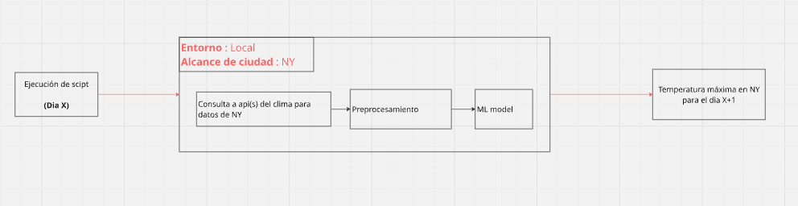
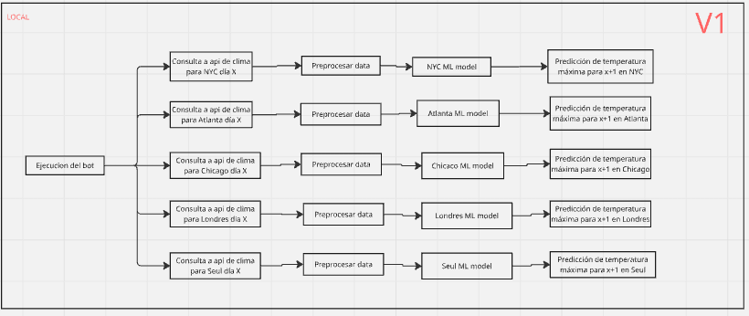
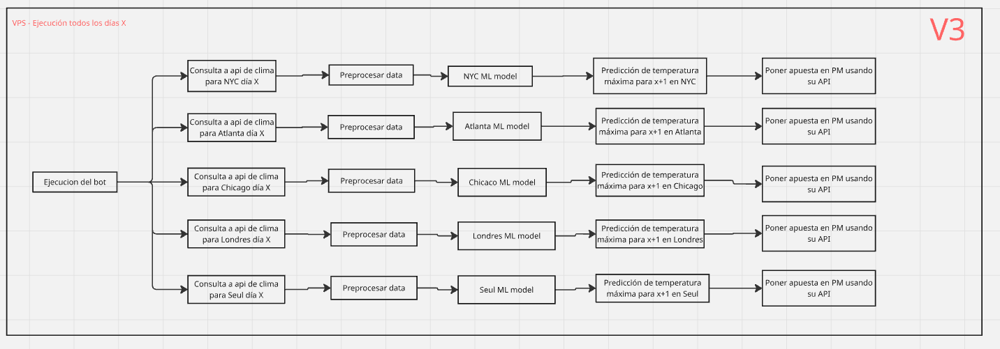

# Moira


El objetivo de este proyecto es crear un bot que se conectara con polymarket para apostar contra la temperatura maxima de una ciudad en un dia especifico.

trello : https://trello.com/b/R37KNQzR/moira

# Desarrollo de V0



## Desarrollo de funcion para consulta a API

### Definicion y refinamiento de features

Nota: es importante tener en cuenta las horas de ejecucion del bot, esto por que el bot se entrenara con data conseguida al final de los dias, entonces el bot mientras mas hacia el final del dia se ejecute, mas preciso sera por que mas se ajustara a su contexto de entrenamiento.

En esta seccion definire las features que se utilizaran para predecir la temperatura de un dia X + 1 a partir de data del dia X.

Empezare con una cantidad reducida de features para ampliar posiblemente en el futuro, mientras mas features, mas complicado construir la funcion.


| Nombre de feature                  |         Unidad | Rango de valores (típico) | Significado (incluye cálculo)                                                                              |
| ---------------------------------- | -------------: | ------------------------- | ---------------------------------------------------------------------------------------------------------- |
| **Tmax_día_x**                     |             °C | ~ -50 a 55                | **Cálculo:** `Tmax[x]`. Máxima del día *x* (persistencia térmica).                                         |
| **Tmin_día_x**                     |             °C | ~ -60 a 35                | **Cálculo:** `Tmin[x]`. Mínima del día *x* (masa de aire/enfriamiento nocturno).                           |
| **Tmedia_día_x**                   |             °C | ~ -55 a 45                | **Cálculo:** `(Tmax[x] + Tmin[x]) / 2` (o `Tmed[x]`). Estado térmico general.                              |
| **ΔTmax_1d**                       |             °C | ~ -20 a 20                | **Cálculo:** `Tmax[x] − Tmax[x−1]`. Tendencia/cambio reciente.                                             |
| **MA_Tmax_3d**                     |             °C | ~ -50 a 55                | **Cálculo:** `(Tmax[x] + Tmax[x−1] + Tmax[x−2]) / 3`. Inercia térmica de corto plazo.                      |
| **DTR_x**                          |             °C | ~ 0 a 25 (puede >30)      | **Cálculo:** `Tmax[x] − Tmin[x]`. Amplitud térmica; proxy nubosidad/humedad.                               |
| **HR_media_día_x**                 |              % | 0 a 100                   | **Cálculo:** `HR_mean[x]`. Humedad relativa media diaria.                                                  |
| **Punto_de_rocío_día_x (Td)**      |             °C | ~ -60 a 30+               | **Cálculo:** `Td[x]` (preferible si viene en el dataset). Contenido real de vapor de agua.                 |
| **Presión_media_día_x (SLP)**      |            hPa | ~ 870 a 1085              | **Cálculo:** `SLP_mean[x]`. Señal sinótica (altas/bajas).                                                  |
| **ΔPresión_24h**                   |            hPa | ~ -20 a 20                | **Cálculo:** `SLP_mean[x] − SLP_mean[x−1]`. Cambio sinótico rápido.                                        |
| **Viento_vel_media_día_x**         |            m/s | 0 a 30 (rachas mayores)   | **Cálculo:** `wind_speed_mean[x]`. Mezcla/advección.                                                       |
| **Viento_dir_sin(x)**              |              — | -1 a 1                    | **Cálculo:** `sin(2π * wind_dir_deg[x] / 360)`. Codificación circular de dirección.                        |
| **Viento_dir_cos(x)**              |              — | -1 a 1                    | **Cálculo:** `cos(2π * wind_dir_deg[x] / 360)`. Codificación circular de dirección.                        |
| **Nubosidad_media_día_x**          | % (o fracción) | 0–100 (o 0–1)             | **Cálculo:** `cloud_cover_mean[x]`. Control de radiación entrante.                                         |
| **Precipitación_acum_día_x**       |         mm/día | 0 a 300+                  | **Cálculo:** `precip_sum[x]`. Efecto de lluvia/nubosidad/evaporación.                                      |
| **t_max_x+1 (si está disponible)** |             °C | ~ -50 a 55                | **Cálculo:** `Tmax[x+1]`. **Label/objetivo** para entrenamiento; **no usar como feature** en inferencia.   |
| **día (del mes)**                  |           1–31 | 1 a 31                    | **Cálculo:** `day_of_month(fecha)`. Calendario (efecto débil; útil como índice).                           |
| **mes**                            |           1–12 | 1 a 12                    | **Cálculo:** `month(fecha)`. Estacionalidad mensual (mejor usar DOY cíclico abajo).                        |
| **año**                            |           YYYY | p.ej. 1950–2100           | **Cálculo:** `year(fecha)`. Tendencia de largo plazo/cambios en medición.                                  |
| **ciudad**                         |      categoría | N categorías              | **Cálculo:** ID/nombre. Se codifica (one-hot/target encoding/embeddings) para capturar climatología local. |
| **doy_sin**                        |              — | -1 a 1                    | **Cálculo:** `sin(2π * doy / 365)`. Estacionalidad en forma cíclica (diciembre cerca de enero).            |
| **doy_cos**                        |              — | -1 a 1                    | **Cálculo:** `cos(2π * doy / 365)`. Complementa `doy_sin` para representar el ciclo anual.                 |

**Nota**: `dia`, `mes` y `año` , son redundantes teniendo `doy_sin` y `doy_cos`, dejarlo unicamente para identificar registros, descartarlos para entrenamiento e inferencia.

### Creacion de funcion para consulta a api

Version inicial :

```
import requests
import pandas as pd
import numpy as np
from datetime import datetime, timedelta
import math

def get_weather_features(city: str, date_str: str):
    """
    Obtiene features meteorológicas para una ciudad y fecha específicas.
    Incluye la temperatura máxima del día siguiente (label) si está disponible.
    """
    
    # 1. Configuración de Coordenadas (Lat/Lon)
    city_coords = {
        'new york': {'lat': 40.7128, 'lon': -74.0060},
        'chicago':  {'lat': 41.8781, 'lon': -87.6298},
        'atlanta':  {'lat': 33.7490, 'lon': -84.3880},
        'seul':     {'lat': 37.5665, 'lon': 126.9780},
        'londres':  {'lat': 51.5074, 'lon': -0.1278}
    }
    
    city_key = city.lower().strip()
    if city_key not in city_coords:
        raise ValueError(f"Ciudad no soportada. Use: {list(city_coords.keys())}")

    # 2. Gestión de Fechas
    target_date = datetime.strptime(date_str, "%d-%m-%y")
    
    # Calculamos el día siguiente (x+1) para pedirlo a la API
    next_day_date = target_date + timedelta(days=1)
    
    # Pedimos 5 días atrás para el contexto (rolling windows)
    start_date = target_date - timedelta(days=5)
    
    # Formato para la API (YYYY-MM-DD)
    api_start = start_date.strftime("%Y-%m-%d")
    # MODIFICACIÓN: Extendemos el final de la petición hasta el día siguiente (x+1)
    api_end = next_day_date.strftime("%Y-%m-%d")

    # 3. Llamada a la API (Open-Meteo Archive)
    url = "https://archive-api.open-meteo.com/v1/archive"
    params = {
        "latitude": city_coords[city_key]['lat'],
        "longitude": city_coords[city_key]['lon'],
        "start_date": api_start,
        "end_date": api_end,
        "daily": [
            "temperature_2m_max",
            "temperature_2m_min",
            "temperature_2m_mean",
            "precipitation_sum",
            "wind_speed_10m_mean",
            "wind_direction_10m_dominant",
            "surface_pressure_mean",
            "relative_humidity_2m_mean",
            "cloud_cover_mean",
            "dew_point_2m_mean"
        ],
        "timezone": "auto"
    }

    response = requests.get(url, params=params)
    
    if response.status_code != 200:
        raise ConnectionError(f"Error conectando con API: {response.text}")
        
    data = response.json()
    
    # 4. Procesamiento con Pandas
    daily_data = data['daily']
    df = pd.DataFrame(daily_data)
    df['time'] = pd.to_datetime(df['time'])
    df = df.sort_values('time')

    # Renombrar columnas
    df = df.rename(columns={
        'temperature_2m_max': 'Tmax',
        'temperature_2m_min': 'Tmin',
        'temperature_2m_mean': 'Tmean',
        'relative_humidity_2m_mean': 'HR',
        'dew_point_2m_mean': 'Td',
        'surface_pressure_mean': 'SLP',
        'wind_speed_10m_mean': 'WindSpd',
        'wind_direction_10m_dominant': 'WindDir',
        'cloud_cover_mean': 'Cloud',
        'precipitation_sum': 'Precip'
    })

    # --- CÁLCULO DE FEATURES ---
    # ΔTmax_1d
    df['Delta_Tmax_1d'] = df['Tmax'].diff()
    # MA_Tmax_3d
    df['MA_Tmax_3d'] = df['Tmax'].rolling(window=3).mean()
    # DTR
    df['DTR'] = df['Tmax'] - df['Tmin']
    # ΔPresión_24h
    df['Delta_Presion'] = df['SLP'].diff()
    
    # Viento Seno/Coseno
    wind_rad = np.deg2rad(df['WindDir'])
    df['Wind_sin'] = np.sin(wind_rad)
    df['Wind_cos'] = np.cos(wind_rad)

    # Features de Fecha
    df['doy'] = df['time'].dt.dayofyear
    df['day'] = df['time'].dt.day
    df['month'] = df['time'].dt.month
    df['year'] = df['time'].dt.year
    df['doy_sin'] = np.sin(2 * np.pi * df['doy'] / 365.25)
    df['doy_cos'] = np.cos(2 * np.pi * df['doy'] / 365.25)

    # 5. Extracción de datos
    
    # A. Fila del día objetivo (x)
    # Usamos try/except o verificamos si está vacío por seguridad
    target_rows = df[df['time'].dt.date == target_date.date()]
    if target_rows.empty:
        raise ValueError(f"No se encontraron datos para la fecha {date_str}")
    target_row = target_rows.iloc[0]

    # B. Fila del día siguiente (x+1) -> LABEL
    next_day_rows = df[df['time'].dt.date == next_day_date.date()]
    
    # Lógica para determinar el valor de t_max_x+1
    if not next_day_rows.empty:
        # Extraemos el valor, manejando posibles NaN nativos de pandas
        val = next_day_rows.iloc[0]['Tmax']
        t_max_next = val if not pd.isna(val) else None
    else:
        t_max_next = None

    # Construcción del diccionario final
    features = {
        "Tmax_día_x": target_row['Tmax'],
        "Tmin_día_x": target_row['Tmin'],
        "Tmedia_día_x": target_row['Tmean'],
        "ΔTmax_1d": target_row['Delta_Tmax_1d'],
        "MA_Tmax_3d": target_row['MA_Tmax_3d'],
        "DTR_x": target_row['DTR'],
        "HR_media_día_x": target_row['HR'],
        "Punto_de_rocío_día_x (Td)": target_row['Td'],
        "Presión_media_día_x (SLP)": target_row['SLP'],
        "ΔPresión_24h": target_row['Delta_Presion'],
        "Viento_vel_media_día_x": target_row['WindSpd'],
        "Viento_dir_sin(x)": target_row['Wind_sin'],
        "Viento_dir_cos(x)": target_row['Wind_cos'],
        "Nubosidad_media_día_x": target_row['Cloud'],
        "Precipitación_acum_día_x": target_row['Precip'],
        
        # FEATURE ACTUALIZADA:
        "t_max_x+1 (Label)": t_max_next, 
        
        "día": target_row['day'],
        "mes": target_row['month'],
        "año": target_row['year'],
        "ciudad": city,
        "doy": target_row['doy'],
        "doy_sin": target_row['doy_sin'],
        "doy_cos": target_row['doy_cos']
    }
    
    return features
```

### Testeo de funcion

La funcion debe ser testeada para:

* Posibles bloqueos por rate limiting 
* Velocidad de respuesta promedio
* Alcance de fechas
* Null values

## Creacion de pipeline de preprocesamiento

## Entrenamiento de modelo

* Definir algoritmo de ML
* Obtener data de entrenamiento
* Seleccion de hiperparametros + entrenamiento

# Desarrollo de V1



# Desarrollo de V2


# Desarrollo de V3



