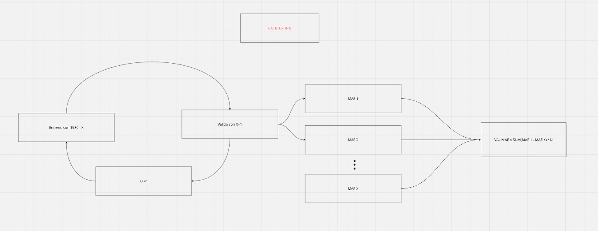

# Moira


El objetivo de este proyecto es crear un bot que se conectará con Polymarket para apostar contra la temperatura máxima de una ciudad en un día específico.

**Trello**: https://trello.com/b/R37KNQzR/moira

**Objetivo de MAE en Celsius**: 0.26 máx.

**Hora de ejecución del bot**: 23h del dia X.

# Desarrollo de V0


# Definición modular de requisitos para V0

* **Función de consumo de data**: una función que reciba una ciudad y un día X, y retorne un diccionario de valores de las features para el día X y la temperatura máxima del día X+1, si está disponible.

* **Generación de dataset para entrenamiento**: usando la función anteriormente generada, se crea el dataset.


* **Entrenamiento de modelo**


* **Fusión de piezas para flujo**

# Sprint 1 - V0


<details>
<summary><strong>Definición y refinamiento de features</strong></summary>


Nota: es importante tener en cuenta las horas de ejecución del bot, esto porque el bot se entrenará con data conseguida al final de los días; entonces, mientras más hacia el final del día se ejecute, más preciso será porque más se ajustará a su contexto de entrenamiento.

En esta sección definiré las features que se utilizarán para predecir la temperatura de un día X + 1 a partir de data del día X.

Empezaré con una cantidad reducida de features para ampliar posiblemente en el futuro; mientras más features, más complicado será construir la función.


| Nombre de feature                  |         Unidad | Significado (incluye cálculo)                                                                              |
| ---------------------------------- | -------------: | ---------------------------------------------------------------------------------------------------------- |
| **Tmax_día_x**                     |             °C | `Tmax[x]`. Máxima del día *x* (persistencia térmica).                                        |
| **Tmin_día_x**                     |             °C | `Tmin[x]`. Mínima del día *x* (masa de aire/enfriamiento nocturno).                           |
| **Tmedia_día_x**                   |             °C | `(Tmax[x] + Tmin[x]) / 2` (o `Tmed[x]`). Estado térmico general.                              |
| **ΔTmax_1d**                       |             °C | `Tmax[x] − Tmax[x−1]`. Tendencia/cambio reciente.                                             |
| **MA_Tmax_3d**                     |             °C | `(Tmax[x] + Tmax[x−1] + Tmax[x−2]) / 3`. Inercia térmica de corto plazo.                      |
| **DTR_x**                          |             °C | `Tmax[x] − Tmin[x]`. Amplitud térmica; proxy nubosidad/humedad.                               |
| **HR_media_día_x**                 |              % | `HR_mean[x]`. Humedad relativa media diaria.                                                  |
| **Punto_de_rocío_día_x (Td)**      |             °C | `Td[x]` (preferible si viene en el dataset). Contenido real de vapor de agua.                 |
| **Presión_media_día_x (SLP)**      |            hPa | `SLP_mean[x]`. Señal sinótica (altas/bajas).                                                  |
| **ΔPresión_24h**                   |            hPa | `SLP_mean[x] − SLP_mean[x−1]`. Cambio sinótico rápido.                                        |
| **Viento_vel_media_día_x**         |            m/s | `wind_speed_mean[x]`. Mezcla/advección.                                                       |
| **Viento_dir_sin(x)**              |              — | `sin(2π * wind_dir_deg[x] / 360)`. Codificación circular de dirección.                        |
| **Viento_dir_cos(x)**              |              — | `cos(2π * wind_dir_deg[x] / 360)`. Codificación circular de dirección.                        |
| **Nubosidad_media_día_x**          | % (o fracción) | `cloud_cover_mean[x]`. Control de radiación entrante.                                         |
| **Precipitación_acum_día_x**       |         mm/día | `precip_sum[x]`. Efecto de lluvia/nubosidad/evaporación.                                      |
| **t_max_x+1 (si está disponible)** |             °C | `Tmax[x+1]`. **Label/objetivo** para entrenamiento; **no usar como feature** en inferencia.   |
| **ciudad**                         |      categoría | ID/nombre. Se codifica (one-hot/target encoding/embeddings) para capturar climatología local. |
| **doy_sin**                        |              — | `sin(2π * doy / 365)`. Estacionalidad en forma cíclica (diciembre cerca de enero).            |
| **doy_cos**                        |              — | `cos(2π * doy / 365)`. Complementa `doy_sin` para representar el ciclo anual.                 |

**Nota**: `dia`, `mes` y `año` son redundantes teniendo `doy_sin` y `doy_cos`; dejarlos únicamente para identificar registros y descartarlos para entrenamiento e inferencia.


</details>

<details>
<summary><strong>Desarrollo de función para consulta a API</strong></summary>


Esta función consultará las siguientes fuentes:

`NCEI/GHCND - LaGuardia Airport (USW00014732)`: para Tmax y Tmin (mismo que Polymarket).

NOAA = National Oceanic and Atmospheric Administration (EE. UU.).

Es una agencia del gobierno estadounidense encargada de meteorología (pronósticos, alertas).

NCEI = National Centers for Environmental Information.

Es un centro dentro de NOAA que funciona como archivo oficial y repositorio de datos ambientales (clima, océanos, geofísica).

GHCND = Global Historical Climatology Network – Daily.

Es un gran dataset global de observaciones diarias de estaciones meteorológicas (sitios físicos con sensores) que NOAA/NCEI recopila y “normaliza” para que lo puedas consultar de forma consistente.

En resumen, es una interfaz de consumo de data relacionada con clima y meteorología que en este proyecto usaremos para tener las mismas referencias que Polymarket.


`Open-Meteo`: para el resto de datos.

La mayoría de sus datos vienen de modelos numéricos y reanálisis (datos “en grilla”), por ejemplo ERA5/ERA5-Land e IFS, y te devuelve valores para una celda cercana a las coordenadas que pides (no una medición puntual exacta).

### Creación de función para consulta a API

Versión inicial:

```python
import requests
import pandas as pd
import numpy as np
from datetime import datetime, timedelta

# ---------------- CONFIG ----------------
NCEI_DATA_URL = "https://www.ncei.noaa.gov/access/services/data/v1"
LGA_GHCND_STATION = "USW00014732"  # LaGuardia Airport (GHCND)

CITY_COORDS = {
    "new york": {"lat": 40.7128, "lon": -74.0060, "tz": "America/New_York"},
    "chicago":  {"lat": 41.8781, "lon": -87.6298, "tz": "America/Chicago"},
    "atlanta":  {"lat": 33.7490, "lon": -84.3880, "tz": "America/New_York"},
    "seul":     {"lat": 37.5665, "lon": 126.9780, "tz": "Asia/Seoul"},
    "londres":  {"lat": 51.5074, "lon": -0.1278, "tz": "Europe/London"},
}

# ---------------- HELPERS ----------------
def _fetch_ncei_daily(station: str, start_date: str, end_date: str, data_types: list[str]) -> pd.DataFrame:
    """
    Descarga Daily Summaries (GHCND) de NCEI para un rango [start_date, end_date] (YYYY-MM-DD),
    devolviendo un df indexado por fecha con columnas por dataTypes (ej: TMAX, TMIN).

    Unidades: metric => °C para TMAX/TMIN.
    """
    params = {
        "dataset": "daily-summaries",
        "stations": station,
        "startDate": start_date,
        "endDate": end_date,
        "dataTypes": ",".join(data_types),
        "format": "json",
        "units": "metric",  # <-- °C
        "includeStationName": "false",
        "includeStationLocation": "false",
        "includeAttributes": "false",
    }
    headers = {"User-Agent": "tmax-bot/1.0 (contact: you@example.com)"}

    r = requests.get(NCEI_DATA_URL, params=params, headers=headers, timeout=25)
    if r.status_code != 200:
        raise ConnectionError(f"Error NCEI: {r.status_code} - {r.text[:300]}")

    rows = r.json()
    if not rows:
        return pd.DataFrame()

    def _find_key(d: dict, candidates: list[str]) -> str | None:
        keys = {k.lower(): k for k in d.keys()}
        for c in candidates:
            if c.lower() in keys:
                return keys[c.lower()]
        return None

    date_key = _find_key(rows[0], ["DATE", "date"])
    if not date_key:
        raise ValueError(f"NCEI: no encontré campo de fecha. Keys={list(rows[0].keys())}")

    out = []
    for row in rows:
        rec = {"time": pd.to_datetime(row[date_key]).normalize()}
        for dt in data_types:
            val = None
            for k in row.keys():
                if k.upper() == dt.upper():
                    val = row[k]
                    break
            if val in (None, "", "NaN"):
                rec[dt.upper()] = np.nan
            else:
                try:
                    rec[dt.upper()] = float(val)
                except ValueError:
                    rec[dt.upper()] = np.nan
        out.append(rec)

    df = pd.DataFrame(out).drop_duplicates(subset=["time"], keep="last").set_index("time").sort_index()
    return df


def _fetch_open_meteo_daily(lat: float, lon: float, start_date: str, end_date: str, tz: str) -> pd.DataFrame:
    """
    Open-Meteo Archive para el resto de features.
    Unidades explícitas: °C y m/s.
    """
    url = "https://archive-api.open-meteo.com/v1/archive"
    params = {
        "latitude": lat,
        "longitude": lon,
        "start_date": start_date,
        "end_date": end_date,
        "daily": [
            "temperature_2m_min",
            "temperature_2m_mean",
            "precipitation_sum",
            "wind_speed_10m_mean",
            "wind_direction_10m_dominant",
            "surface_pressure_mean",
            "relative_humidity_2m_mean",
            "cloud_cover_mean",
            "dew_point_2m_mean",
        ],
        "temperature_unit": "celsius",
        "wind_speed_unit": "ms",
        "precipitation_unit": "mm",
        "timezone": tz,
    }

    r = requests.get(url, params=params, timeout=25)
    if r.status_code != 200:
        raise ConnectionError(f"Error Open-Meteo: {r.status_code} - {r.text[:300]}")

    daily = r.json().get("daily", {})
    if "time" not in daily:
        raise ValueError(f"Open-Meteo: respuesta inesperada. Keys daily={list(daily.keys())}")

    df = pd.DataFrame(daily)
    df["time"] = pd.to_datetime(df["time"]).dt.normalize()
    df = df.drop_duplicates(subset=["time"], keep="last").set_index("time").sort_index()

    df = df.rename(columns={
        "temperature_2m_min": "Tmin_model",      # °C (modelo)
        "temperature_2m_mean": "Tmean_model",    # °C (modelo)
        "relative_humidity_2m_mean": "HR",       # %
        "dew_point_2m_mean": "Td",               # °C
        "surface_pressure_mean": "SLP",          # hPa (presión a superficie)
        "wind_speed_10m_mean": "WindSpd",        # m/s
        "wind_direction_10m_dominant": "WindDir",# grados
        "cloud_cover_mean": "Cloud",             # %
        "precipitation_sum": "Precip",           # mm
    })
    return df


def _missing_mask(series_or_df: pd.Series | pd.DataFrame) -> bool:
    """True si el valor está missing (NaN)."""
    if isinstance(series_or_df, pd.DataFrame):
        return series_or_df.isna().any().any()
    return pd.isna(series_or_df)


# ---------------- MAIN ----------------
def get_weather_features(city: str, date_str: str, strict: bool = True) -> dict:
    """
    strict=True:
      - si faltan datos previos necesarios (no solo Tmax), retorna {}.
    """
    city_key = city.lower().strip()
    if city_key not in CITY_COORDS:
        raise ValueError(f"Ciudad no soportada. Use: {list(CITY_COORDS.keys())}")

    target_date = datetime.strptime(date_str, "%d-%m-%y")
    next_day = target_date + timedelta(days=1)
    start_date = target_date - timedelta(days=5)

    api_start = start_date.strftime("%Y-%m-%d")
    api_end = next_day.strftime("%Y-%m-%d")

    expected_idx = pd.date_range(api_start, api_end, freq="D")
    target_ts = pd.to_datetime(target_date.strftime("%Y-%m-%d"))
    next_ts = pd.to_datetime(next_day.strftime("%Y-%m-%d"))

    # 1) Open-Meteo
    om = _fetch_open_meteo_daily(
        lat=CITY_COORDS[city_key]["lat"],
        lon=CITY_COORDS[city_key]["lon"],
        start_date=api_start,
        end_date=api_end,
        tz=CITY_COORDS[city_key]["tz"],
    ).reindex(expected_idx)

    # 2) NCEI (NYC)
    if city_key == "new york":
        ncei = _fetch_ncei_daily(
            station=LGA_GHCND_STATION,
            start_date=api_start,
            end_date=api_end,
            data_types=["TMAX", "TMIN"],
        ).reindex(expected_idx)
    else:
        raise ValueError("Esta versión solo implementa NCEI para New York (LaGuardia USW00014732).")

    # DataFrame unificado
    df = pd.DataFrame(index=expected_idx)
    df.index.name = "time"
    df["Tmax"] = ncei.get("TMAX")
    df["Tmin"] = ncei.get("TMIN")
    df["Tmean"] = (df["Tmax"] + df["Tmin"]) / 2.0

    for col in ["HR", "Td", "SLP", "WindSpd", "WindDir", "Cloud", "Precip"]:
        df[col] = om.get(col)

    # Derivadas
    df["Delta_Tmax_1d"] = df["Tmax"] - df["Tmax"].shift(1)
    df["MA_Tmax_3d"] = df["Tmax"].rolling(window=3, min_periods=3).mean()
    df["DTR"] = df["Tmax"] - df["Tmin"]
    df["Delta_Presion"] = df["SLP"] - df["SLP"].shift(1)

    wind_rad = np.deg2rad(df["WindDir"])
    df["Wind_sin"] = np.sin(wind_rad)
    df["Wind_cos"] = np.cos(wind_rad)

    df["doy"] = df.index.dayofyear
    df["doy_sin"] = np.sin(2 * np.pi * df["doy"] / 365.25)
    df["doy_cos"] = np.cos(2 * np.pi * df["doy"] / 365.25)

    if target_ts not in df.index:
        raise ValueError(f"No se encontró el día objetivo {target_ts.date()} en el índice reindexado.")

    # ---------------- VALIDACIÓN NUEVA (FULL) ----------------
    # Días previos necesarios:
    # - Para ΔTmax_1d: x-1
    # - Para MA_Tmax_3d: x-1, x-2
    # - Para label: x+1
    # - Para ΔPresión_24h: x-1
    needed_days = {
        "x-2": target_ts - pd.Timedelta(days=2),
        "x-1": target_ts - pd.Timedelta(days=1),
        "x": target_ts,
        "x+1": next_ts,
    }

    # Variables necesarias por día:
    # - Tmax: x-2, x-1, x, x+1
    # - Tmin: x (para DTR y Tmean)
    # - Open-Meteo: HR/Td/SLP/Wind/Cloud/Precip en x
    # - SLP también en x-1 para Delta_Presion
    requirements = []

    # Tmax requeridos (para rolling/diff/label)
    for tag, day in needed_days.items():
        requirements.append((f"NCEI.Tmax({tag})", day, "Tmax"))

    # Tmin requerido al menos en x
    requirements.append(("NCEI.Tmin(x)", needed_days["x"], "Tmin"))

    # Open-Meteo variables para día x
    for var in ["HR", "Td", "SLP", "WindSpd", "WindDir", "Cloud", "Precip"]:
        requirements.append((f"OM.{var}(x)", needed_days["x"], var))

    # SLP de x-1 para Delta_Presion
    requirements.append(("OM.SLP(x-1)", needed_days["x-1"], "SLP"))

    missing_items = []
    for name, day, col in requirements:
        if day not in df.index:
            missing_items.append(f"{name}: day_out_of_range({day.date()})")
            continue
        if pd.isna(df.loc[day, col]):
            missing_items.append(f"{name}: NaN")

    if strict and missing_items:
        print("Error: No se pudieron obtener TODOS los datos previos necesarios.")
        for it in missing_items[:30]:
            print(" -", it)
        if len(missing_items) > 30:
            print(f" - ... y {len(missing_items) - 30} más")
        return {}
    # ----------------------------------------------------------

    target_row = df.loc[target_ts]

    def _safe(v):
        return None if (v is None or (isinstance(v, float) and np.isnan(v))) else float(v)

    features = {
        "Tmax_día_x": _safe(target_row["Tmax"]),
        "Tmin_día_x": _safe(target_row["Tmin"]),
        "Tmedia_día_x": _safe(target_row["Tmean"]),
        "ΔTmax_1d": _safe(target_row["Delta_Tmax_1d"]),
        "MA_Tmax_3d": _safe(target_row["MA_Tmax_3d"]),
        "DTR_x": _safe(target_row["DTR"]),
        "HR_media_día_x": _safe(target_row["HR"]),
        "Punto_de_rocío_día_x (Td)": _safe(target_row["Td"]),
        "Presión_media_día_x (SLP)": _safe(target_row["SLP"]),
        "ΔPresión_24h": _safe(target_row["Delta_Presion"]),
        "Viento_vel_media_día_x": _safe(target_row["WindSpd"]),
        "Viento_dir_sin(x)": _safe(target_row["Wind_sin"]),
        "Viento_dir_cos(x)": _safe(target_row["Wind_cos"]),
        "Nubosidad_media_día_x": _safe(target_row["Cloud"]),
        "Precipitación_acum_día_x": _safe(target_row["Precip"]),
        "t_max_x+1": _safe(df.loc[next_ts, "Tmax"]),
        "ciudad": city,
        "doy_sin": _safe(target_row["doy_sin"]),
        "doy_cos": _safe(target_row["doy_cos"]),
    }

    return features
```

### Testeo de función

La función fue testeada para:

* Posibles bloqueos por rate limiting.
* Velocidad de respuesta promedio.
* Alcance de fechas.
* Null values.
* Acierto en valores dados.
* Consistencia de unidades.
* Correspondencia con valores históricos de Polymarket para todos los Tmax y Tmin.


</details>

<details>
<summary><strong>Generación de dataset 1.0</strong></summary>


Luego de minar datos de 1980 a 2026 utilizando el script `./utils/miner.py`, obtuvimos los siguientes resultados:

```
Dimensiones de dataset 15118 x  21
```

Posteriormente, se generó el valset utilizando registros de otoño a través del script `./utils/split_dataset.py`, obteniendo los siguientes resultados:

```
Dimensiones de train 11392 x  21
Dimensiones de val 3726 x  21
```

La lista de features es:

```
date
date_str
Tmax_día_x
Tmin_día_x
Tmedia_día_x
ΔTmax_1d
MA_Tmax_3d
DTR_x
HR_media_día_x
Punto_de_rocío_día_x (Td)
Presión_media_día_x (SLP)
ΔPresión_24h
Viento_vel_media_día_x
Viento_dir_sin(x)
Viento_dir_cos(x)
Nubosidad_media_día_x
Precipitación_acum_día_x
t_max_x+1
ciudad
doy_sin
doy_cos
```


</details>

<details>
<summary><strong>Entrenamiento de modelo</strong></summary>


### Entrenamiento 1.0

Algoritmo: HistGradientBoostingRegressor
Versión de dataset: 1.0
Valset: otoño


Se seleccionó el algoritmo `HistGradientBoostingRegressor` y, en conjunto con el dataset anteriormente mencionado y un proceso de selección de hiperparámetros, se obtuvieron los siguientes resultados:

**Configuración**:

```python

# main.py
import argparse
import json
import unicodedata
from pathlib import Path
from typing import Optional, Tuple, List

import numpy as np
import pandas as pd

from sklearn.compose import ColumnTransformer
from sklearn.impute import SimpleImputer
from sklearn.metrics import mean_absolute_error, mean_squared_error, r2_score
from sklearn.model_selection import RandomizedSearchCV, PredefinedSplit
from sklearn.pipeline import Pipeline
from sklearn.preprocessing import OneHotEncoder, StandardScaler
from sklearn.ensemble import HistGradientBoostingRegressor
from sklearn.svm import SVR

import joblib


# -------------------- Helpers --------------------

def norm(s: str) -> str:
    s = str(s).strip()
    s = unicodedata.normalize("NFKD", s)
    s = "".join(ch for ch in s if not unicodedata.combining(ch))
    s = s.lower()
    out = []
    prev_us = False
    for ch in s:
        if ch.isalnum():
            out.append(ch)
            prev_us = False
        else:
            if not prev_us:
                out.append("_")
                prev_us = True
    s2 = "".join(out).strip("_")
    while "__" in s2:
        s2 = s2.replace("__", "_")
    return s2


def split_xy(df: pd.DataFrame, target_col: str, drop_cols: List[str]) -> Tuple[pd.DataFrame, pd.Series]:
    if target_col not in df.columns:
        raise ValueError(f"No existe target_col='{target_col}' en el dataframe.")
    X = df.drop(columns=[target_col] + drop_cols, errors="ignore")
    y = df[target_col]
    return X, y


# -------------------- Main --------------------

def main():
    train_path = Path("./dataset/trainset.csv")
    val_path = Path("./dataset/valset.csv")

    df_train = pd.read_csv(train_path)
    df_val = pd.read_csv(val_path)

    # Target
    target = "t_max_x+1"

    if target not in df_val.columns:
        raise SystemExit(f"[ERROR] El target '{target}' no existe en valset.csv.")

    # Excluir columnas de fecha si existen (porque ya tienes doy_sin/cos)
    drop_cols = ["date","date_str"]
    X_train, y_train = split_xy(df_train, target, drop_cols)
    X_val, y_val = split_xy(df_val, target, drop_cols)

    # Columnas categóricas vs numéricas (simple y robusto)
    cat_cols = [c for c in X_train.columns if X_train[c].dtype in ["object", "str"] or str(X_train[c].dtype).startswith("category")]

    num_cols = [c for c in X_train.columns if c not in cat_cols]

    # Preprocesamiento básico: imputación + normalización
    # Nota: para modelos tipo boosting no es estrictamente necesario escalar,
    # pero lo incluyo porque lo pediste y no hace daño.
    numeric_pipe = Pipeline(steps=[
        ("scaler", StandardScaler()),
    ])

    categorical_pipe = Pipeline(steps=[
        ("onehot", OneHotEncoder(handle_unknown="ignore")),
    ])

    preprocessor = ColumnTransformer(
        transformers=[
            ("num", numeric_pipe, num_cols),
            ("cat", categorical_pipe, cat_cols),
        ],
        remainder="drop",
    )

    model = HistGradientBoostingRegressor(
        loss="absolute_error",
        random_state=42,
        early_stopping=True,
    )

    pipe = Pipeline(steps=[
        ("preprocess", preprocessor),
        ("model", model),
    ])

    # Usar tu split train/val tal cual (sin CV aleatorio)
    # -> combinamos datasets y marcamos val como fold=0, train como fold=-1
    X_all = pd.concat([X_train, X_val], axis=0, ignore_index=True)
    y_all = pd.concat([y_train, y_val], axis=0, ignore_index=True)
    test_fold = np.array([-1] * len(X_train) + [0] * len(X_val))  # -1=entrena, 0=val
    ps = PredefinedSplit(test_fold=test_fold)

    # Espacio de búsqueda (práctico para tabular time-series con features engineered)
    param_dist = {
        "model__max_iter": [300, 600, 1000, 1500],
        "model__learning_rate": [0.02, 0.03, 0.05, 0.08, 0.1],
        "model__max_depth": [None, 3, 5, 7, 9],
        "model__max_leaf_nodes": [15, 31, 63, 127],
        "model__min_samples_leaf": [10, 20, 50, 100],
        "model__l2_regularization": [0.0, 0.01, 0.1, 1.0, 5.0],
        "model__max_bins": [64, 127, 255],
    }

    search = RandomizedSearchCV(
        estimator=pipe,
        param_distributions=param_dist,
        n_iter=15_000,
        scoring="neg_mean_absolute_error",  # minimiza MAE
        cv=ps,
        refit=False, # que hace esto?
        random_state=42,
        n_jobs=15,
        verbose=2,
    )

    print("\n=== Entrenando + Hypertuning (MAE) ===")
    print(f"Train rows: {len(X_train):,} | Val rows: {len(X_val):,}")
    print(f"Target: {target}")
    if drop_cols:
        print(f"Drop cols (fecha detectada): {drop_cols}")
    print(f"Num cols: {len(num_cols)} | Cat cols: {len(cat_cols)}")
    if cat_cols:
        print(f"Categorical: {cat_cols}")

    search.fit(X_all, y_all)

    best_params = search.best_params_
    best_cv_mae = -float(search.best_score_)  # neg -> mae

    print("\n=== RESULTADOS ===")
    print(f"Best CV MAE (en tu valset): {best_cv_mae:.4f}")

    print("\nBest params:")
    for k, v in best_params.items():
        print(f"  {k}: {v}")


    # Guardar reporte
    report = {
        "target": target,
        "rows": {"train": int(len(X_train)), "val": int(len(X_val))},
        "cols": {"num": num_cols, "cat": cat_cols, "dropped": drop_cols},
        "best_params": best_params,
        "best_cv_mae": best_cv_mae
    }
    report_name = "report.json"
    Path(report_name).write_text(json.dumps(report, indent=2, ensure_ascii=False), encoding="utf-8")
    print(f"Reporte guardado en: {Path(report_name).resolve()}")


if __name__ == "__main__":
    main()

```

**Resultados**:

```
{
  "target": "t_max_x+1",
  "rows": {
    "train": 11392,
    "val": 3726
  },
  "cols": {
    "num": [
      "Tmax_día_x",
      "Tmin_día_x",
      "Tmedia_día_x",
      "ΔTmax_1d",
      "MA_Tmax_3d",
      "DTR_x",
      "HR_media_día_x",
      "Punto_de_rocío_día_x (Td)",
      "Presión_media_día_x (SLP)",
      "ΔPresión_24h",
      "Viento_vel_media_día_x",
      "Viento_dir_sin(x)",
      "Viento_dir_cos(x)",
      "Nubosidad_media_día_x",
      "Precipitación_acum_día_x",
      "doy_sin",
      "doy_cos"
    ],
    "cat": [
      "ciudad"
    ],
    "dropped": [
      "date",
      "date_str"
    ]
  },
  "best_params": {
    "model__min_samples_leaf": 10,
    "model__max_leaf_nodes": 127,
    "model__max_iter": 300,
    "model__max_depth": null,
    "model__max_bins": 255,
    "model__learning_rate": 0.03,
    "model__l2_regularization": 0.1
  },
  "best_cv_mae": 2.3821435019630037
}
```

### Entrenamiento 1.1


Algoritmo: HistGradientBoostingRegressor
Versión de dataset: 1.0
Valset: random split

**Configuración**

```python
import argparse
import json
import unicodedata
from pathlib import Path
from typing import Optional, Tuple, List

import numpy as np
import pandas as pd

from sklearn.compose import ColumnTransformer
from sklearn.impute import SimpleImputer
from sklearn.metrics import mean_absolute_error, mean_squared_error, r2_score
from sklearn.model_selection import RandomizedSearchCV, PredefinedSplit, train_test_split
from sklearn.pipeline import Pipeline
from sklearn.preprocessing import OneHotEncoder, StandardScaler
from sklearn.ensemble import HistGradientBoostingRegressor
from sklearn.svm import SVR

import joblib


# -------------------- Helpers --------------------

def norm(s: str) -> str:
    s = str(s).strip()
    s = unicodedata.normalize("NFKD", s)
    s = "".join(ch for ch in s if not unicodedata.combining(ch))
    s = s.lower()
    out = []
    prev_us = False
    for ch in s:
        if ch.isalnum():
            out.append(ch)
            prev_us = False
        else:
            if not prev_us:
                out.append("_")
                prev_us = True
    s2 = "".join(out).strip("_")
    while "__" in s2:
        s2 = s2.replace("__", "_")
    return s2


def split_xy(df: pd.DataFrame, target_col: str, drop_cols: List[str]) -> Tuple[pd.DataFrame, pd.Series]:
    if target_col not in df.columns:
        raise ValueError(f"No existe target_col='{target_col}' en el dataframe.")
    X = df.drop(columns=[target_col] + drop_cols, errors="ignore")
    y = df[target_col]
    return X, y


# -------------------- Main --------------------

def main():
    dataset = Path("../../dataset/original_dataset.csv")

    # ✅ Leer dataset original
    df = pd.read_csv(dataset)

    # Target
    target = "t_max_x+1"

    if target not in df.columns:
        raise SystemExit(f"[ERROR] El target '{target}' no existe en el dataset original.")

    # ✅ Split RANDOM: train / val / test (70/15/15)
    # Primero sacamos test (15%), luego val (15% del total ≈ 0.17647 del restante)
    df_trainval, df_test = train_test_split(df, test_size=0.15, random_state=42, shuffle=True)
    df_train, df_val = train_test_split(df_trainval, test_size=0.20, random_state=42, shuffle=True)

    # Excluir columnas de fecha si existen (porque ya tienes doy_sin/cos)
    drop_cols = ["date", "date_str"]
    X_train, y_train = split_xy(df_train, target, drop_cols)
    X_val, y_val = split_xy(df_val, target, drop_cols)
    X_test, y_test = split_xy(df_test, target, drop_cols)

    # Columnas categóricas vs numéricas (simple y robusto)
    cat_cols = [c for c in X_train.columns if X_train[c].dtype in ["object", "str"] or str(X_train[c].dtype).startswith("category")]
    num_cols = [c for c in X_train.columns if c not in cat_cols]

    # Preprocesamiento básico: imputación + normalización
    numeric_pipe = Pipeline(steps=[
        ("scaler", StandardScaler()),
    ])

    categorical_pipe = Pipeline(steps=[
        ("onehot", OneHotEncoder(handle_unknown="ignore")),
    ])

    preprocessor = ColumnTransformer(
        transformers=[
            ("num", numeric_pipe, num_cols),
            ("cat", categorical_pipe, cat_cols),
        ],
        remainder="drop",
    )

    model = HistGradientBoostingRegressor(
        loss="absolute_error",
        random_state=42,
        early_stopping=True,
    )

    pipe = Pipeline(steps=[
        ("preprocess", preprocessor),
        ("model", model),
    ])

    # ✅ Hypertuning SOLO con train/val (PredefinedSplit)
    X_all = pd.concat([X_train, X_val], axis=0, ignore_index=True)
    y_all = pd.concat([y_train, y_val], axis=0, ignore_index=True)
    test_fold = np.array([-1] * len(X_train) + [0] * len(X_val))  # -1=entrena, 0=val
    ps = PredefinedSplit(test_fold=test_fold)

    # Espacio de búsqueda
    param_dist = {
        "model__max_iter": [300, 600, 1000, 1500],
        "model__learning_rate": [0.02, 0.03, 0.05, 0.08, 0.1],
        "model__max_depth": [None, 3, 5, 7, 9],
        "model__max_leaf_nodes": [15, 31, 63, 127],
        "model__min_samples_leaf": [10, 20, 50, 100],
        "model__l2_regularization": [0.0, 0.01, 0.1, 1.0, 5.0],
        "model__max_bins": [64, 127, 255],
    }

    search = RandomizedSearchCV(
        estimator=pipe,
        param_distributions=param_dist,
        n_iter=15_000,
        scoring="neg_mean_absolute_error",  # minimiza MAE
        cv=ps,
        refit=False,
        random_state=42,
        n_jobs=15,
        verbose=2,
    )

    print("\n=== Entrenando + Hypertuning (MAE) ===")
    print(f"Train rows: {len(X_train):,} | Val rows: {len(X_val):,} | Test rows: {len(X_test):,}")
    print(f"Target: {target}")
    if drop_cols:
        print(f"Drop cols (fecha detectada): {drop_cols}")
    print(f"Num cols: {len(num_cols)} | Cat cols: {len(cat_cols)}")
    if cat_cols:
        print(f"Categorical: {cat_cols}")

    search.fit(X_all, y_all)

    best_params = search.best_params_
    best_cv_mae = -float(search.best_score_)  # neg -> mae

    print("\n=== RESULTADOS ===")
    print(f"Best CV MAE (en tu valset): {best_cv_mae:.4f}")

    print("\nBest params:")
    for k, v in best_params.items():
        print(f"  {k}: {v}")

    # Guardar reporte
    report = {
        "target": target,
        "rows": {"train": int(len(X_train)), "val": int(len(X_val)), "test": int(len(X_test))},
        "cols": {"num": num_cols, "cat": cat_cols, "dropped": drop_cols},
        "best_params": best_params,
        "best_cv_mae": best_cv_mae
    }
    report_name = "report.json"
    Path(report_name).write_text(json.dumps(report, indent=2, ensure_ascii=False), encoding="utf-8")
    print(f"Reporte guardado en: {Path(report_name).resolve()}")


if __name__ == "__main__":
    main()

```

**Resultados**:

```python
{
  "target": "t_max_x+1",
  "rows": {
    "train": 10280,
    "val": 2570,
    "test": 2268
  },
  "cols": {
    "num": [
      "Tmax_día_x",
      "Tmin_día_x",
      "Tmedia_día_x",
      "ΔTmax_1d",
      "MA_Tmax_3d",
      "DTR_x",
      "HR_media_día_x",
      "Punto_de_rocío_día_x (Td)",
      "Presión_media_día_x (SLP)",
      "ΔPresión_24h",
      "Viento_vel_media_día_x",
      "Viento_dir_sin(x)",
      "Viento_dir_cos(x)",
      "Nubosidad_media_día_x",
      "Precipitación_acum_día_x",
      "doy_sin",
      "doy_cos"
    ],
    "cat": [
      "ciudad"
    ],
    "dropped": [
      "date",
      "date_str"
    ]
  },
  "best_params": {
    "model__min_samples_leaf": 50,
    "model__max_leaf_nodes": 31,
    "model__max_iter": 600,
    "model__max_depth": null,
    "model__max_bins": 127,
    "model__learning_rate": 0.03,
    "model__l2_regularization": 0.0
  },
  "best_cv_mae": 2.4033782931158805
}
```

### Entrenamiento 1.2

Algoritmo: XGBoostRegressor
Versión de dataset: 1.0
Valset: random split

**Configuración**:

```python

import argparse
import json
import unicodedata
from pathlib import Path
from typing import Optional, Tuple, List

import numpy as np
import pandas as pd

from sklearn.compose import ColumnTransformer
from sklearn.impute import SimpleImputer
from sklearn.metrics import mean_absolute_error, mean_squared_error, r2_score
from sklearn.model_selection import RandomizedSearchCV, PredefinedSplit, train_test_split
from sklearn.pipeline import Pipeline
from sklearn.preprocessing import OneHotEncoder, StandardScaler

# ✅ Cambiado: HistGradientBoostingRegressor -> XGBoost
# Requiere: pip install xgboost
from xgboost import XGBRegressor

from sklearn.svm import SVR

import joblib


# -------------------- Helpers --------------------

def norm(s: str) -> str:
    s = str(s).strip()
    s = unicodedata.normalize("NFKD", s)
    s = "".join(ch for ch in s if not unicodedata.combining(ch))
    s = s.lower()
    out = []
    prev_us = False
    for ch in s:
        if ch.isalnum():
            out.append(ch)
            prev_us = False
        else:
            if not prev_us:
                out.append("_")
                prev_us = True
    s2 = "".join(out).strip("_")
    while "__" in s2:
        s2 = s2.replace("__", "_")
    return s2


def split_xy(df: pd.DataFrame, target_col: str, drop_cols: List[str]) -> Tuple[pd.DataFrame, pd.Series]:
    if target_col not in df.columns:
        raise ValueError(f"No existe target_col='{target_col}' en el dataframe.")
    X = df.drop(columns=[target_col] + drop_cols, errors="ignore")
    y = df[target_col]
    return X, y


# -------------------- Main --------------------

def main():
    dataset = Path("../../dataset/original_dataset.csv")

    # ✅ Leer dataset original
    df = pd.read_csv(dataset)

    # Target
    target = "t_max_x+1"

    if target not in df.columns:
        raise SystemExit(f"[ERROR] El target '{target}' no existe en el dataset original.")

    # ✅ Split RANDOM: train / val / test (70/15/15)
    df_trainval, df_test = train_test_split(df, test_size=0.15, random_state=42, shuffle=True)
    df_train, df_val = train_test_split(df_trainval, test_size=0.20, random_state=42, shuffle=True)

    # Excluir columnas de fecha si existen (porque ya tienes doy_sin/cos)
    drop_cols = ["date", "date_str"]
    X_train, y_train = split_xy(df_train, target, drop_cols)
    X_val, y_val = split_xy(df_val, target, drop_cols)
    X_test, y_test = split_xy(df_test, target, drop_cols)

    # Columnas categóricas vs numéricas (simple y robusto)
    cat_cols = [c for c in X_train.columns if X_train[c].dtype in ["object", "str"] or str(X_train[c].dtype).startswith("category")]
    num_cols = [c for c in X_train.columns if c not in cat_cols]

    # Preprocesamiento básico: normalización (se mantiene igual)
    numeric_pipe = Pipeline(steps=[
        ("scaler", StandardScaler()),
    ])

    categorical_pipe = Pipeline(steps=[
        ("onehot", OneHotEncoder(handle_unknown="ignore")),
    ])

    preprocessor = ColumnTransformer(
        transformers=[
            ("num", numeric_pipe, num_cols),
            ("cat", categorical_pipe, cat_cols),
        ],
        remainder="drop",
    )

    # ✅ Modelo XGBoost orientado a MAE (L1)
    model = XGBRegressor(
        objective="reg:absoluteerror",   # optimiza MAE (L1)
        eval_metric="mae",
        tree_method="hist",              # más rápido en tabular
        random_state=42,
        n_jobs=15,
        verbosity=0,
    )

    pipe = Pipeline(steps=[
        ("preprocess", preprocessor),
        ("model", model),
    ])

    # ✅ Hypertuning SOLO con train/val (PredefinedSplit) (se mantiene igual)
    X_all = pd.concat([X_train, X_val], axis=0, ignore_index=True)
    y_all = pd.concat([y_train, y_val], axis=0, ignore_index=True)
    test_fold = np.array([-1] * len(X_train) + [0] * len(X_val))  # -1=entrena, 0=val
    ps = PredefinedSplit(test_fold=test_fold)

    # ✅ Espacio de búsqueda adaptado a XGBoost
    param_dist = {
        "model__n_estimators": [300, 600, 1000, 1500],
        "model__learning_rate": [0.02, 0.03, 0.05, 0.08, 0.1],
        "model__max_depth": [3, 4, 5, 6, 8, 10],
        "model__min_child_weight": [1, 5, 10, 20],
        "model__subsample": [0.6, 0.8, 1.0],
        "model__colsample_bytree": [0.6, 0.8, 1.0],
        "model__reg_lambda": [0.0, 0.01, 0.1, 1.0, 5.0, 10.0],
        "model__reg_alpha": [0.0, 0.01, 0.1, 1.0],
        "model__gamma": [0.0, 0.1, 0.5, 1.0],
        "model__max_bin": [64, 127, 255],
    }

    search = RandomizedSearchCV(
        estimator=pipe,
        param_distributions=param_dist,
        n_iter=2_500,
        scoring="neg_mean_absolute_error",  # minimiza MAE
        cv=ps,
        refit=False,
        random_state=42,
        n_jobs=15,
        verbose=2,
    )

    print("\n=== Entrenando + Hypertuning (MAE) | XGBoost ===")
    print(f"Train rows: {len(X_train):,} | Val rows: {len(X_val):,} | Test rows: {len(X_test):,}")
    print(f"Target: {target}")
    if drop_cols:
        print(f"Drop cols (fecha detectada): {drop_cols}")
    print(f"Num cols: {len(num_cols)} | Cat cols: {len(cat_cols)}")
    if cat_cols:
        print(f"Categorical: {cat_cols}")

    search.fit(X_all, y_all)

    best_params = search.best_params_
    best_cv_mae = -float(search.best_score_)  # neg -> mae

    print("\n=== RESULTADOS ===")
    print(f"Best CV MAE (en tu valset): {best_cv_mae:.4f}")

    print("\nBest params:")
    for k, v in best_params.items():
        print(f"  {k}: {v}")

    # Guardar reporte
    report = {
        "target": target,
        "rows": {"train": int(len(X_train)), "val": int(len(X_val)), "test": int(len(X_test))},
        "cols": {"num": num_cols, "cat": cat_cols, "dropped": drop_cols},
        "best_params": best_params,
        "best_cv_mae": best_cv_mae
    }
    report_name = "report.json"
    Path(report_name).write_text(json.dumps(report, indent=2, ensure_ascii=False), encoding="utf-8")
    print(f"Reporte guardado en: {Path(report_name).resolve()}")


if __name__ == "__main__":
    main()
```


**Resultados**:

```python
{
  "target": "t_max_x+1",
  "rows": {
    "train": 10280,
    "val": 2570,
    "test": 2268
  },
  "cols": {
    "num": [
      "Tmax_día_x",
      "Tmin_día_x",
      "Tmedia_día_x",
      "ΔTmax_1d",
      "MA_Tmax_3d",
      "DTR_x",
      "HR_media_día_x",
      "Punto_de_rocío_día_x (Td)",
      "Presión_media_día_x (SLP)",
      "ΔPresión_24h",
      "Viento_vel_media_día_x",
      "Viento_dir_sin(x)",
      "Viento_dir_cos(x)",
      "Nubosidad_media_día_x",
      "Precipitación_acum_día_x",
      "doy_sin",
      "doy_cos"
    ],
    "cat": [
      "ciudad"
    ],
    "dropped": [
      "date",
      "date_str"
    ]
  },
  "best_params": {
    "model__subsample": 0.6,
    "model__reg_lambda": 5.0,
    "model__reg_alpha": 0.01,
    "model__n_estimators": 1000,
    "model__min_child_weight": 20,
    "model__max_depth": 6,
    "model__max_bin": 127,
    "model__learning_rate": 0.03,
    "model__gamma": 1.0,
    "model__colsample_bytree": 1.0
  },
  "best_cv_mae": 2.381992741876177
}
```


</details>

# Sprint 2 - V0

<details>
<summary><strong>Sesgos introducidos en SPRINT 1 - V0</strong></summary>


* La validacion random o por otoño provoca que en validacion hayan muchos registros muy parecidos a los ya vistos por el modelo en train.


</details>

<details>
<summary><strong>Tareas para el SPRINT 2 - V0</strong></summary>


Para este 2.º sprint del V0 se buscará mejorar los resultados a través de:

1. Ampliación de features
2. Redefinir modulo para obtención de data (Posibilidad de cambiar fuente de datos (Open-Meteo))
3. Testear nueva versión.
4. Generar dataset 1.1 (para todas las features acumuladas).
5. Revisión de features a través de estudio de correlaciones.
6. Split:
    - Train-val : 1980 - 2020
    - Test : 2021 - 2026
7. Entrenamiento:
    - Se hara una version de entrenamiento para diferentes versiones del dataset analizando las correlaciones
    - Para validacion se hara un **backtesting - walk-forward**
8. Evaluación usando set de test.





</details>

<details>
<summary><strong>Modificacion de script para eliminacion de open-meteo</strong></summary>


Actualmente, los valores de las features se obtienen de la siguiente forma:


| Feature                       | Fuente                                                                                     |
| ----------------------------- | ------------------------------------------------------------------------------------------ |
| **Tmax_día_x**                | **NCEI/GHCND - LaGuardia Airport `USW00014732`**                                           |
| **Tmin_día_x**                | **NCEI/GHCND - LaGuardia Airport `USW00014732`**                                           |
| **t_max_x+1**                 | **NCEI/GHCND - LaGuardia Airport `USW00014732`**                                           |
| **HR_media_día_x**            | **Open-Meteo Archive**                                                                     |
| **Punto_de_rocío_día_x (Td)** | **Open-Meteo Archive**                                                                     |
| **Presión_media_día_x (SLP)** | **Open-Meteo Archive**                                                                     |
| **Viento_vel_media_día_x**    | **Open-Meteo Archive**                                                                     |
| **Nubosidad_media_día_x**     | **Open-Meteo Archive**                                                                     |
| **Precipitación_acum_día_x**  | **Open-Meteo Archive**                                                                     |
| **Tmedia_día_x**              | **Calculada internamente** a partir de `Tmax` y `Tmin` de NCEI/GHCND                       |
| **ΔTmax_1d**                  | **Calculada internamente** a partir de `Tmax[x]` y `Tmax[x-1]` de NCEI/GHCND               |
| **MA_Tmax_3d**                | **Calculada internamente** a partir de `Tmax[x]`, `Tmax[x-1]` y `Tmax[x-2]` de NCEI/GHCND  |
| **DTR_x**                     | **Calculada internamente** a partir de `Tmax` y `Tmin` de NCEI/GHCND                       |
| **ΔPresión_24h**              | **Calculada internamente** a partir de `SLP[x]` y `SLP[x-1]` de Open-Meteo Archive         |
| **Viento_dir_sin(x)**         | **Calculada internamente** a partir de `wind_direction_10m_dominant` de Open-Meteo Archive |
| **Viento_dir_cos(x)**         | **Calculada internamente** a partir de `wind_direction_10m_dominant` de Open-Meteo Archive |
| **doy_sin**                   | **Calculada internamente** a partir de la fecha del registro                               |
| **doy_cos**                   | **Calculada internamente** a partir de la fecha del registro                               |
| **ciudad**                    | **Input/configuración interna del script**                                                 |

El problema es que obtener data de fuentes/sensores diferentes puede provocar un desalineamiento entre feature y targets, por lo cual, lo mejor es obtener todos los valores de la misma estacion (no necesariamente misma fuente).

Teniendo en cuenta lo anterior, se modifico el modulo `./utils/build_climate_data.py` para obtener todos los datos de la misma estacion: el aeropuerto LaGuardia de NY.


```python
"""
Consulta las APIs climáticas necesarias para obtener datos históricos o recientes del día X.

Versión modificada:
- NCEI/GHCND Daily Summaries:
    - Tmax
    - Tmin
    - PRCP
    - target t_max_x+1

- NCEI ISD-Lite / Global Hourly, estación LaGuardia:
    - HR_media_día_x
    - Punto_de_rocío_día_x (Td)
    - Presión_media_día_x (SLP)
    - Viento_vel_media_día_x
    - WindDir para sin/cos
    - Nubosidad_media_día_x
    - Precipitación como fallback si PRCP diario no está disponible

Nota:
ISD-Lite usa observaciones horarias. Para generar features diarias,
el script agrega los registros horarios por día local de New York.
"""

from __future__ import annotations

import gzip
from io import StringIO
from datetime import datetime, timedelta

import requests
import pandas as pd
import numpy as np


# ---------------- CONFIG ----------------

NCEI_DATA_URL = "https://www.ncei.noaa.gov/access/services/data/v1"

# Daily Summaries / GHCND
LGA_GHCND_STATION = "USW00014732"  # LaGuardia Airport - GHCND

# ISD-Lite / Global Hourly
# Formato ISD: USAF-WBAN
# LaGuardia suele usarse como 725030-14732.
LGA_ISD_LITE_STATION = "725030-14732"
ISD_LITE_BASE_URL = "https://www.ncei.noaa.gov/pub/data/noaa/isd-lite"

CITY_COORDS = {
    "new york": {"lat": 40.7128, "lon": -74.0060, "tz": "America/New_York"},
    "chicago":  {"lat": 41.8781, "lon": -87.6298, "tz": "America/Chicago"},
    "atlanta":  {"lat": 33.7490, "lon": -84.3880, "tz": "America/New_York"},
    "seul":     {"lat": 37.5665, "lon": 126.9780, "tz": "Asia/Seoul"},
    "londres":  {"lat": 51.5074, "lon": -0.1278, "tz": "Europe/London"},
}


# ---------------- HELPERS NCEI DAILY ----------------

def _fetch_ncei_daily(
    station: str,
    start_date: str,
    end_date: str,
    data_types: list[str],
) -> pd.DataFrame:
    """
    Descarga Daily Summaries de NCEI/GHCND.

    Unidades con units=metric:
    - TMAX/TMIN: °C
    - PRCP: mm
    """
    params = {
        "dataset": "daily-summaries",
        "stations": station,
        "startDate": start_date,
        "endDate": end_date,
        "dataTypes": ",".join(data_types),
        "format": "json",
        "units": "metric",
        "includeStationName": "false",
        "includeStationLocation": "false",
        "includeAttributes": "false",
    }

    headers = {"User-Agent": "tmax-bot/1.0"}

    r = requests.get(NCEI_DATA_URL, params=params, headers=headers, timeout=30)

    if r.status_code != 200:
        raise ConnectionError(f"Error NCEI Daily Summaries: {r.status_code} - {r.text[:300]}")

    rows = r.json()

    if not rows:
        return pd.DataFrame()

    def _find_key(d: dict, candidates: list[str]) -> str | None:
        keys = {k.lower(): k for k in d.keys()}

        for c in candidates:
            if c.lower() in keys:
                return keys[c.lower()]

        return None

    date_key = _find_key(rows[0], ["DATE", "date"])

    if not date_key:
        raise ValueError(f"NCEI: no encontré campo de fecha. Keys={list(rows[0].keys())}")

    out = []

    for row in rows:
        rec = {"time": pd.to_datetime(row[date_key]).normalize()}

        for dt in data_types:
            val = None

            for k in row.keys():
                if k.upper() == dt.upper():
                    val = row[k]
                    break

            if val in (None, "", "NaN"):
                rec[dt.upper()] = np.nan
            else:
                try:
                    rec[dt.upper()] = float(val)
                except ValueError:
                    rec[dt.upper()] = np.nan

        out.append(rec)

    df = (
        pd.DataFrame(out)
        .drop_duplicates(subset=["time"], keep="last")
        .set_index("time")
        .sort_index()
    )

    return df


# ---------------- HELPERS ISD-LITE ----------------

def _to_scaled_value(series: pd.Series, scale: float = 10.0) -> pd.Series:
    """
    ISD-Lite usa -9999 como missing.
    Muchas variables vienen escaladas por 10.
    """
    s = pd.to_numeric(series, errors="coerce")
    s = s.replace(-9999, np.nan)
    return s / scale


def _to_unscaled_value(series: pd.Series) -> pd.Series:
    """
    Para variables sin escala decimal, como wind direction o sky condition.
    """
    s = pd.to_numeric(series, errors="coerce")
    s = s.replace(-9999, np.nan)
    return s


def _precip_scaled(series: pd.Series) -> pd.Series:
    """
    Precipitación ISD-Lite:
    - -9999 = missing
    - -1 = trace precipitation

    Para ML diario, trato trace como 0.0 mm.
    Si prefieres, puedes cambiarlo a 0.05 mm.
    """
    s = pd.to_numeric(series, errors="coerce")
    s = s.replace(-9999, np.nan)
    s = s.replace(-1, 0.0)
    return s / 10.0


def _sky_condition_to_cloud_pct(code: float) -> float:
    """
    Convierte sky condition code de ISD-Lite a porcentaje aproximado de nubosidad.

    Códigos principales:
    0-8 representan oktas.
    9 y 10 se tratan como missing/indeterminado.
    11-19 son variantes textuales; se aproximan a porcentajes.
    """
    if pd.isna(code):
        return np.nan

    code = int(code)

    if 0 <= code <= 8:
        return (code / 8.0) * 100.0

    # 9: sky obscured / cannot be estimated
    # 10: partial obscuration
    if code in [9, 10]:
        return np.nan

    # Aproximaciones:
    # 11 thin scattered, 12 scattered, 13 dark scattered
    if code in [11, 12, 13]:
        return 37.5

    # 14 thin broken, 15 broken, 16 dark broken
    if code in [14, 15, 16]:
        return 75.0

    # 17 thin overcast, 18 overcast, 19 dark overcast
    if code in [17, 18, 19]:
        return 100.0

    return np.nan


def _relative_humidity_from_temp_dewpoint(temp_c: pd.Series, dewpoint_c: pd.Series) -> pd.Series:
    """
    Calcula humedad relativa aproximada usando temperatura y punto de rocío.

    Fórmula Magnus:
    RH = 100 * e(Td) / e(T)
    """
    temp_c = pd.to_numeric(temp_c, errors="coerce")
    dewpoint_c = pd.to_numeric(dewpoint_c, errors="coerce")

    a = 17.625
    b = 243.04

    es_td = np.exp((a * dewpoint_c) / (b + dewpoint_c))
    es_t = np.exp((a * temp_c) / (b + temp_c))

    rh = 100.0 * (es_td / es_t)
    rh = rh.clip(lower=0.0, upper=100.0)

    return rh


def _circular_mean_degrees(series: pd.Series) -> float:
    """
    Promedio circular para dirección del viento.
    """
    s = pd.to_numeric(series, errors="coerce").dropna()

    if s.empty:
        return np.nan

    rad = np.deg2rad(s)

    mean_sin = np.sin(rad).mean()
    mean_cos = np.cos(rad).mean()

    if np.isclose(mean_sin, 0.0) and np.isclose(mean_cos, 0.0):
        return np.nan

    angle = np.rad2deg(np.arctan2(mean_sin, mean_cos)) % 360.0
    return float(angle)


def _daily_precip_from_isd(group: pd.DataFrame) -> float:
    """
    Calcula precipitación diaria desde ISD-Lite.

    Preferencia:
    1. Sumar precipitación 1h si hay suficientes observaciones.
    2. Si no, usar precipitación 6h.
    """
    p1 = group["Precip_1h"].dropna()
    p6 = group["Precip_6h"].dropna()

    # Umbral conservador: si hay varias observaciones horarias, usamos 1h.
    if len(p1) >= 6:
        return float(p1.sum())

    if len(p6) >= 1:
        return float(p6.sum())

    return np.nan


def _fetch_isd_lite_year(station: str, year: int) -> pd.DataFrame:
    """
    Descarga un año de ISD-Lite para una estación.

    URL esperada:
    https://www.ncei.noaa.gov/pub/data/noaa/isd-lite/YYYY/STATION-YYYY.gz
    """
    url = f"{ISD_LITE_BASE_URL}/{year}/{station}-{year}.gz"

    r = requests.get(url, timeout=40)

    if r.status_code == 404:
        return pd.DataFrame()

    if r.status_code != 200:
        raise ConnectionError(f"Error ISD-Lite {year}: {r.status_code} - {r.text[:200]}")

    try:
        text = gzip.decompress(r.content).decode("utf-8", errors="replace")
    except OSError:
        text = r.content.decode("utf-8", errors="replace")

    if not text.strip():
        return pd.DataFrame()

    cols = [
        "year",
        "month",
        "day",
        "hour",
        "air_temperature",
        "dew_point_temperature",
        "sea_level_pressure",
        "wind_direction",
        "wind_speed",
        "sky_condition",
        "precip_1h",
        "precip_6h",
    ]

    df = pd.read_csv(
        StringIO(text),
        sep=r"\s+",
        names=cols,
        engine="python",
    )

    return df


def _fetch_ncei_isd_lite_daily(
    station: str,
    start_date: str,
    end_date: str,
    tz: str,
) -> pd.DataFrame:
    """
    Descarga ISD-Lite horario y lo agrega a día local.

    Retorna columnas:
    - HR
    - Td
    - SLP
    - WindSpd
    - WindDir
    - Cloud
    - Precip_ISD
    """
    start_ts = pd.to_datetime(start_date).normalize()
    end_ts = pd.to_datetime(end_date).normalize()

    frames = []

    for year in range(start_ts.year, end_ts.year + 1):
        yearly = _fetch_isd_lite_year(station=station, year=year)

        if yearly.empty:
            continue

        frames.append(yearly)

    if not frames:
        return pd.DataFrame()

    raw = pd.concat(frames, ignore_index=True)

    # Parse datetime.
    # ISD global/hourly normalmente está en UTC. Convertimos a día local.
    raw["datetime_utc"] = pd.to_datetime(
        dict(
            year=raw["year"],
            month=raw["month"],
            day=raw["day"],
            hour=raw["hour"],
        ),
        errors="coerce",
        utc=True,
    )

    raw = raw.dropna(subset=["datetime_utc"]).copy()

    raw["datetime_local"] = (
        raw["datetime_utc"]
        .dt.tz_convert(tz)
        .dt.tz_localize(None)
    )

    raw["time"] = raw["datetime_local"].dt.normalize()

    # Convertir variables.
    raw["Temp_C"] = _to_scaled_value(raw["air_temperature"], scale=10.0)
    raw["Td"] = _to_scaled_value(raw["dew_point_temperature"], scale=10.0)
    raw["SLP"] = _to_scaled_value(raw["sea_level_pressure"], scale=10.0)
    raw["WindDir"] = _to_unscaled_value(raw["wind_direction"])
    raw["WindSpd"] = _to_scaled_value(raw["wind_speed"], scale=10.0)

    raw["Cloud"] = _to_unscaled_value(raw["sky_condition"]).apply(_sky_condition_to_cloud_pct)

    raw["Precip_1h"] = _precip_scaled(raw["precip_1h"])
    raw["Precip_6h"] = _precip_scaled(raw["precip_6h"])

    raw["HR"] = _relative_humidity_from_temp_dewpoint(
        temp_c=raw["Temp_C"],
        dewpoint_c=raw["Td"],
    )

    # Limitar al rango pedido por día local.
    raw = raw[(raw["time"] >= start_ts) & (raw["time"] <= end_ts)].copy()

    if raw.empty:
        return pd.DataFrame()

    daily_basic = raw.groupby("time").agg(
        HR=("HR", "mean"),
        Td=("Td", "mean"),
        SLP=("SLP", "mean"),
        WindSpd=("WindSpd", "mean"),
        Cloud=("Cloud", "mean"),
        obs_count_isd=("Temp_C", "count"),
    )

    daily_wind_dir = raw.groupby("time")["WindDir"].apply(_circular_mean_degrees)
    daily_precip = raw.groupby("time").apply(_daily_precip_from_isd)

    daily = daily_basic.copy()
    daily["WindDir"] = daily_wind_dir
    daily["Precip_ISD"] = daily_precip

    daily = daily.sort_index()

    return daily


# ---------------- MAIN ----------------

def get_weather_features(city: str, date_str: str, strict: bool = True) -> dict:
    """
    strict=True:
      - si faltan datos previos necesarios, retorna {}.
    """
    city_key = city.lower().strip()

    if city_key not in CITY_COORDS:
        raise ValueError(f"Ciudad no soportada. Use: {list(CITY_COORDS.keys())}")

    if city_key != "new york":
        raise ValueError(
            "Esta versión solo implementa fuentes NCEI/LaGuardia para New York."
        )

    target_date = datetime.strptime(date_str, "%d-%m-%y")
    next_day = target_date + timedelta(days=1)
    start_date = target_date - timedelta(days=5)

    api_start = start_date.strftime("%Y-%m-%d")
    api_end = next_day.strftime("%Y-%m-%d")

    expected_idx = pd.date_range(api_start, api_end, freq="D")

    target_ts = pd.to_datetime(target_date.strftime("%Y-%m-%d")).normalize()
    next_ts = pd.to_datetime(next_day.strftime("%Y-%m-%d")).normalize()

    # 1) NCEI Daily Summaries / GHCND
    # PRCP se intenta traer desde Daily Summaries.
    ncei_daily = _fetch_ncei_daily(
        station=LGA_GHCND_STATION,
        start_date=api_start,
        end_date=api_end,
        data_types=["TMAX", "TMIN", "PRCP"],
    ).reindex(expected_idx)

    # 2) NCEI ISD-Lite / Global Hourly
    ncei_hourly_daily = _fetch_ncei_isd_lite_daily(
        station=LGA_ISD_LITE_STATION,
        start_date=api_start,
        end_date=api_end,
        tz=CITY_COORDS[city_key]["tz"],
    ).reindex(expected_idx)

    # DataFrame unificado
    df = pd.DataFrame(index=expected_idx)
    df.index.name = "time"

    # Temperatura oficial / target: GHCND Daily Summaries
    df["Tmax"] = ncei_daily.get("TMAX")
    df["Tmin"] = ncei_daily.get("TMIN")
    df["Tmean"] = (df["Tmax"] + df["Tmin"]) / 2.0

    # Variables complementarias: NCEI ISD-Lite
    df["HR"] = ncei_hourly_daily.get("HR")
    df["Td"] = ncei_hourly_daily.get("Td")
    df["SLP"] = ncei_hourly_daily.get("SLP")
    df["WindSpd"] = ncei_hourly_daily.get("WindSpd")
    df["WindDir"] = ncei_hourly_daily.get("WindDir")
    df["Cloud"] = ncei_hourly_daily.get("Cloud")

    # Precipitación:
    # preferimos PRCP de Daily Summaries; si falta, usamos ISD-Lite.
    df["Precip"] = ncei_daily.get("PRCP")

    if "Precip_ISD" in ncei_hourly_daily.columns:
        df["Precip"] = df["Precip"].fillna(ncei_hourly_daily["Precip_ISD"])

    # Derivadas
    df["Delta_Tmax_1d"] = df["Tmax"] - df["Tmax"].shift(1)
    df["MA_Tmax_3d"] = df["Tmax"].rolling(window=3, min_periods=3).mean()
    df["DTR"] = df["Tmax"] - df["Tmin"]
    df["Delta_Presion"] = df["SLP"] - df["SLP"].shift(1)

    wind_rad = np.deg2rad(df["WindDir"])
    df["Wind_sin"] = np.sin(wind_rad)
    df["Wind_cos"] = np.cos(wind_rad)

    df["doy"] = df.index.dayofyear
    df["doy_sin"] = np.sin(2 * np.pi * df["doy"] / 365.25)
    df["doy_cos"] = np.cos(2 * np.pi * df["doy"] / 365.25)

    if target_ts not in df.index:
        raise ValueError(f"No se encontró el día objetivo {target_ts.date()} en el índice reindexado.")

    # ---------------- VALIDACIÓN STRICT ----------------

    needed_days = {
        "x-2": target_ts - pd.Timedelta(days=2),
        "x-1": target_ts - pd.Timedelta(days=1),
        "x": target_ts,
        "x+1": next_ts,
    }

    requirements = []

    # Tmax requeridos para:
    # - ΔTmax_1d
    # - MA_Tmax_3d
    # - label x+1
    for tag, day in needed_days.items():
        requirements.append((f"NCEI_GHCND.Tmax({tag})", day, "Tmax"))

    # Tmin requerido en x para Tmean y DTR.
    requirements.append(("NCEI_GHCND.Tmin(x)", needed_days["x"], "Tmin"))

    # Variables ISD-Lite para x.
    for var in ["HR", "Td", "SLP", "WindSpd", "WindDir", "Cloud"]:
        requirements.append((f"NCEI_ISD_LITE.{var}(x)", needed_days["x"], var))

    # Precipitación diaria desde NCEI.
    requirements.append(("NCEI.PRCP/ISD.Precip(x)", needed_days["x"], "Precip"))

    # SLP de x-1 para ΔPresión_24h.
    requirements.append(("NCEI_ISD_LITE.SLP(x-1)", needed_days["x-1"], "SLP"))

    missing_items = []

    for name, day, col in requirements:
        if day not in df.index:
            missing_items.append(f"{name}: day_out_of_range({day.date()})")
            continue

        if pd.isna(df.loc[day, col]):
            missing_items.append(f"{name}: NaN")

    if strict and missing_items:
        print("Error: No se pudieron obtener TODOS los datos previos necesarios.")
        for it in missing_items[:30]:
            print(" -", it)

        if len(missing_items) > 30:
            print(f" - ... y {len(missing_items) - 30} más")

        return {}

    # ---------------- OUTPUT ----------------

    target_row = df.loc[target_ts]

    def _safe(v):
        return None if (v is None or pd.isna(v)) else float(v)

    features = {
        "Tmax_día_x": _safe(target_row["Tmax"]),
        "Tmin_día_x": _safe(target_row["Tmin"]),
        "Tmedia_día_x": _safe(target_row["Tmean"]),
        "ΔTmax_1d": _safe(target_row["Delta_Tmax_1d"]),
        "MA_Tmax_3d": _safe(target_row["MA_Tmax_3d"]),
        "DTR_x": _safe(target_row["DTR"]),

        # Ahora vienen de NCEI ISD-Lite / LaGuardia
        "HR_media_día_x": _safe(target_row["HR"]),
        "Punto_de_rocío_día_x (Td)": _safe(target_row["Td"]),
        "Presión_media_día_x (SLP)": _safe(target_row["SLP"]),
        "ΔPresión_24h": _safe(target_row["Delta_Presion"]),
        "Viento_vel_media_día_x": _safe(target_row["WindSpd"]),
        "Viento_dir_sin(x)": _safe(target_row["Wind_sin"]),
        "Viento_dir_cos(x)": _safe(target_row["Wind_cos"]),
        "Nubosidad_media_día_x": _safe(target_row["Cloud"]),
        "Precipitación_acum_día_x": _safe(target_row["Precip"]),

        # Target oficial
        "t_max_x+1": _safe(df.loc[next_ts, "Tmax"]),

        # Metadata / estacionalidad
        "ciudad": city,
        "doy_sin": _safe(target_row["doy_sin"]),
        "doy_cos": _safe(target_row["doy_cos"]),
    }

    return features
```

| Feature                     | Fuente real en el script                                                                | Cómo se obtiene                                                                                                 |
| --------------------------- | --------------------------------------------------------------------------------------- | --------------------------------------------------------------------------------------------------------------- |
| `Tmax_día_x`                | **NCEI Daily Summaries / GHCND - LaGuardia `USW00014732`**                              | Viene de `TMAX` solicitado en `_fetch_ncei_daily(...)`.                                                         |
| `Tmin_día_x`                | **NCEI Daily Summaries / GHCND - LaGuardia `USW00014732`**                              | Viene de `TMIN` solicitado en `_fetch_ncei_daily(...)`.                                                         |
| `Tmedia_día_x`              | **Cálculo interno desde NCEI GHCND**                                                    | `(Tmax + Tmin) / 2.0`.                                                                                          |
| `ΔTmax_1d`                  | **Cálculo interno desde NCEI GHCND**                                                    | `Tmax[x] - Tmax[x-1]`.                                                                                          |
| `MA_Tmax_3d`                | **Cálculo interno desde NCEI GHCND**                                                    | Media móvil de 3 días de `Tmax`.                                                                                |
| `DTR_x`                     | **Cálculo interno desde NCEI GHCND**                                                    | `Tmax - Tmin`.                                                                                                  |
| `HR_media_día_x`            | **NCEI ISD-Lite / Global Hourly - LaGuardia `725030-14732`**                            | Se calcula desde temperatura horaria y punto de rocío horario usando fórmula Magnus; luego se promedia por día. |
| `Punto_de_rocío_día_x (Td)` | **NCEI ISD-Lite / Global Hourly - LaGuardia `725030-14732`**                            | Viene de `dew_point_temperature`, escalado `/10`, luego promedio diario.                                        |
| `Presión_media_día_x (SLP)` | **NCEI ISD-Lite / Global Hourly - LaGuardia `725030-14732`**                            | Viene de `sea_level_pressure`, escalado `/10`, luego promedio diario.                                           |
| `ΔPresión_24h`              | **Cálculo interno desde NCEI ISD-Lite**                                                 | `SLP[x] - SLP[x-1]`.                                                                                            |
| `Viento_vel_media_día_x`    | **NCEI ISD-Lite / Global Hourly - LaGuardia `725030-14732`**                            | Viene de `wind_speed`, escalado `/10`, luego promedio diario.                                                   |
| `Viento_dir_sin(x)`         | **Cálculo interno desde NCEI ISD-Lite**                                                 | Primero calcula dirección media circular diaria desde `wind_direction`; luego aplica `sin`.                     |
| `Viento_dir_cos(x)`         | **Cálculo interno desde NCEI ISD-Lite**                                                 | Primero calcula dirección media circular diaria desde `wind_direction`; luego aplica `cos`.                     |
| `Nubosidad_media_día_x`     | **NCEI ISD-Lite / Global Hourly - LaGuardia `725030-14732`, con conversión aproximada** | Convierte `sky_condition` a porcentaje aproximado de nubosidad y luego promedia por día.                        |
| `Precipitación_acum_día_x`  | **NCEI Daily Summaries / GHCND como fuente principal; ISD-Lite como fallback**          | Primero usa `PRCP` de Daily Summaries; si falta, usa `Precip_ISD` calculada desde precipitación horaria 1h/6h.  |
| `t_max_x+1`                 | **NCEI Daily Summaries / GHCND - LaGuardia `USW00014732`**                              | Viene de `TMAX` del día `x+1`. Es el label/target.                                                              |
| `ciudad`                    | **Input/configuración interna**                                                         | Es el argumento `city` recibido por `get_weather_features(...)`.                                                |
| `doy_sin`                   | **Cálculo interno desde fecha**                                                         | `sin(2π * doy / 365.25)`.                                                                                       |
| `doy_cos`                   | **Cálculo interno desde fecha**                                                         | `cos(2π * doy / 365.25)`.                                                                                       |


</details>

<details>
<summary><strong>Modificacion de hora de referencia para consumo de valores de features</strong></summary>

Hay un detalle importante a destacar: el plan es ejecutar el bot a las 23h del dia X para obtener la temperatura maxima del dia x+1. Teniendo en cuenta eso, el bot debe entrenarse usando valores de features disponibles a las 23h, ni mas ni menos. Teniendo eso en cuenta:

**Nueva version de features**

| Feature                    |    Unidad | Fuente de extracción                                 | Cálculo                                                                                                                              |
| -------------------------- | --------: | ---------------------------------------------------- | ------------------------------------------------------------------------------------------------------------------------------------ |
| `Tmax_so_far_23h_x`        |        °C | NCEI ISD-Lite / LaGuardia `725030-14732`             | Máximo de `Temp_C` observado entre 00:00 y 23:00 del día X.                                                                          |
| `Tmin_so_far_23h_x`        |        °C | NCEI ISD-Lite / LaGuardia `725030-14732`             | Mínimo de `Temp_C` observado entre 00:00 y 23:00 del día X.                                                                          |
| `Tmean_so_far_23h_x`       |        °C | NCEI ISD-Lite / LaGuardia `725030-14732`             | Promedio de `Temp_C` observado entre 00:00 y 23:00 del día X.                                                                        |
| `Delta_Tmax_so_far_1d_23h` |        °C | Mixta: ISD-Lite + NCEI/GHCND                         | `Tmax_so_far_23h_x - TMAX[x-1]`.                                                                                                     |
| `MA_Tmax_3d_asof_23h`      |        °C | Mixta: ISD-Lite + NCEI/GHCND                         | `(Tmax_so_far_23h_x + TMAX[x-1] + TMAX[x-2]) / 3`.                                                                                   |
| `DTR_so_far_23h_x`         |        °C | NCEI ISD-Lite / LaGuardia `725030-14732`             | `Tmax_so_far_23h_x - Tmin_so_far_23h_x`.                                                                                             |
| `HR_23h_x`                 |         % | NCEI ISD-Lite / LaGuardia `725030-14732`             | Humedad relativa calculada con fórmula Magnus desde `Temp_C` y `Td`; se toma la observación más cercana a las 23:00 sin usar futuro. |
| `Td_23h_x`                 |        °C | NCEI ISD-Lite / LaGuardia `725030-14732`             | `dew_point_temperature / 10`; se toma la observación más cercana a las 23:00 sin usar futuro.                                        |
| `SLP_23h_x`                |       hPa | NCEI ISD-Lite / LaGuardia `725030-14732`             | `sea_level_pressure / 10`; se toma la observación más cercana a las 23:00 sin usar futuro.                                           |
| `Delta_SLP_24h_23h`        |       hPa | NCEI ISD-Lite / LaGuardia `725030-14732`             | `SLP_23h[x] - SLP_23h[x-1]`.                                                                                                         |
| `WindSpd_23h_x`            |       m/s | NCEI ISD-Lite / LaGuardia `725030-14732`             | `wind_speed / 10`; se toma la observación más cercana a las 23:00 sin usar futuro.                                                   |
| `WindDir_sin_23h_x`        |         — | NCEI ISD-Lite / LaGuardia `725030-14732`             | `sin(WindDir_23h_x en radianes)`.                                                                                                    |
| `WindDir_cos_23h_x`        |         — | NCEI ISD-Lite / LaGuardia `725030-14732`             | `cos(WindDir_23h_x en radianes)`.                                                                                                    |
| `Cloud_23h_x`              |  % aprox. | NCEI ISD-Lite / LaGuardia `725030-14732`             | Convierte `sky_condition` a porcentaje aproximado y toma la observación más cercana a las 23:00.                                     |
| `Precip_sum_00_23h_x`      |        mm | NCEI ISD-Lite / LaGuardia `725030-14732`             | Suma `Precip_1h` desde 00:00 hasta 23:00; si no hay suficientes registros, usa `Precip_6h` como fallback.                            |
| `t_max_x+1`                |        °C | NCEI/GHCND Daily Summaries / LaGuardia `USW00014732` | `TMAX[x+1]`. Es el target oficial para entrenamiento.                                                                                |
| `ciudad`                   | categoría | Input/configuración interna                          | Valor del argumento `city`; actualmente solo se permite `new york`.                                                                  |
| `doy_sin`                  |         — | Cálculo interno desde fecha                          | `sin(2π * day_of_year / 365.25)`.                                                                                                    |
| `doy_cos`                  |         — | Cálculo interno desde fecha                          | `cos(2π * day_of_year / 365.25)`.                                                                                                    |


**Nueva version de script**

```python
"""
Consulta las APIs climáticas necesarias para obtener datos históricos o recientes del día X.

Versión as-of 23h:
- NCEI/GHCND Daily Summaries:
    - TMAX[x-1], TMAX[x-2] para lags/MA.
    - TMAX[x+1] para target oficial.

- NCEI ISD-Lite / Global Hourly, estación LaGuardia:
    - Temperatura horaria desde 00:00 hasta 23:00 del día X.
    - HR, Td, SLP, viento y nubosidad cercanos a las 23:00.
    - Precipitación acumulada desde 00:00 hasta 23:00.

El objetivo es simular el momento real de ejecución del bot:
día X a las 23:00 hora local de New York.
"""

from __future__ import annotations

import gzip
from io import StringIO
from datetime import datetime

import requests
import pandas as pd
import numpy as np


# ---------------- CONFIG ----------------

NCEI_DATA_URL = "https://www.ncei.noaa.gov/access/services/data/v1"

# Daily Summaries / GHCND
LGA_GHCND_STATION = "USW00014732"  # LaGuardia Airport - GHCND

# ISD-Lite / Global Hourly
# Formato ISD: USAF-WBAN
# LaGuardia suele usarse como 725030-14732.
LGA_ISD_LITE_STATION = "725030-14732"
ISD_LITE_BASE_URL = "https://www.ncei.noaa.gov/pub/data/noaa/isd-lite"

CITY_COORDS = {
    "new york": {"lat": 40.7128, "lon": -74.0060, "tz": "America/New_York"},
    "chicago":  {"lat": 41.8781, "lon": -87.6298, "tz": "America/Chicago"},
    "atlanta":  {"lat": 33.7490, "lon": -84.3880, "tz": "America/New_York"},
    "seul":     {"lat": 37.5665, "lon": 126.9780, "tz": "Asia/Seoul"},
    "londres":  {"lat": 51.5074, "lon": -0.1278, "tz": "Europe/London"},
}


# ---------------- HELPERS GENERALES ----------------

def _safe(v):
    return None if (v is None or pd.isna(v)) else float(v)


def _nearest_observation_at_or_before(
    hourly: pd.DataFrame,
    target_dt: pd.Timestamp,
    tolerance_hours: int = 2,
) -> pd.Series:
    """
    Busca la observación más cercana a una hora objetivo, sin usar futuro.

    Ejemplo:
    target_dt = 2025-07-10 23:00
    Puede tomar 23:00, 22:00 o 21:00 si están dentro de la tolerancia.
    """
    if hourly.empty:
        return pd.Series(dtype=float)

    eligible = hourly[hourly["datetime_local"] <= target_dt].copy()

    if eligible.empty:
        return pd.Series(dtype=float)

    eligible["diff_hours"] = (
        target_dt - eligible["datetime_local"]
    ).dt.total_seconds() / 3600.0

    eligible = eligible[eligible["diff_hours"] <= tolerance_hours]

    if eligible.empty:
        return pd.Series(dtype=float)

    return eligible.sort_values("diff_hours").iloc[0]


def _rows_from_local_day_until(
    hourly: pd.DataFrame,
    day_ts: pd.Timestamp,
    execution_dt: pd.Timestamp,
) -> pd.DataFrame:
    """
    Devuelve observaciones del día local desde 00:00 hasta execution_dt.
    """
    start_day = day_ts.normalize()

    return hourly[
        (hourly["datetime_local"] >= start_day)
        & (hourly["datetime_local"] <= execution_dt)
    ].copy()


def _precip_sum_until_execution(day_rows: pd.DataFrame) -> float:
    """
    Precipitación acumulada desde 00:00 hasta la hora de ejecución.

    Preferencia:
    1. Sumar precipitación 1h si hay suficientes observaciones.
    2. Si no, usar precipitación 6h como fallback.
    """
    if day_rows.empty:
        return np.nan

    p1 = day_rows["Precip_1h"].dropna()

    if len(p1) >= 6:
        return float(p1.sum())

    p6 = day_rows["Precip_6h"].dropna()

    if len(p6) >= 1:
        return float(p6.sum())

    return np.nan


# ---------------- HELPERS NCEI DAILY SUMMARIES / GHCND ----------------

def _fetch_ncei_daily(
    station: str,
    start_date: str,
    end_date: str,
    data_types: list[str],
) -> pd.DataFrame:
    """
    Descarga Daily Summaries de NCEI/GHCND.

    Unidades con units=metric:
    - TMAX/TMIN: °C
    - PRCP: mm, si se solicita
    """
    params = {
        "dataset": "daily-summaries",
        "stations": station,
        "startDate": start_date,
        "endDate": end_date,
        "dataTypes": ",".join(data_types),
        "format": "json",
        "units": "metric",
        "includeStationName": "false",
        "includeStationLocation": "false",
        "includeAttributes": "false",
    }

    headers = {"User-Agent": "tmax-bot/1.0"}

    r = requests.get(NCEI_DATA_URL, params=params, headers=headers, timeout=30)

    if r.status_code != 200:
        raise ConnectionError(
            f"Error NCEI Daily Summaries: {r.status_code} - {r.text[:300]}"
        )

    rows = r.json()

    if not rows:
        return pd.DataFrame()

    def _find_key(d: dict, candidates: list[str]) -> str | None:
        keys = {k.lower(): k for k in d.keys()}

        for c in candidates:
            if c.lower() in keys:
                return keys[c.lower()]

        return None

    date_key = _find_key(rows[0], ["DATE", "date"])

    if not date_key:
        raise ValueError(
            f"NCEI: no encontré campo de fecha. Keys={list(rows[0].keys())}"
        )

    out = []

    for row in rows:
        rec = {"time": pd.to_datetime(row[date_key]).normalize()}

        for dt in data_types:
            val = None

            for k in row.keys():
                if k.upper() == dt.upper():
                    val = row[k]
                    break

            if val in (None, "", "NaN"):
                rec[dt.upper()] = np.nan
            else:
                try:
                    rec[dt.upper()] = float(val)
                except ValueError:
                    rec[dt.upper()] = np.nan

        out.append(rec)

    df = (
        pd.DataFrame(out)
        .drop_duplicates(subset=["time"], keep="last")
        .set_index("time")
        .sort_index()
    )

    return df


# ---------------- HELPERS ISD-LITE ----------------

def _to_scaled_value(series: pd.Series, scale: float = 10.0) -> pd.Series:
    """
    ISD-Lite usa -9999 como missing.
    Muchas variables vienen escaladas por 10.
    """
    s = pd.to_numeric(series, errors="coerce")
    s = s.replace(-9999, np.nan)
    return s / scale


def _to_unscaled_value(series: pd.Series) -> pd.Series:
    """
    Para variables sin escala decimal, como wind direction o sky condition.
    """
    s = pd.to_numeric(series, errors="coerce")
    s = s.replace(-9999, np.nan)
    return s


def _precip_scaled(series: pd.Series) -> pd.Series:
    """
    Precipitación ISD-Lite:
    - -9999 = missing
    - -1 = trace precipitation

    Para ML diario, trace se toma como 0.0 mm.
    """
    s = pd.to_numeric(series, errors="coerce")
    s = s.replace(-9999, np.nan)
    s = s.replace(-1, 0.0)
    return s / 10.0


def _sky_condition_to_cloud_pct(code: float) -> float:
    """
    Convierte sky condition code de ISD-Lite a porcentaje aproximado de nubosidad.

    Códigos principales:
    0-8 representan oktas.
    9 y 10 se tratan como missing/indeterminado.
    11-19 son variantes textuales; se aproximan a porcentajes.
    """
    if pd.isna(code):
        return np.nan

    code = int(code)

    if 0 <= code <= 8:
        return (code / 8.0) * 100.0

    if code in [9, 10]:
        return np.nan

    if code in [11, 12, 13]:
        return 37.5

    if code in [14, 15, 16]:
        return 75.0

    if code in [17, 18, 19]:
        return 100.0

    return np.nan


def _relative_humidity_from_temp_dewpoint(
    temp_c: pd.Series,
    dewpoint_c: pd.Series,
) -> pd.Series:
    """
    Calcula humedad relativa aproximada usando temperatura y punto de rocío.

    Fórmula Magnus:
    RH = 100 * e(Td) / e(T)
    """
    temp_c = pd.to_numeric(temp_c, errors="coerce")
    dewpoint_c = pd.to_numeric(dewpoint_c, errors="coerce")

    a = 17.625
    b = 243.04

    es_td = np.exp((a * dewpoint_c) / (b + dewpoint_c))
    es_t = np.exp((a * temp_c) / (b + temp_c))

    rh = 100.0 * (es_td / es_t)
    rh = rh.clip(lower=0.0, upper=100.0)

    return rh


def _fetch_isd_lite_year(station: str, year: int) -> pd.DataFrame:
    """
    Descarga un año de ISD-Lite para una estación.

    URL esperada:
    https://www.ncei.noaa.gov/pub/data/noaa/isd-lite/YYYY/STATION-YYYY.gz
    """
    url = f"{ISD_LITE_BASE_URL}/{year}/{station}-{year}.gz"

    r = requests.get(url, timeout=40)

    if r.status_code == 404:
        return pd.DataFrame()

    if r.status_code != 200:
        raise ConnectionError(
            f"Error ISD-Lite {year}: {r.status_code} - {r.text[:200]}"
        )

    try:
        text = gzip.decompress(r.content).decode("utf-8", errors="replace")
    except OSError:
        text = r.content.decode("utf-8", errors="replace")

    if not text.strip():
        return pd.DataFrame()

    cols = [
        "year",
        "month",
        "day",
        "hour",
        "air_temperature",
        "dew_point_temperature",
        "sea_level_pressure",
        "wind_direction",
        "wind_speed",
        "sky_condition",
        "precip_1h",
        "precip_6h",
    ]

    df = pd.read_csv(
        StringIO(text),
        sep=r"\s+",
        names=cols,
        engine="python",
    )

    return df


def _fetch_ncei_isd_lite_hourly(
    station: str,
    start_date: str,
    end_date: str,
    tz: str,
) -> pd.DataFrame:
    """
    Descarga ISD-Lite horario y conserva observaciones por hora local.

    Retorna filas horarias con:
    - datetime_utc
    - datetime_local
    - time
    - Temp_C
    - HR
    - Td
    - SLP
    - WindSpd
    - WindDir
    - Cloud
    - Precip_1h
    - Precip_6h
    """
    start_ts = pd.to_datetime(start_date).normalize()
    end_ts = pd.to_datetime(end_date).normalize() + pd.Timedelta(
        hours=23,
        minutes=59,
    )

    frames = []

    for year in range(start_ts.year, end_ts.year + 1):
        yearly = _fetch_isd_lite_year(station=station, year=year)

        if not yearly.empty:
            frames.append(yearly)

    if not frames:
        return pd.DataFrame()

    raw = pd.concat(frames, ignore_index=True)

    raw["datetime_utc"] = pd.to_datetime(
        dict(
            year=raw["year"],
            month=raw["month"],
            day=raw["day"],
            hour=raw["hour"],
        ),
        errors="coerce",
        utc=True,
    )

    raw = raw.dropna(subset=["datetime_utc"]).copy()

    raw["datetime_local"] = (
        raw["datetime_utc"]
        .dt.tz_convert(tz)
        .dt.tz_localize(None)
    )

    raw["time"] = raw["datetime_local"].dt.normalize()

    raw["Temp_C"] = _to_scaled_value(raw["air_temperature"], scale=10.0)
    raw["Td"] = _to_scaled_value(raw["dew_point_temperature"], scale=10.0)
    raw["SLP"] = _to_scaled_value(raw["sea_level_pressure"], scale=10.0)
    raw["WindDir"] = _to_unscaled_value(raw["wind_direction"])
    raw["WindSpd"] = _to_scaled_value(raw["wind_speed"], scale=10.0)
    raw["Cloud"] = (
        _to_unscaled_value(raw["sky_condition"])
        .apply(_sky_condition_to_cloud_pct)
    )

    raw["Precip_1h"] = _precip_scaled(raw["precip_1h"])
    raw["Precip_6h"] = _precip_scaled(raw["precip_6h"])

    raw["HR"] = _relative_humidity_from_temp_dewpoint(
        temp_c=raw["Temp_C"],
        dewpoint_c=raw["Td"],
    )

    raw = raw[
        (raw["datetime_local"] >= start_ts)
        & (raw["datetime_local"] <= end_ts)
    ].copy()

    raw = raw.sort_values("datetime_local")

    return raw


# ---------------- MAIN ----------------

def get_weather_features(
    city: str,
    date_str: str,
    strict: bool = True,
    execution_hour: int = 23,
    nearest_tolerance_hours: int = 2,
) -> dict:
    """
    Genera features usando únicamente información disponible hasta las 23:00
    del día X, hora local de New York.

    date_str:
      formato esperado: "%d-%m-%y"

    Target:
      - t_max_x+1 sale de NCEI/GHCND Daily Summaries.

    Features:
      - Variables horarias vienen de ISD-Lite / sensores de LaGuardia.
      - Tmax/Tmin/Tmean del día X se calculan desde 00:00 hasta 23:00.
    """
    city_key = city.lower().strip()

    if city_key not in CITY_COORDS:
        raise ValueError(f"Ciudad no soportada. Use: {list(CITY_COORDS.keys())}")

    if city_key != "new york":
        raise ValueError(
            "Esta versión solo implementa fuentes NCEI/LaGuardia para New York."
        )

    target_date = datetime.strptime(date_str, "%d-%m-%y")

    target_ts = pd.to_datetime(target_date.strftime("%Y-%m-%d")).normalize()
    next_ts = target_ts + pd.Timedelta(days=1)

    execution_dt = target_ts + pd.Timedelta(hours=execution_hour)
    previous_execution_dt = execution_dt - pd.Timedelta(days=1)

    # Daily Summaries:
    # - x-2 y x-1 para lags/MA
    # - x+1 para target
    daily_start = target_ts - pd.Timedelta(days=2)
    daily_end = next_ts

    daily_idx = pd.date_range(daily_start, daily_end, freq="D")

    ncei_daily = _fetch_ncei_daily(
        station=LGA_GHCND_STATION,
        start_date=daily_start.strftime("%Y-%m-%d"),
        end_date=daily_end.strftime("%Y-%m-%d"),
        data_types=["TMAX", "TMIN"],
    ).reindex(daily_idx)

    # ISD-Lite horario:
    # - x-1 para presión 23h del día anterior
    # - x para features as-of 23h
    hourly_start = target_ts - pd.Timedelta(days=1)
    hourly_end = target_ts

    hourly = _fetch_ncei_isd_lite_hourly(
        station=LGA_ISD_LITE_STATION,
        start_date=hourly_start.strftime("%Y-%m-%d"),
        end_date=hourly_end.strftime("%Y-%m-%d"),
        tz=CITY_COORDS[city_key]["tz"],
    )

    if hourly.empty:
        if strict:
            print("Error: ISD-Lite no devolvió observaciones horarias.")
            return {}

    day_rows = _rows_from_local_day_until(
        hourly=hourly,
        day_ts=target_ts,
        execution_dt=execution_dt,
    )

    if day_rows.empty and strict:
        print(
            f"Error: no hay observaciones para {target_ts.date()} "
            f"hasta {execution_hour}:00."
        )
        return {}

    obs_23 = _nearest_observation_at_or_before(
        hourly=hourly,
        target_dt=execution_dt,
        tolerance_hours=nearest_tolerance_hours,
    )

    obs_prev_23 = _nearest_observation_at_or_before(
        hourly=hourly,
        target_dt=previous_execution_dt,
        tolerance_hours=nearest_tolerance_hours,
    )

    # ---------------- FEATURES TÉRMICAS AS-OF 23H ----------------

    tmax_so_far_23h_x = day_rows["Temp_C"].max()
    tmin_so_far_23h_x = day_rows["Temp_C"].min()
    tmean_so_far_23h_x = day_rows["Temp_C"].mean()

    tmax_x_minus_1 = ncei_daily.loc[target_ts - pd.Timedelta(days=1), "TMAX"]
    tmax_x_minus_2 = ncei_daily.loc[target_ts - pd.Timedelta(days=2), "TMAX"]

    delta_tmax_so_far_1d_23h = (
        tmax_so_far_23h_x - tmax_x_minus_1
        if pd.notna(tmax_so_far_23h_x) and pd.notna(tmax_x_minus_1)
        else np.nan
    )

    ma_tmax_3d_asof_23h = (
        (tmax_so_far_23h_x + tmax_x_minus_1 + tmax_x_minus_2) / 3.0
        if pd.notna(tmax_so_far_23h_x)
        and pd.notna(tmax_x_minus_1)
        and pd.notna(tmax_x_minus_2)
        else np.nan
    )

    dtr_so_far_23h_x = (
        tmax_so_far_23h_x - tmin_so_far_23h_x
        if pd.notna(tmax_so_far_23h_x) and pd.notna(tmin_so_far_23h_x)
        else np.nan
    )

    # ---------------- FEATURES 23H ----------------

    hr_23h_x = obs_23.get("HR", np.nan)
    td_23h_x = obs_23.get("Td", np.nan)
    slp_23h_x = obs_23.get("SLP", np.nan)
    wind_spd_23h_x = obs_23.get("WindSpd", np.nan)
    wind_dir_23h_x = obs_23.get("WindDir", np.nan)
    cloud_23h_x = obs_23.get("Cloud", np.nan)

    slp_23h_x_minus_1 = obs_prev_23.get("SLP", np.nan)

    delta_slp_24h_23h = (
        slp_23h_x - slp_23h_x_minus_1
        if pd.notna(slp_23h_x) and pd.notna(slp_23h_x_minus_1)
        else np.nan
    )

    wind_rad = np.deg2rad(wind_dir_23h_x) if pd.notna(wind_dir_23h_x) else np.nan
    wind_dir_sin_23h_x = np.sin(wind_rad) if pd.notna(wind_rad) else np.nan
    wind_dir_cos_23h_x = np.cos(wind_rad) if pd.notna(wind_rad) else np.nan

    precip_sum_00_23h_x = _precip_sum_until_execution(day_rows)

    # ---------------- ESTACIONALIDAD ----------------

    doy = target_ts.dayofyear
    doy_sin = np.sin(2 * np.pi * doy / 365.25)
    doy_cos = np.cos(2 * np.pi * doy / 365.25)

    # ---------------- TARGET ----------------

    target_x_plus_1 = ncei_daily.loc[next_ts, "TMAX"]

    features = {
        # Térmicas as-of 23h
        "Tmax_so_far_23h_x": _safe(tmax_so_far_23h_x),
        "Tmin_so_far_23h_x": _safe(tmin_so_far_23h_x),
        "Tmean_so_far_23h_x": _safe(tmean_so_far_23h_x),
        "Delta_Tmax_so_far_1d_23h": _safe(delta_tmax_so_far_1d_23h),
        "MA_Tmax_3d_asof_23h": _safe(ma_tmax_3d_asof_23h),
        "DTR_so_far_23h_x": _safe(dtr_so_far_23h_x),

        # Variables de sensores de LaGuardia cercanas a 23h
        "HR_23h_x": _safe(hr_23h_x),
        "Td_23h_x": _safe(td_23h_x),
        "SLP_23h_x": _safe(slp_23h_x),
        "Delta_SLP_24h_23h": _safe(delta_slp_24h_23h),
        "WindSpd_23h_x": _safe(wind_spd_23h_x),
        "WindDir_sin_23h_x": _safe(wind_dir_sin_23h_x),
        "WindDir_cos_23h_x": _safe(wind_dir_cos_23h_x),
        "Cloud_23h_x": _safe(cloud_23h_x),

        # Acumulada desde 00:00 hasta 23h
        "Precip_sum_00_23h_x": _safe(precip_sum_00_23h_x),

        # Target oficial
        "t_max_x+1": _safe(target_x_plus_1),

        # Metadata / estacionalidad
        "ciudad": city,
        "doy_sin": _safe(doy_sin),
        "doy_cos": _safe(doy_cos),
    }

    if strict:
        allowed_non_numeric = {"ciudad"}

        missing_features = [
            k for k, v in features.items()
            if k not in allowed_non_numeric and v is None
        ]

        if missing_features:
            print("Error: faltan features necesarias para construir la fila as-of 23:00.")
            for k in missing_features[:40]:
                print(" -", k)

            if len(missing_features) > 40:
                print(f" - ... y {len(missing_features) - 40} más")

            return {}

    return features
```

</details>

<details>
<summary><strong>Adicion de nuevas features</strong></summary>

Se propone agregar las siguientes features


| Rank | Feature propuesta                         | Posibilidad de mejora | Idea                                                                                                                     |
| ---: | ----------------------------------------- | --------------------- | ------------------------------------------------------------------------------------------------------------------------ |
|    1 | `forecast_tmax_x+1`                       | Muy alta              | Pronóstico externo de Tmax para mañana. Sería la feature más potente si la fuente está disponible antes de apostar.      |
|    2 | `forecast_error_tmax_lag1`                | Muy alta              | Error del forecast de ayer: `Tmax_real[x] - forecast_Tmax[x]`. Ayuda a corregir sesgo reciente.                          |
|    3 | `forecast_error_tmax_ma3`                 | Muy alta              | Promedio del error del forecast en los últimos 3 días. Captura si el modelo externo viene subestimando o sobreestimando. |
|    4 | `climatology_tmax_doy`                    | Muy alta              | Promedio histórico de Tmax para ese día del año. Da una referencia climática normal.                                     |
|    5 | `tmax_anomaly_x`                          | Muy alta              | `Tmax[x] - climatology_tmax_doy[x]`. Indica si el día actual está más caliente/frío de lo normal.                        |
|    6 | `forecast_anomaly_x+1`                    | Muy alta              | `forecast_tmax_x+1 - climatology_tmax_doy[x+1]`. Indica qué tan extremo es el pronóstico de mañana.                      |
|    7 | `tmax_lag2`                               | Alta                  | Tmax de hace 2 días. Refuerza persistencia térmica sin depender solo de `x`.                                             |
|    8 | `tmax_lag3`                               | Alta                  | Tmax de hace 3 días. Captura continuidad o ruptura de patrón térmico.                                                    |
|    9 | `tmax_lag7`                               | Alta                  | Tmax de hace 7 días. Puede capturar ciclos semanales/masas de aire persistentes.                                         |
|   10 | `tmin_lag1`                               | Alta                  | Tmin del día anterior. Refuerza información de masa de aire nocturna.                                                    |
|   11 | `tmean_ma7`                               | Alta                  | Media móvil de temperatura media en 7 días. Captura régimen térmico reciente.                                            |
|   12 | `tmax_trend_3d`                           | Alta                  | Pendiente/tendencia de Tmax en los últimos 3 días. Mejor que solo `ΔTmax_1d`.                                            |
|   13 | `tmax_trend_7d`                           | Media-alta            | Tendencia térmica semanal. Puede detectar calentamiento/enfriamiento progresivo.                                         |
|   14 | `dtr_ma3`                                 | Media-alta            | Promedio móvil de amplitud térmica en 3 días. Resume nubosidad, humedad y estabilidad.                                   |
|   15 | `td_anomaly_x`                            | Media-alta            | Punto de rocío actual menos su climatología histórica. Puede mejorar en días húmedos/calientes.                          |
|   16 | `td_ma3`                                  | Media-alta            | Promedio de punto de rocío de 3 días. Captura masa de aire húmeda persistente.                                           |
|   17 | `wind_u` / `wind_v`                       | Media                 | Componentes vectoriales del viento: velocidad × dirección. Mejor que velocidad y sin/cos separados.                      |
|   18 | `pressure_trend_3d`                       | Media                 | Cambio de presión en 3 días. Puede capturar entrada/salida de frentes.                                                   |
|   19 | `season` o `month`                        | Media                 | Aunque tienes `doy_sin/cos`, una variable de estación/mes puede ayudar a modelos de árboles.                             |
|   20 | `extreme_heat_flag` / `extreme_cold_flag` | Media                 | Flag si el día actual está sobre percentil 90 o bajo percentil 10 histórico para ese DOY.                                |


</details>


</details>

# Desarrollo de V1


# Desarrollo de V2


# Desarrollo de V3


