# Moira


El objetivo de este proyecto es crear un bot que se conectará con Polymarket para apostar contra la temperatura máxima de una ciudad en un día específico.

**Trello**: https://trello.com/b/R37KNQzR/moira

**Objetivo de MAE en Celsius**: 0.26 máx.

**Hora de ejecución del bot**: 23h del dia X.

# Desarrollo de V0


# Definición modular de requisitos para V0

* **Función de consumo de data**: una función que reciba una ciudad y un día X, y retorne un diccionario de valores de las features para el día X y la temperatura máxima del día X+1, si está disponible.

* **Generación de dataset para entrenamiento**: usando la función anteriormente generada, se crea el dataset.


* **Entrenamiento de modelo**


* **Fusión de piezas para flujo**

# Sprint 1 - V0


<details>
<summary><strong>Definición y refinamiento de features</strong></summary>


Nota: es importante tener en cuenta las horas de ejecución del bot, esto porque el bot se entrenará con data conseguida al final de los días; entonces, mientras más hacia el final del día se ejecute, más preciso será porque más se ajustará a su contexto de entrenamiento.

En esta sección definiré las features que se utilizarán para predecir la temperatura de un día X + 1 a partir de data del día X.

Empezaré con una cantidad reducida de features para ampliar posiblemente en el futuro; mientras más features, más complicado será construir la función.


| Nombre de feature                  |         Unidad | Significado (incluye cálculo)                                                                              |
| ---------------------------------- | -------------: | ---------------------------------------------------------------------------------------------------------- |
| **Tmax_día_x**                     |             °C | `Tmax[x]`. Máxima del día *x* (persistencia térmica).                                        |
| **Tmin_día_x**                     |             °C | `Tmin[x]`. Mínima del día *x* (masa de aire/enfriamiento nocturno).                           |
| **Tmedia_día_x**                   |             °C | `(Tmax[x] + Tmin[x]) / 2` (o `Tmed[x]`). Estado térmico general.                              |
| **ΔTmax_1d**                       |             °C | `Tmax[x] − Tmax[x−1]`. Tendencia/cambio reciente.                                             |
| **MA_Tmax_3d**                     |             °C | `(Tmax[x] + Tmax[x−1] + Tmax[x−2]) / 3`. Inercia térmica de corto plazo.                      |
| **DTR_x**                          |             °C | `Tmax[x] − Tmin[x]`. Amplitud térmica; proxy nubosidad/humedad.                               |
| **HR_media_día_x**                 |              % | `HR_mean[x]`. Humedad relativa media diaria.                                                  |
| **Punto_de_rocío_día_x (Td)**      |             °C | `Td[x]` (preferible si viene en el dataset). Contenido real de vapor de agua.                 |
| **Presión_media_día_x (SLP)**      |            hPa | `SLP_mean[x]`. Señal sinótica (altas/bajas).                                                  |
| **ΔPresión_24h**                   |            hPa | `SLP_mean[x] − SLP_mean[x−1]`. Cambio sinótico rápido.                                        |
| **Viento_vel_media_día_x**         |            m/s | `wind_speed_mean[x]`. Mezcla/advección.                                                       |
| **Viento_dir_sin(x)**              |              — | `sin(2π * wind_dir_deg[x] / 360)`. Codificación circular de dirección.                        |
| **Viento_dir_cos(x)**              |              — | `cos(2π * wind_dir_deg[x] / 360)`. Codificación circular de dirección.                        |
| **Nubosidad_media_día_x**          | % (o fracción) | `cloud_cover_mean[x]`. Control de radiación entrante.                                         |
| **Precipitación_acum_día_x**       |         mm/día | `precip_sum[x]`. Efecto de lluvia/nubosidad/evaporación.                                      |
| **t_max_x+1 (si está disponible)** |             °C | `Tmax[x+1]`. **Label/objetivo** para entrenamiento; **no usar como feature** en inferencia.   |
| **ciudad**                         |      categoría | ID/nombre. Se codifica (one-hot/target encoding/embeddings) para capturar climatología local. |
| **doy_sin**                        |              — | `sin(2π * doy / 365)`. Estacionalidad en forma cíclica (diciembre cerca de enero).            |
| **doy_cos**                        |              — | `cos(2π * doy / 365)`. Complementa `doy_sin` para representar el ciclo anual.                 |

**Nota**: `dia`, `mes` y `año` son redundantes teniendo `doy_sin` y `doy_cos`; dejarlos únicamente para identificar registros y descartarlos para entrenamiento e inferencia.


</details>

<details>
<summary><strong>Desarrollo de función para consulta a API</strong></summary>


Esta función consultará las siguientes fuentes:

`NCEI/GHCND - LaGuardia Airport (USW00014732)`: para Tmax y Tmin (mismo que Polymarket).

NOAA = National Oceanic and Atmospheric Administration (EE. UU.).

Es una agencia del gobierno estadounidense encargada de meteorología (pronósticos, alertas).

NCEI = National Centers for Environmental Information.

Es un centro dentro de NOAA que funciona como archivo oficial y repositorio de datos ambientales (clima, océanos, geofísica).

GHCND = Global Historical Climatology Network – Daily.

Es un gran dataset global de observaciones diarias de estaciones meteorológicas (sitios físicos con sensores) que NOAA/NCEI recopila y “normaliza” para que lo puedas consultar de forma consistente.

En resumen, es una interfaz de consumo de data relacionada con clima y meteorología que en este proyecto usaremos para tener las mismas referencias que Polymarket.


`Open-Meteo`: para el resto de datos.

La mayoría de sus datos vienen de modelos numéricos y reanálisis (datos “en grilla”), por ejemplo ERA5/ERA5-Land e IFS, y te devuelve valores para una celda cercana a las coordenadas que pides (no una medición puntual exacta).

### Creación de función para consulta a API

Versión inicial:

```python
import requests
import pandas as pd
import numpy as np
from datetime import datetime, timedelta

# ---------------- CONFIG ----------------
NCEI_DATA_URL = "https://www.ncei.noaa.gov/access/services/data/v1"
LGA_GHCND_STATION = "USW00014732"  # LaGuardia Airport (GHCND)

CITY_COORDS = {
    "new york": {"lat": 40.7128, "lon": -74.0060, "tz": "America/New_York"},
    "chicago":  {"lat": 41.8781, "lon": -87.6298, "tz": "America/Chicago"},
    "atlanta":  {"lat": 33.7490, "lon": -84.3880, "tz": "America/New_York"},
    "seul":     {"lat": 37.5665, "lon": 126.9780, "tz": "Asia/Seoul"},
    "londres":  {"lat": 51.5074, "lon": -0.1278, "tz": "Europe/London"},
}

# ---------------- HELPERS ----------------
def _fetch_ncei_daily(station: str, start_date: str, end_date: str, data_types: list[str]) -> pd.DataFrame:
    """
    Descarga Daily Summaries (GHCND) de NCEI para un rango [start_date, end_date] (YYYY-MM-DD),
    devolviendo un df indexado por fecha con columnas por dataTypes (ej: TMAX, TMIN).

    Unidades: metric => °C para TMAX/TMIN.
    """
    params = {
        "dataset": "daily-summaries",
        "stations": station,
        "startDate": start_date,
        "endDate": end_date,
        "dataTypes": ",".join(data_types),
        "format": "json",
        "units": "metric",  # <-- °C
        "includeStationName": "false",
        "includeStationLocation": "false",
        "includeAttributes": "false",
    }
    headers = {"User-Agent": "tmax-bot/1.0 (contact: you@example.com)"}

    r = requests.get(NCEI_DATA_URL, params=params, headers=headers, timeout=25)
    if r.status_code != 200:
        raise ConnectionError(f"Error NCEI: {r.status_code} - {r.text[:300]}")

    rows = r.json()
    if not rows:
        return pd.DataFrame()

    def _find_key(d: dict, candidates: list[str]) -> str | None:
        keys = {k.lower(): k for k in d.keys()}
        for c in candidates:
            if c.lower() in keys:
                return keys[c.lower()]
        return None

    date_key = _find_key(rows[0], ["DATE", "date"])
    if not date_key:
        raise ValueError(f"NCEI: no encontré campo de fecha. Keys={list(rows[0].keys())}")

    out = []
    for row in rows:
        rec = {"time": pd.to_datetime(row[date_key]).normalize()}
        for dt in data_types:
            val = None
            for k in row.keys():
                if k.upper() == dt.upper():
                    val = row[k]
                    break
            if val in (None, "", "NaN"):
                rec[dt.upper()] = np.nan
            else:
                try:
                    rec[dt.upper()] = float(val)
                except ValueError:
                    rec[dt.upper()] = np.nan
        out.append(rec)

    df = pd.DataFrame(out).drop_duplicates(subset=["time"], keep="last").set_index("time").sort_index()
    return df


def _fetch_open_meteo_daily(lat: float, lon: float, start_date: str, end_date: str, tz: str) -> pd.DataFrame:
    """
    Open-Meteo Archive para el resto de features.
    Unidades explícitas: °C y m/s.
    """
    url = "https://archive-api.open-meteo.com/v1/archive"
    params = {
        "latitude": lat,
        "longitude": lon,
        "start_date": start_date,
        "end_date": end_date,
        "daily": [
            "temperature_2m_min",
            "temperature_2m_mean",
            "precipitation_sum",
            "wind_speed_10m_mean",
            "wind_direction_10m_dominant",
            "surface_pressure_mean",
            "relative_humidity_2m_mean",
            "cloud_cover_mean",
            "dew_point_2m_mean",
        ],
        "temperature_unit": "celsius",
        "wind_speed_unit": "ms",
        "precipitation_unit": "mm",
        "timezone": tz,
    }

    r = requests.get(url, params=params, timeout=25)
    if r.status_code != 200:
        raise ConnectionError(f"Error Open-Meteo: {r.status_code} - {r.text[:300]}")

    daily = r.json().get("daily", {})
    if "time" not in daily:
        raise ValueError(f"Open-Meteo: respuesta inesperada. Keys daily={list(daily.keys())}")

    df = pd.DataFrame(daily)
    df["time"] = pd.to_datetime(df["time"]).dt.normalize()
    df = df.drop_duplicates(subset=["time"], keep="last").set_index("time").sort_index()

    df = df.rename(columns={
        "temperature_2m_min": "Tmin_model",      # °C (modelo)
        "temperature_2m_mean": "Tmean_model",    # °C (modelo)
        "relative_humidity_2m_mean": "HR",       # %
        "dew_point_2m_mean": "Td",               # °C
        "surface_pressure_mean": "SLP",          # hPa (presión a superficie)
        "wind_speed_10m_mean": "WindSpd",        # m/s
        "wind_direction_10m_dominant": "WindDir",# grados
        "cloud_cover_mean": "Cloud",             # %
        "precipitation_sum": "Precip",           # mm
    })
    return df


def _missing_mask(series_or_df: pd.Series | pd.DataFrame) -> bool:
    """True si el valor está missing (NaN)."""
    if isinstance(series_or_df, pd.DataFrame):
        return series_or_df.isna().any().any()
    return pd.isna(series_or_df)


# ---------------- MAIN ----------------
def get_weather_features(city: str, date_str: str, strict: bool = True) -> dict:
    """
    strict=True:
      - si faltan datos previos necesarios (no solo Tmax), retorna {}.
    """
    city_key = city.lower().strip()
    if city_key not in CITY_COORDS:
        raise ValueError(f"Ciudad no soportada. Use: {list(CITY_COORDS.keys())}")

    target_date = datetime.strptime(date_str, "%d-%m-%y")
    next_day = target_date + timedelta(days=1)
    start_date = target_date - timedelta(days=5)

    api_start = start_date.strftime("%Y-%m-%d")
    api_end = next_day.strftime("%Y-%m-%d")

    expected_idx = pd.date_range(api_start, api_end, freq="D")
    target_ts = pd.to_datetime(target_date.strftime("%Y-%m-%d"))
    next_ts = pd.to_datetime(next_day.strftime("%Y-%m-%d"))

    # 1) Open-Meteo
    om = _fetch_open_meteo_daily(
        lat=CITY_COORDS[city_key]["lat"],
        lon=CITY_COORDS[city_key]["lon"],
        start_date=api_start,
        end_date=api_end,
        tz=CITY_COORDS[city_key]["tz"],
    ).reindex(expected_idx)

    # 2) NCEI (NYC)
    if city_key == "new york":
        ncei = _fetch_ncei_daily(
            station=LGA_GHCND_STATION,
            start_date=api_start,
            end_date=api_end,
            data_types=["TMAX", "TMIN"],
        ).reindex(expected_idx)
    else:
        raise ValueError("Esta versión solo implementa NCEI para New York (LaGuardia USW00014732).")

    # DataFrame unificado
    df = pd.DataFrame(index=expected_idx)
    df.index.name = "time"
    df["Tmax"] = ncei.get("TMAX")
    df["Tmin"] = ncei.get("TMIN")
    df["Tmean"] = (df["Tmax"] + df["Tmin"]) / 2.0

    for col in ["HR", "Td", "SLP", "WindSpd", "WindDir", "Cloud", "Precip"]:
        df[col] = om.get(col)

    # Derivadas
    df["Delta_Tmax_1d"] = df["Tmax"] - df["Tmax"].shift(1)
    df["MA_Tmax_3d"] = df["Tmax"].rolling(window=3, min_periods=3).mean()
    df["DTR"] = df["Tmax"] - df["Tmin"]
    df["Delta_Presion"] = df["SLP"] - df["SLP"].shift(1)

    wind_rad = np.deg2rad(df["WindDir"])
    df["Wind_sin"] = np.sin(wind_rad)
    df["Wind_cos"] = np.cos(wind_rad)

    df["doy"] = df.index.dayofyear
    df["doy_sin"] = np.sin(2 * np.pi * df["doy"] / 365.25)
    df["doy_cos"] = np.cos(2 * np.pi * df["doy"] / 365.25)

    if target_ts not in df.index:
        raise ValueError(f"No se encontró el día objetivo {target_ts.date()} en el índice reindexado.")

    # ---------------- VALIDACIÓN NUEVA (FULL) ----------------
    # Días previos necesarios:
    # - Para ΔTmax_1d: x-1
    # - Para MA_Tmax_3d: x-1, x-2
    # - Para label: x+1
    # - Para ΔPresión_24h: x-1
    needed_days = {
        "x-2": target_ts - pd.Timedelta(days=2),
        "x-1": target_ts - pd.Timedelta(days=1),
        "x": target_ts,
        "x+1": next_ts,
    }

    # Variables necesarias por día:
    # - Tmax: x-2, x-1, x, x+1
    # - Tmin: x (para DTR y Tmean)
    # - Open-Meteo: HR/Td/SLP/Wind/Cloud/Precip en x
    # - SLP también en x-1 para Delta_Presion
    requirements = []

    # Tmax requeridos (para rolling/diff/label)
    for tag, day in needed_days.items():
        requirements.append((f"NCEI.Tmax({tag})", day, "Tmax"))

    # Tmin requerido al menos en x
    requirements.append(("NCEI.Tmin(x)", needed_days["x"], "Tmin"))

    # Open-Meteo variables para día x
    for var in ["HR", "Td", "SLP", "WindSpd", "WindDir", "Cloud", "Precip"]:
        requirements.append((f"OM.{var}(x)", needed_days["x"], var))

    # SLP de x-1 para Delta_Presion
    requirements.append(("OM.SLP(x-1)", needed_days["x-1"], "SLP"))

    missing_items = []
    for name, day, col in requirements:
        if day not in df.index:
            missing_items.append(f"{name}: day_out_of_range({day.date()})")
            continue
        if pd.isna(df.loc[day, col]):
            missing_items.append(f"{name}: NaN")

    if strict and missing_items:
        print("Error: No se pudieron obtener TODOS los datos previos necesarios.")
        for it in missing_items[:30]:
            print(" -", it)
        if len(missing_items) > 30:
            print(f" - ... y {len(missing_items) - 30} más")
        return {}
    # ----------------------------------------------------------

    target_row = df.loc[target_ts]

    def _safe(v):
        return None if (v is None or (isinstance(v, float) and np.isnan(v))) else float(v)

    features = {
        "Tmax_día_x": _safe(target_row["Tmax"]),
        "Tmin_día_x": _safe(target_row["Tmin"]),
        "Tmedia_día_x": _safe(target_row["Tmean"]),
        "ΔTmax_1d": _safe(target_row["Delta_Tmax_1d"]),
        "MA_Tmax_3d": _safe(target_row["MA_Tmax_3d"]),
        "DTR_x": _safe(target_row["DTR"]),
        "HR_media_día_x": _safe(target_row["HR"]),
        "Punto_de_rocío_día_x (Td)": _safe(target_row["Td"]),
        "Presión_media_día_x (SLP)": _safe(target_row["SLP"]),
        "ΔPresión_24h": _safe(target_row["Delta_Presion"]),
        "Viento_vel_media_día_x": _safe(target_row["WindSpd"]),
        "Viento_dir_sin(x)": _safe(target_row["Wind_sin"]),
        "Viento_dir_cos(x)": _safe(target_row["Wind_cos"]),
        "Nubosidad_media_día_x": _safe(target_row["Cloud"]),
        "Precipitación_acum_día_x": _safe(target_row["Precip"]),
        "t_max_x+1": _safe(df.loc[next_ts, "Tmax"]),
        "ciudad": city,
        "doy_sin": _safe(target_row["doy_sin"]),
        "doy_cos": _safe(target_row["doy_cos"]),
    }

    return features
```

### Testeo de función

La función fue testeada para:

* Posibles bloqueos por rate limiting.
* Velocidad de respuesta promedio.
* Alcance de fechas.
* Null values.
* Acierto en valores dados.
* Consistencia de unidades.
* Correspondencia con valores históricos de Polymarket para todos los Tmax y Tmin.


</details>

<details>
<summary><strong>Generación de dataset 1.0</strong></summary>


Luego de minar datos de 1980 a 2026 utilizando el script `./src/moira/data/miner.py`, obtuvimos los siguientes resultados:

```
Dimensiones de dataset 15118 x  21
```

Posteriormente, se generó el valset utilizando registros de otoño a través del script `./src/moira/data/split_dataset.py`, obteniendo los siguientes resultados:

```
Dimensiones de train 11392 x  21
Dimensiones de val 3726 x  21
```

La lista de features es:

```
date
date_str
Tmax_día_x
Tmin_día_x
Tmedia_día_x
ΔTmax_1d
MA_Tmax_3d
DTR_x
HR_media_día_x
Punto_de_rocío_día_x (Td)
Presión_media_día_x (SLP)
ΔPresión_24h
Viento_vel_media_día_x
Viento_dir_sin(x)
Viento_dir_cos(x)
Nubosidad_media_día_x
Precipitación_acum_día_x
t_max_x+1
ciudad
doy_sin
doy_cos
```


</details>

<details>
<summary><strong>Entrenamiento de modelo</strong></summary>


### Entrenamiento 1.0

Algoritmo: HistGradientBoostingRegressor
Versión de dataset: 1.0
Valset: otoño


Se seleccionó el algoritmo `HistGradientBoostingRegressor` y, en conjunto con el dataset anteriormente mencionado y un proceso de selección de hiperparámetros, se obtuvieron los siguientes resultados:

**Configuración**:

```python

# main.py
import argparse
import json
import unicodedata
from pathlib import Path
from typing import Optional, Tuple, List

import numpy as np
import pandas as pd

from sklearn.compose import ColumnTransformer
from sklearn.impute import SimpleImputer
from sklearn.metrics import mean_absolute_error, mean_squared_error, r2_score
from sklearn.model_selection import RandomizedSearchCV, PredefinedSplit
from sklearn.pipeline import Pipeline
from sklearn.preprocessing import OneHotEncoder, StandardScaler
from sklearn.ensemble import HistGradientBoostingRegressor
from sklearn.svm import SVR

import joblib


# -------------------- Helpers --------------------

def norm(s: str) -> str:
    s = str(s).strip()
    s = unicodedata.normalize("NFKD", s)
    s = "".join(ch for ch in s if not unicodedata.combining(ch))
    s = s.lower()
    out = []
    prev_us = False
    for ch in s:
        if ch.isalnum():
            out.append(ch)
            prev_us = False
        else:
            if not prev_us:
                out.append("_")
                prev_us = True
    s2 = "".join(out).strip("_")
    while "__" in s2:
        s2 = s2.replace("__", "_")
    return s2


def split_xy(df: pd.DataFrame, target_col: str, drop_cols: List[str]) -> Tuple[pd.DataFrame, pd.Series]:
    if target_col not in df.columns:
        raise ValueError(f"No existe target_col='{target_col}' en el dataframe.")
    X = df.drop(columns=[target_col] + drop_cols, errors="ignore")
    y = df[target_col]
    return X, y


# -------------------- Main --------------------

def main():
    train_path = Path("./data/processed/sprint1/autumn_split/trainset.csv")
    val_path = Path("./data/processed/sprint1/autumn_split/valset.csv")

    df_train = pd.read_csv(train_path)
    df_val = pd.read_csv(val_path)

    # Target
    target = "t_max_x+1"

    if target not in df_val.columns:
        raise SystemExit(f"[ERROR] El target '{target}' no existe en valset.csv.")

    # Excluir columnas de fecha si existen (porque ya tienes doy_sin/cos)
    drop_cols = ["date","date_str"]
    X_train, y_train = split_xy(df_train, target, drop_cols)
    X_val, y_val = split_xy(df_val, target, drop_cols)

    # Columnas categóricas vs numéricas (simple y robusto)
    cat_cols = [c for c in X_train.columns if X_train[c].dtype in ["object", "str"] or str(X_train[c].dtype).startswith("category")]

    num_cols = [c for c in X_train.columns if c not in cat_cols]

    # Preprocesamiento básico: imputación + normalización
    # Nota: para modelos tipo boosting no es estrictamente necesario escalar,
    # pero lo incluyo porque lo pediste y no hace daño.
    numeric_pipe = Pipeline(steps=[
        ("scaler", StandardScaler()),
    ])

    categorical_pipe = Pipeline(steps=[
        ("onehot", OneHotEncoder(handle_unknown="ignore")),
    ])

    preprocessor = ColumnTransformer(
        transformers=[
            ("num", numeric_pipe, num_cols),
            ("cat", categorical_pipe, cat_cols),
        ],
        remainder="drop",
    )

    model = HistGradientBoostingRegressor(
        loss="absolute_error",
        random_state=42,
        early_stopping=True,
    )

    pipe = Pipeline(steps=[
        ("preprocess", preprocessor),
        ("model", model),
    ])

    # Usar tu split train/val tal cual (sin CV aleatorio)
    # -> combinamos datasets y marcamos val como fold=0, train como fold=-1
    X_all = pd.concat([X_train, X_val], axis=0, ignore_index=True)
    y_all = pd.concat([y_train, y_val], axis=0, ignore_index=True)
    test_fold = np.array([-1] * len(X_train) + [0] * len(X_val))  # -1=entrena, 0=val
    ps = PredefinedSplit(test_fold=test_fold)

    # Espacio de búsqueda (práctico para tabular time-series con features engineered)
    param_dist = {
        "model__max_iter": [300, 600, 1000, 1500],
        "model__learning_rate": [0.02, 0.03, 0.05, 0.08, 0.1],
        "model__max_depth": [None, 3, 5, 7, 9],
        "model__max_leaf_nodes": [15, 31, 63, 127],
        "model__min_samples_leaf": [10, 20, 50, 100],
        "model__l2_regularization": [0.0, 0.01, 0.1, 1.0, 5.0],
        "model__max_bins": [64, 127, 255],
    }

    search = RandomizedSearchCV(
        estimator=pipe,
        param_distributions=param_dist,
        n_iter=15_000,
        scoring="neg_mean_absolute_error",  # minimiza MAE
        cv=ps,
        refit=False, # que hace esto?
        random_state=42,
        n_jobs=15,
        verbose=2,
    )

    print("\n=== Entrenando + Hypertuning (MAE) ===")
    print(f"Train rows: {len(X_train):,} | Val rows: {len(X_val):,}")
    print(f"Target: {target}")
    if drop_cols:
        print(f"Drop cols (fecha detectada): {drop_cols}")
    print(f"Num cols: {len(num_cols)} | Cat cols: {len(cat_cols)}")
    if cat_cols:
        print(f"Categorical: {cat_cols}")

    search.fit(X_all, y_all)

    best_params = search.best_params_
    best_cv_mae = -float(search.best_score_)  # neg -> mae

    print("\n=== RESULTADOS ===")
    print(f"Best CV MAE (en tu valset): {best_cv_mae:.4f}")

    print("\nBest params:")
    for k, v in best_params.items():
        print(f"  {k}: {v}")


    # Guardar reporte
    report = {
        "target": target,
        "rows": {"train": int(len(X_train)), "val": int(len(X_val))},
        "cols": {"num": num_cols, "cat": cat_cols, "dropped": drop_cols},
        "best_params": best_params,
        "best_cv_mae": best_cv_mae
    }
    report_name = "report.json"
    Path(report_name).write_text(json.dumps(report, indent=2, ensure_ascii=False), encoding="utf-8")
    print(f"Reporte guardado en: {Path(report_name).resolve()}")


if __name__ == "__main__":
    main()

```

**Resultados**:

```
{
  "target": "t_max_x+1",
  "rows": {
    "train": 11392,
    "val": 3726
  },
  "cols": {
    "num": [
      "Tmax_día_x",
      "Tmin_día_x",
      "Tmedia_día_x",
      "ΔTmax_1d",
      "MA_Tmax_3d",
      "DTR_x",
      "HR_media_día_x",
      "Punto_de_rocío_día_x (Td)",
      "Presión_media_día_x (SLP)",
      "ΔPresión_24h",
      "Viento_vel_media_día_x",
      "Viento_dir_sin(x)",
      "Viento_dir_cos(x)",
      "Nubosidad_media_día_x",
      "Precipitación_acum_día_x",
      "doy_sin",
      "doy_cos"
    ],
    "cat": [
      "ciudad"
    ],
    "dropped": [
      "date",
      "date_str"
    ]
  },
  "best_params": {
    "model__min_samples_leaf": 10,
    "model__max_leaf_nodes": 127,
    "model__max_iter": 300,
    "model__max_depth": null,
    "model__max_bins": 255,
    "model__learning_rate": 0.03,
    "model__l2_regularization": 0.1
  },
  "best_cv_mae": 2.3821435019630037
}
```

### Entrenamiento 1.1


Algoritmo: HistGradientBoostingRegressor
Versión de dataset: 1.0
Valset: random split

**Configuración**

```python
import argparse
import json
import unicodedata
from pathlib import Path
from typing import Optional, Tuple, List

import numpy as np
import pandas as pd

from sklearn.compose import ColumnTransformer
from sklearn.impute import SimpleImputer
from sklearn.metrics import mean_absolute_error, mean_squared_error, r2_score
from sklearn.model_selection import RandomizedSearchCV, PredefinedSplit, train_test_split
from sklearn.pipeline import Pipeline
from sklearn.preprocessing import OneHotEncoder, StandardScaler
from sklearn.ensemble import HistGradientBoostingRegressor
from sklearn.svm import SVR

import joblib


# -------------------- Helpers --------------------

def norm(s: str) -> str:
    s = str(s).strip()
    s = unicodedata.normalize("NFKD", s)
    s = "".join(ch for ch in s if not unicodedata.combining(ch))
    s = s.lower()
    out = []
    prev_us = False
    for ch in s:
        if ch.isalnum():
            out.append(ch)
            prev_us = False
        else:
            if not prev_us:
                out.append("_")
                prev_us = True
    s2 = "".join(out).strip("_")
    while "__" in s2:
        s2 = s2.replace("__", "_")
    return s2


def split_xy(df: pd.DataFrame, target_col: str, drop_cols: List[str]) -> Tuple[pd.DataFrame, pd.Series]:
    if target_col not in df.columns:
        raise ValueError(f"No existe target_col='{target_col}' en el dataframe.")
    X = df.drop(columns=[target_col] + drop_cols, errors="ignore")
    y = df[target_col]
    return X, y


# -------------------- Main --------------------

def main():
    dataset = Path("../../data/processed/sprint1/original_dataset.csv")

    # ✅ Leer dataset original
    df = pd.read_csv(dataset)

    # Target
    target = "t_max_x+1"

    if target not in df.columns:
        raise SystemExit(f"[ERROR] El target '{target}' no existe en el dataset original.")

    # ✅ Split RANDOM: train / val / test (70/15/15)
    # Primero sacamos test (15%), luego val (15% del total ≈ 0.17647 del restante)
    df_trainval, df_test = train_test_split(df, test_size=0.15, random_state=42, shuffle=True)
    df_train, df_val = train_test_split(df_trainval, test_size=0.20, random_state=42, shuffle=True)

    # Excluir columnas de fecha si existen (porque ya tienes doy_sin/cos)
    drop_cols = ["date", "date_str"]
    X_train, y_train = split_xy(df_train, target, drop_cols)
    X_val, y_val = split_xy(df_val, target, drop_cols)
    X_test, y_test = split_xy(df_test, target, drop_cols)

    # Columnas categóricas vs numéricas (simple y robusto)
    cat_cols = [c for c in X_train.columns if X_train[c].dtype in ["object", "str"] or str(X_train[c].dtype).startswith("category")]
    num_cols = [c for c in X_train.columns if c not in cat_cols]

    # Preprocesamiento básico: imputación + normalización
    numeric_pipe = Pipeline(steps=[
        ("scaler", StandardScaler()),
    ])

    categorical_pipe = Pipeline(steps=[
        ("onehot", OneHotEncoder(handle_unknown="ignore")),
    ])

    preprocessor = ColumnTransformer(
        transformers=[
            ("num", numeric_pipe, num_cols),
            ("cat", categorical_pipe, cat_cols),
        ],
        remainder="drop",
    )

    model = HistGradientBoostingRegressor(
        loss="absolute_error",
        random_state=42,
        early_stopping=True,
    )

    pipe = Pipeline(steps=[
        ("preprocess", preprocessor),
        ("model", model),
    ])

    # ✅ Hypertuning SOLO con train/val (PredefinedSplit)
    X_all = pd.concat([X_train, X_val], axis=0, ignore_index=True)
    y_all = pd.concat([y_train, y_val], axis=0, ignore_index=True)
    test_fold = np.array([-1] * len(X_train) + [0] * len(X_val))  # -1=entrena, 0=val
    ps = PredefinedSplit(test_fold=test_fold)

    # Espacio de búsqueda
    param_dist = {
        "model__max_iter": [300, 600, 1000, 1500],
        "model__learning_rate": [0.02, 0.03, 0.05, 0.08, 0.1],
        "model__max_depth": [None, 3, 5, 7, 9],
        "model__max_leaf_nodes": [15, 31, 63, 127],
        "model__min_samples_leaf": [10, 20, 50, 100],
        "model__l2_regularization": [0.0, 0.01, 0.1, 1.0, 5.0],
        "model__max_bins": [64, 127, 255],
    }

    search = RandomizedSearchCV(
        estimator=pipe,
        param_distributions=param_dist,
        n_iter=15_000,
        scoring="neg_mean_absolute_error",  # minimiza MAE
        cv=ps,
        refit=False,
        random_state=42,
        n_jobs=15,
        verbose=2,
    )

    print("\n=== Entrenando + Hypertuning (MAE) ===")
    print(f"Train rows: {len(X_train):,} | Val rows: {len(X_val):,} | Test rows: {len(X_test):,}")
    print(f"Target: {target}")
    if drop_cols:
        print(f"Drop cols (fecha detectada): {drop_cols}")
    print(f"Num cols: {len(num_cols)} | Cat cols: {len(cat_cols)}")
    if cat_cols:
        print(f"Categorical: {cat_cols}")

    search.fit(X_all, y_all)

    best_params = search.best_params_
    best_cv_mae = -float(search.best_score_)  # neg -> mae

    print("\n=== RESULTADOS ===")
    print(f"Best CV MAE (en tu valset): {best_cv_mae:.4f}")

    print("\nBest params:")
    for k, v in best_params.items():
        print(f"  {k}: {v}")

    # Guardar reporte
    report = {
        "target": target,
        "rows": {"train": int(len(X_train)), "val": int(len(X_val)), "test": int(len(X_test))},
        "cols": {"num": num_cols, "cat": cat_cols, "dropped": drop_cols},
        "best_params": best_params,
        "best_cv_mae": best_cv_mae
    }
    report_name = "report.json"
    Path(report_name).write_text(json.dumps(report, indent=2, ensure_ascii=False), encoding="utf-8")
    print(f"Reporte guardado en: {Path(report_name).resolve()}")


if __name__ == "__main__":
    main()

```

**Resultados**:

```python
{
  "target": "t_max_x+1",
  "rows": {
    "train": 10280,
    "val": 2570,
    "test": 2268
  },
  "cols": {
    "num": [
      "Tmax_día_x",
      "Tmin_día_x",
      "Tmedia_día_x",
      "ΔTmax_1d",
      "MA_Tmax_3d",
      "DTR_x",
      "HR_media_día_x",
      "Punto_de_rocío_día_x (Td)",
      "Presión_media_día_x (SLP)",
      "ΔPresión_24h",
      "Viento_vel_media_día_x",
      "Viento_dir_sin(x)",
      "Viento_dir_cos(x)",
      "Nubosidad_media_día_x",
      "Precipitación_acum_día_x",
      "doy_sin",
      "doy_cos"
    ],
    "cat": [
      "ciudad"
    ],
    "dropped": [
      "date",
      "date_str"
    ]
  },
  "best_params": {
    "model__min_samples_leaf": 50,
    "model__max_leaf_nodes": 31,
    "model__max_iter": 600,
    "model__max_depth": null,
    "model__max_bins": 127,
    "model__learning_rate": 0.03,
    "model__l2_regularization": 0.0
  },
  "best_cv_mae": 2.4033782931158805
}
```

### Entrenamiento 1.2

Algoritmo: XGBoostRegressor
Versión de dataset: 1.0
Valset: random split

**Configuración**:

```python

import argparse
import json
import unicodedata
from pathlib import Path
from typing import Optional, Tuple, List

import numpy as np
import pandas as pd

from sklearn.compose import ColumnTransformer
from sklearn.impute import SimpleImputer
from sklearn.metrics import mean_absolute_error, mean_squared_error, r2_score
from sklearn.model_selection import RandomizedSearchCV, PredefinedSplit, train_test_split
from sklearn.pipeline import Pipeline
from sklearn.preprocessing import OneHotEncoder, StandardScaler

# ✅ Cambiado: HistGradientBoostingRegressor -> XGBoost
# Requiere: pip install xgboost
from xgboost import XGBRegressor

from sklearn.svm import SVR

import joblib


# -------------------- Helpers --------------------

def norm(s: str) -> str:
    s = str(s).strip()
    s = unicodedata.normalize("NFKD", s)
    s = "".join(ch for ch in s if not unicodedata.combining(ch))
    s = s.lower()
    out = []
    prev_us = False
    for ch in s:
        if ch.isalnum():
            out.append(ch)
            prev_us = False
        else:
            if not prev_us:
                out.append("_")
                prev_us = True
    s2 = "".join(out).strip("_")
    while "__" in s2:
        s2 = s2.replace("__", "_")
    return s2


def split_xy(df: pd.DataFrame, target_col: str, drop_cols: List[str]) -> Tuple[pd.DataFrame, pd.Series]:
    if target_col not in df.columns:
        raise ValueError(f"No existe target_col='{target_col}' en el dataframe.")
    X = df.drop(columns=[target_col] + drop_cols, errors="ignore")
    y = df[target_col]
    return X, y


# -------------------- Main --------------------

def main():
    dataset = Path("../../data/processed/sprint1/original_dataset.csv")

    # ✅ Leer dataset original
    df = pd.read_csv(dataset)

    # Target
    target = "t_max_x+1"

    if target not in df.columns:
        raise SystemExit(f"[ERROR] El target '{target}' no existe en el dataset original.")

    # ✅ Split RANDOM: train / val / test (70/15/15)
    df_trainval, df_test = train_test_split(df, test_size=0.15, random_state=42, shuffle=True)
    df_train, df_val = train_test_split(df_trainval, test_size=0.20, random_state=42, shuffle=True)

    # Excluir columnas de fecha si existen (porque ya tienes doy_sin/cos)
    drop_cols = ["date", "date_str"]
    X_train, y_train = split_xy(df_train, target, drop_cols)
    X_val, y_val = split_xy(df_val, target, drop_cols)
    X_test, y_test = split_xy(df_test, target, drop_cols)

    # Columnas categóricas vs numéricas (simple y robusto)
    cat_cols = [c for c in X_train.columns if X_train[c].dtype in ["object", "str"] or str(X_train[c].dtype).startswith("category")]
    num_cols = [c for c in X_train.columns if c not in cat_cols]

    # Preprocesamiento básico: normalización (se mantiene igual)
    numeric_pipe = Pipeline(steps=[
        ("scaler", StandardScaler()),
    ])

    categorical_pipe = Pipeline(steps=[
        ("onehot", OneHotEncoder(handle_unknown="ignore")),
    ])

    preprocessor = ColumnTransformer(
        transformers=[
            ("num", numeric_pipe, num_cols),
            ("cat", categorical_pipe, cat_cols),
        ],
        remainder="drop",
    )

    # ✅ Modelo XGBoost orientado a MAE (L1)
    model = XGBRegressor(
        objective="reg:absoluteerror",   # optimiza MAE (L1)
        eval_metric="mae",
        tree_method="hist",              # más rápido en tabular
        random_state=42,
        n_jobs=15,
        verbosity=0,
    )

    pipe = Pipeline(steps=[
        ("preprocess", preprocessor),
        ("model", model),
    ])

    # ✅ Hypertuning SOLO con train/val (PredefinedSplit) (se mantiene igual)
    X_all = pd.concat([X_train, X_val], axis=0, ignore_index=True)
    y_all = pd.concat([y_train, y_val], axis=0, ignore_index=True)
    test_fold = np.array([-1] * len(X_train) + [0] * len(X_val))  # -1=entrena, 0=val
    ps = PredefinedSplit(test_fold=test_fold)

    # ✅ Espacio de búsqueda adaptado a XGBoost
    param_dist = {
        "model__n_estimators": [300, 600, 1000, 1500],
        "model__learning_rate": [0.02, 0.03, 0.05, 0.08, 0.1],
        "model__max_depth": [3, 4, 5, 6, 8, 10],
        "model__min_child_weight": [1, 5, 10, 20],
        "model__subsample": [0.6, 0.8, 1.0],
        "model__colsample_bytree": [0.6, 0.8, 1.0],
        "model__reg_lambda": [0.0, 0.01, 0.1, 1.0, 5.0, 10.0],
        "model__reg_alpha": [0.0, 0.01, 0.1, 1.0],
        "model__gamma": [0.0, 0.1, 0.5, 1.0],
        "model__max_bin": [64, 127, 255],
    }

    search = RandomizedSearchCV(
        estimator=pipe,
        param_distributions=param_dist,
        n_iter=2_500,
        scoring="neg_mean_absolute_error",  # minimiza MAE
        cv=ps,
        refit=False,
        random_state=42,
        n_jobs=15,
        verbose=2,
    )

    print("\n=== Entrenando + Hypertuning (MAE) | XGBoost ===")
    print(f"Train rows: {len(X_train):,} | Val rows: {len(X_val):,} | Test rows: {len(X_test):,}")
    print(f"Target: {target}")
    if drop_cols:
        print(f"Drop cols (fecha detectada): {drop_cols}")
    print(f"Num cols: {len(num_cols)} | Cat cols: {len(cat_cols)}")
    if cat_cols:
        print(f"Categorical: {cat_cols}")

    search.fit(X_all, y_all)

    best_params = search.best_params_
    best_cv_mae = -float(search.best_score_)  # neg -> mae

    print("\n=== RESULTADOS ===")
    print(f"Best CV MAE (en tu valset): {best_cv_mae:.4f}")

    print("\nBest params:")
    for k, v in best_params.items():
        print(f"  {k}: {v}")

    # Guardar reporte
    report = {
        "target": target,
        "rows": {"train": int(len(X_train)), "val": int(len(X_val)), "test": int(len(X_test))},
        "cols": {"num": num_cols, "cat": cat_cols, "dropped": drop_cols},
        "best_params": best_params,
        "best_cv_mae": best_cv_mae
    }
    report_name = "report.json"
    Path(report_name).write_text(json.dumps(report, indent=2, ensure_ascii=False), encoding="utf-8")
    print(f"Reporte guardado en: {Path(report_name).resolve()}")


if __name__ == "__main__":
    main()
```


**Resultados**:

```python
{
  "target": "t_max_x+1",
  "rows": {
    "train": 10280,
    "val": 2570,
    "test": 2268
  },
  "cols": {
    "num": [
      "Tmax_día_x",
      "Tmin_día_x",
      "Tmedia_día_x",
      "ΔTmax_1d",
      "MA_Tmax_3d",
      "DTR_x",
      "HR_media_día_x",
      "Punto_de_rocío_día_x (Td)",
      "Presión_media_día_x (SLP)",
      "ΔPresión_24h",
      "Viento_vel_media_día_x",
      "Viento_dir_sin(x)",
      "Viento_dir_cos(x)",
      "Nubosidad_media_día_x",
      "Precipitación_acum_día_x",
      "doy_sin",
      "doy_cos"
    ],
    "cat": [
      "ciudad"
    ],
    "dropped": [
      "date",
      "date_str"
    ]
  },
  "best_params": {
    "model__subsample": 0.6,
    "model__reg_lambda": 5.0,
    "model__reg_alpha": 0.01,
    "model__n_estimators": 1000,
    "model__min_child_weight": 20,
    "model__max_depth": 6,
    "model__max_bin": 127,
    "model__learning_rate": 0.03,
    "model__gamma": 1.0,
    "model__colsample_bytree": 1.0
  },
  "best_cv_mae": 2.381992741876177
}
```


</details>

# Sprint 2 - V0

<details>
<summary><strong>Sesgos introducidos en SPRINT 1 - V0</strong></summary>


* La validacion random o por otoño provoca que en validacion hayan muchos registros muy parecidos a los ya vistos por el modelo en train.


</details>

<details>
<summary><strong>Modificacion de script para eliminacion de open-meteo</strong></summary>


Actualmente, los valores de las features se obtienen de la siguiente forma:


| Feature                       | Fuente                                                                                     |
| ----------------------------- | ------------------------------------------------------------------------------------------ |
| **Tmax_día_x**                | **NCEI/GHCND - LaGuardia Airport `USW00014732`**                                           |
| **Tmin_día_x**                | **NCEI/GHCND - LaGuardia Airport `USW00014732`**                                           |
| **t_max_x+1**                 | **NCEI/GHCND - LaGuardia Airport `USW00014732`**                                           |
| **HR_media_día_x**            | **Open-Meteo Archive**                                                                     |
| **Punto_de_rocío_día_x (Td)** | **Open-Meteo Archive**                                                                     |
| **Presión_media_día_x (SLP)** | **Open-Meteo Archive**                                                                     |
| **Viento_vel_media_día_x**    | **Open-Meteo Archive**                                                                     |
| **Nubosidad_media_día_x**     | **Open-Meteo Archive**                                                                     |
| **Precipitación_acum_día_x**  | **Open-Meteo Archive**                                                                     |
| **Tmedia_día_x**              | **Calculada internamente** a partir de `Tmax` y `Tmin` de NCEI/GHCND                       |
| **ΔTmax_1d**                  | **Calculada internamente** a partir de `Tmax[x]` y `Tmax[x-1]` de NCEI/GHCND               |
| **MA_Tmax_3d**                | **Calculada internamente** a partir de `Tmax[x]`, `Tmax[x-1]` y `Tmax[x-2]` de NCEI/GHCND  |
| **DTR_x**                     | **Calculada internamente** a partir de `Tmax` y `Tmin` de NCEI/GHCND                       |
| **ΔPresión_24h**              | **Calculada internamente** a partir de `SLP[x]` y `SLP[x-1]` de Open-Meteo Archive         |
| **Viento_dir_sin(x)**         | **Calculada internamente** a partir de `wind_direction_10m_dominant` de Open-Meteo Archive |
| **Viento_dir_cos(x)**         | **Calculada internamente** a partir de `wind_direction_10m_dominant` de Open-Meteo Archive |
| **doy_sin**                   | **Calculada internamente** a partir de la fecha del registro                               |
| **doy_cos**                   | **Calculada internamente** a partir de la fecha del registro                               |
| **ciudad**                    | **Input/configuración interna del script**                                                 |

El problema es que obtener data de fuentes/sensores diferentes puede provocar un desalineamiento entre feature y targets, por lo cual, lo mejor es obtener todos los valores de la misma estacion (no necesariamente misma fuente).

Teniendo en cuenta lo anterior, se modifico el modulo `./src/moira/features/build_climate_data.py` para obtener todos los datos de la misma estacion: el aeropuerto LaGuardia de NY.


```python
"""
Consulta las APIs climáticas necesarias para obtener datos históricos o recientes del día X.

Versión modificada:
- NCEI/GHCND Daily Summaries:
    - Tmax
    - Tmin
    - PRCP
    - target t_max_x+1

- NCEI ISD-Lite / Global Hourly, estación LaGuardia:
    - HR_media_día_x
    - Punto_de_rocío_día_x (Td)
    - Presión_media_día_x (SLP)
    - Viento_vel_media_día_x
    - WindDir para sin/cos
    - Nubosidad_media_día_x
    - Precipitación como fallback si PRCP diario no está disponible

Nota:
ISD-Lite usa observaciones horarias. Para generar features diarias,
el script agrega los registros horarios por día local de New York.
"""

from __future__ import annotations

import gzip
from io import StringIO
from datetime import datetime, timedelta

import requests
import pandas as pd
import numpy as np


# ---------------- CONFIG ----------------

NCEI_DATA_URL = "https://www.ncei.noaa.gov/access/services/data/v1"

# Daily Summaries / GHCND
LGA_GHCND_STATION = "USW00014732"  # LaGuardia Airport - GHCND

# ISD-Lite / Global Hourly
# Formato ISD: USAF-WBAN
# LaGuardia suele usarse como 725030-14732.
LGA_ISD_LITE_STATION = "725030-14732"
ISD_LITE_BASE_URL = "https://www.ncei.noaa.gov/pub/data/noaa/isd-lite"

CITY_COORDS = {
    "new york": {"lat": 40.7128, "lon": -74.0060, "tz": "America/New_York"},
    "chicago":  {"lat": 41.8781, "lon": -87.6298, "tz": "America/Chicago"},
    "atlanta":  {"lat": 33.7490, "lon": -84.3880, "tz": "America/New_York"},
    "seul":     {"lat": 37.5665, "lon": 126.9780, "tz": "Asia/Seoul"},
    "londres":  {"lat": 51.5074, "lon": -0.1278, "tz": "Europe/London"},
}


# ---------------- HELPERS NCEI DAILY ----------------

def _fetch_ncei_daily(
    station: str,
    start_date: str,
    end_date: str,
    data_types: list[str],
) -> pd.DataFrame:
    """
    Descarga Daily Summaries de NCEI/GHCND.

    Unidades con units=metric:
    - TMAX/TMIN: °C
    - PRCP: mm
    """
    params = {
        "dataset": "daily-summaries",
        "stations": station,
        "startDate": start_date,
        "endDate": end_date,
        "dataTypes": ",".join(data_types),
        "format": "json",
        "units": "metric",
        "includeStationName": "false",
        "includeStationLocation": "false",
        "includeAttributes": "false",
    }

    headers = {"User-Agent": "tmax-bot/1.0"}

    r = requests.get(NCEI_DATA_URL, params=params, headers=headers, timeout=30)

    if r.status_code != 200:
        raise ConnectionError(f"Error NCEI Daily Summaries: {r.status_code} - {r.text[:300]}")

    rows = r.json()

    if not rows:
        return pd.DataFrame()

    def _find_key(d: dict, candidates: list[str]) -> str | None:
        keys = {k.lower(): k for k in d.keys()}

        for c in candidates:
            if c.lower() in keys:
                return keys[c.lower()]

        return None

    date_key = _find_key(rows[0], ["DATE", "date"])

    if not date_key:
        raise ValueError(f"NCEI: no encontré campo de fecha. Keys={list(rows[0].keys())}")

    out = []

    for row in rows:
        rec = {"time": pd.to_datetime(row[date_key]).normalize()}

        for dt in data_types:
            val = None

            for k in row.keys():
                if k.upper() == dt.upper():
                    val = row[k]
                    break

            if val in (None, "", "NaN"):
                rec[dt.upper()] = np.nan
            else:
                try:
                    rec[dt.upper()] = float(val)
                except ValueError:
                    rec[dt.upper()] = np.nan

        out.append(rec)

    df = (
        pd.DataFrame(out)
        .drop_duplicates(subset=["time"], keep="last")
        .set_index("time")
        .sort_index()
    )

    return df


# ---------------- HELPERS ISD-LITE ----------------

def _to_scaled_value(series: pd.Series, scale: float = 10.0) -> pd.Series:
    """
    ISD-Lite usa -9999 como missing.
    Muchas variables vienen escaladas por 10.
    """
    s = pd.to_numeric(series, errors="coerce")
    s = s.replace(-9999, np.nan)
    return s / scale


def _to_unscaled_value(series: pd.Series) -> pd.Series:
    """
    Para variables sin escala decimal, como wind direction o sky condition.
    """
    s = pd.to_numeric(series, errors="coerce")
    s = s.replace(-9999, np.nan)
    return s


def _precip_scaled(series: pd.Series) -> pd.Series:
    """
    Precipitación ISD-Lite:
    - -9999 = missing
    - -1 = trace precipitation

    Para ML diario, trato trace como 0.0 mm.
    Si prefieres, puedes cambiarlo a 0.05 mm.
    """
    s = pd.to_numeric(series, errors="coerce")
    s = s.replace(-9999, np.nan)
    s = s.replace(-1, 0.0)
    return s / 10.0


def _sky_condition_to_cloud_pct(code: float) -> float:
    """
    Convierte sky condition code de ISD-Lite a porcentaje aproximado de nubosidad.

    Códigos principales:
    0-8 representan oktas.
    9 y 10 se tratan como missing/indeterminado.
    11-19 son variantes textuales; se aproximan a porcentajes.
    """
    if pd.isna(code):
        return np.nan

    code = int(code)

    if 0 <= code <= 8:
        return (code / 8.0) * 100.0

    # 9: sky obscured / cannot be estimated
    # 10: partial obscuration
    if code in [9, 10]:
        return np.nan

    # Aproximaciones:
    # 11 thin scattered, 12 scattered, 13 dark scattered
    if code in [11, 12, 13]:
        return 37.5

    # 14 thin broken, 15 broken, 16 dark broken
    if code in [14, 15, 16]:
        return 75.0

    # 17 thin overcast, 18 overcast, 19 dark overcast
    if code in [17, 18, 19]:
        return 100.0

    return np.nan


def _relative_humidity_from_temp_dewpoint(temp_c: pd.Series, dewpoint_c: pd.Series) -> pd.Series:
    """
    Calcula humedad relativa aproximada usando temperatura y punto de rocío.

    Fórmula Magnus:
    RH = 100 * e(Td) / e(T)
    """
    temp_c = pd.to_numeric(temp_c, errors="coerce")
    dewpoint_c = pd.to_numeric(dewpoint_c, errors="coerce")

    a = 17.625
    b = 243.04

    es_td = np.exp((a * dewpoint_c) / (b + dewpoint_c))
    es_t = np.exp((a * temp_c) / (b + temp_c))

    rh = 100.0 * (es_td / es_t)
    rh = rh.clip(lower=0.0, upper=100.0)

    return rh


def _circular_mean_degrees(series: pd.Series) -> float:
    """
    Promedio circular para dirección del viento.
    """
    s = pd.to_numeric(series, errors="coerce").dropna()

    if s.empty:
        return np.nan

    rad = np.deg2rad(s)

    mean_sin = np.sin(rad).mean()
    mean_cos = np.cos(rad).mean()

    if np.isclose(mean_sin, 0.0) and np.isclose(mean_cos, 0.0):
        return np.nan

    angle = np.rad2deg(np.arctan2(mean_sin, mean_cos)) % 360.0
    return float(angle)


def _daily_precip_from_isd(group: pd.DataFrame) -> float:
    """
    Calcula precipitación diaria desde ISD-Lite.

    Preferencia:
    1. Sumar precipitación 1h si hay suficientes observaciones.
    2. Si no, usar precipitación 6h.
    """
    p1 = group["Precip_1h"].dropna()
    p6 = group["Precip_6h"].dropna()

    # Umbral conservador: si hay varias observaciones horarias, usamos 1h.
    if len(p1) >= 6:
        return float(p1.sum())

    if len(p6) >= 1:
        return float(p6.sum())

    return np.nan


def _fetch_isd_lite_year(station: str, year: int) -> pd.DataFrame:
    """
    Descarga un año de ISD-Lite para una estación.

    URL esperada:
    https://www.ncei.noaa.gov/pub/data/noaa/isd-lite/YYYY/STATION-YYYY.gz
    """
    url = f"{ISD_LITE_BASE_URL}/{year}/{station}-{year}.gz"

    r = requests.get(url, timeout=40)

    if r.status_code == 404:
        return pd.DataFrame()

    if r.status_code != 200:
        raise ConnectionError(f"Error ISD-Lite {year}: {r.status_code} - {r.text[:200]}")

    try:
        text = gzip.decompress(r.content).decode("utf-8", errors="replace")
    except OSError:
        text = r.content.decode("utf-8", errors="replace")

    if not text.strip():
        return pd.DataFrame()

    cols = [
        "year",
        "month",
        "day",
        "hour",
        "air_temperature",
        "dew_point_temperature",
        "sea_level_pressure",
        "wind_direction",
        "wind_speed",
        "sky_condition",
        "precip_1h",
        "precip_6h",
    ]

    df = pd.read_csv(
        StringIO(text),
        sep=r"\s+",
        names=cols,
        engine="python",
    )

    return df


def _fetch_ncei_isd_lite_daily(
    station: str,
    start_date: str,
    end_date: str,
    tz: str,
) -> pd.DataFrame:
    """
    Descarga ISD-Lite horario y lo agrega a día local.

    Retorna columnas:
    - HR
    - Td
    - SLP
    - WindSpd
    - WindDir
    - Cloud
    - Precip_ISD
    """
    start_ts = pd.to_datetime(start_date).normalize()
    end_ts = pd.to_datetime(end_date).normalize()

    frames = []

    for year in range(start_ts.year, end_ts.year + 1):
        yearly = _fetch_isd_lite_year(station=station, year=year)

        if yearly.empty:
            continue

        frames.append(yearly)

    if not frames:
        return pd.DataFrame()

    raw = pd.concat(frames, ignore_index=True)

    # Parse datetime.
    # ISD global/hourly normalmente está en UTC. Convertimos a día local.
    raw["datetime_utc"] = pd.to_datetime(
        dict(
            year=raw["year"],
            month=raw["month"],
            day=raw["day"],
            hour=raw["hour"],
        ),
        errors="coerce",
        utc=True,
    )

    raw = raw.dropna(subset=["datetime_utc"]).copy()

    raw["datetime_local"] = (
        raw["datetime_utc"]
        .dt.tz_convert(tz)
        .dt.tz_localize(None)
    )

    raw["time"] = raw["datetime_local"].dt.normalize()

    # Convertir variables.
    raw["Temp_C"] = _to_scaled_value(raw["air_temperature"], scale=10.0)
    raw["Td"] = _to_scaled_value(raw["dew_point_temperature"], scale=10.0)
    raw["SLP"] = _to_scaled_value(raw["sea_level_pressure"], scale=10.0)
    raw["WindDir"] = _to_unscaled_value(raw["wind_direction"])
    raw["WindSpd"] = _to_scaled_value(raw["wind_speed"], scale=10.0)

    raw["Cloud"] = _to_unscaled_value(raw["sky_condition"]).apply(_sky_condition_to_cloud_pct)

    raw["Precip_1h"] = _precip_scaled(raw["precip_1h"])
    raw["Precip_6h"] = _precip_scaled(raw["precip_6h"])

    raw["HR"] = _relative_humidity_from_temp_dewpoint(
        temp_c=raw["Temp_C"],
        dewpoint_c=raw["Td"],
    )

    # Limitar al rango pedido por día local.
    raw = raw[(raw["time"] >= start_ts) & (raw["time"] <= end_ts)].copy()

    if raw.empty:
        return pd.DataFrame()

    daily_basic = raw.groupby("time").agg(
        HR=("HR", "mean"),
        Td=("Td", "mean"),
        SLP=("SLP", "mean"),
        WindSpd=("WindSpd", "mean"),
        Cloud=("Cloud", "mean"),
        obs_count_isd=("Temp_C", "count"),
    )

    daily_wind_dir = raw.groupby("time")["WindDir"].apply(_circular_mean_degrees)
    daily_precip = raw.groupby("time").apply(_daily_precip_from_isd)

    daily = daily_basic.copy()
    daily["WindDir"] = daily_wind_dir
    daily["Precip_ISD"] = daily_precip

    daily = daily.sort_index()

    return daily


# ---------------- MAIN ----------------

def get_weather_features(city: str, date_str: str, strict: bool = True) -> dict:
    """
    strict=True:
      - si faltan datos previos necesarios, retorna {}.
    """
    city_key = city.lower().strip()

    if city_key not in CITY_COORDS:
        raise ValueError(f"Ciudad no soportada. Use: {list(CITY_COORDS.keys())}")

    if city_key != "new york":
        raise ValueError(
            "Esta versión solo implementa fuentes NCEI/LaGuardia para New York."
        )

    target_date = datetime.strptime(date_str, "%d-%m-%y")
    next_day = target_date + timedelta(days=1)
    start_date = target_date - timedelta(days=5)

    api_start = start_date.strftime("%Y-%m-%d")
    api_end = next_day.strftime("%Y-%m-%d")

    expected_idx = pd.date_range(api_start, api_end, freq="D")

    target_ts = pd.to_datetime(target_date.strftime("%Y-%m-%d")).normalize()
    next_ts = pd.to_datetime(next_day.strftime("%Y-%m-%d")).normalize()

    # 1) NCEI Daily Summaries / GHCND
    # PRCP se intenta traer desde Daily Summaries.
    ncei_daily = _fetch_ncei_daily(
        station=LGA_GHCND_STATION,
        start_date=api_start,
        end_date=api_end,
        data_types=["TMAX", "TMIN", "PRCP"],
    ).reindex(expected_idx)

    # 2) NCEI ISD-Lite / Global Hourly
    ncei_hourly_daily = _fetch_ncei_isd_lite_daily(
        station=LGA_ISD_LITE_STATION,
        start_date=api_start,
        end_date=api_end,
        tz=CITY_COORDS[city_key]["tz"],
    ).reindex(expected_idx)

    # DataFrame unificado
    df = pd.DataFrame(index=expected_idx)
    df.index.name = "time"

    # Temperatura oficial / target: GHCND Daily Summaries
    df["Tmax"] = ncei_daily.get("TMAX")
    df["Tmin"] = ncei_daily.get("TMIN")
    df["Tmean"] = (df["Tmax"] + df["Tmin"]) / 2.0

    # Variables complementarias: NCEI ISD-Lite
    df["HR"] = ncei_hourly_daily.get("HR")
    df["Td"] = ncei_hourly_daily.get("Td")
    df["SLP"] = ncei_hourly_daily.get("SLP")
    df["WindSpd"] = ncei_hourly_daily.get("WindSpd")
    df["WindDir"] = ncei_hourly_daily.get("WindDir")
    df["Cloud"] = ncei_hourly_daily.get("Cloud")

    # Precipitación:
    # preferimos PRCP de Daily Summaries; si falta, usamos ISD-Lite.
    df["Precip"] = ncei_daily.get("PRCP")

    if "Precip_ISD" in ncei_hourly_daily.columns:
        df["Precip"] = df["Precip"].fillna(ncei_hourly_daily["Precip_ISD"])

    # Derivadas
    df["Delta_Tmax_1d"] = df["Tmax"] - df["Tmax"].shift(1)
    df["MA_Tmax_3d"] = df["Tmax"].rolling(window=3, min_periods=3).mean()
    df["DTR"] = df["Tmax"] - df["Tmin"]
    df["Delta_Presion"] = df["SLP"] - df["SLP"].shift(1)

    wind_rad = np.deg2rad(df["WindDir"])
    df["Wind_sin"] = np.sin(wind_rad)
    df["Wind_cos"] = np.cos(wind_rad)

    df["doy"] = df.index.dayofyear
    df["doy_sin"] = np.sin(2 * np.pi * df["doy"] / 365.25)
    df["doy_cos"] = np.cos(2 * np.pi * df["doy"] / 365.25)

    if target_ts not in df.index:
        raise ValueError(f"No se encontró el día objetivo {target_ts.date()} en el índice reindexado.")

    # ---------------- VALIDACIÓN STRICT ----------------

    needed_days = {
        "x-2": target_ts - pd.Timedelta(days=2),
        "x-1": target_ts - pd.Timedelta(days=1),
        "x": target_ts,
        "x+1": next_ts,
    }

    requirements = []

    # Tmax requeridos para:
    # - ΔTmax_1d
    # - MA_Tmax_3d
    # - label x+1
    for tag, day in needed_days.items():
        requirements.append((f"NCEI_GHCND.Tmax({tag})", day, "Tmax"))

    # Tmin requerido en x para Tmean y DTR.
    requirements.append(("NCEI_GHCND.Tmin(x)", needed_days["x"], "Tmin"))

    # Variables ISD-Lite para x.
    for var in ["HR", "Td", "SLP", "WindSpd", "WindDir", "Cloud"]:
        requirements.append((f"NCEI_ISD_LITE.{var}(x)", needed_days["x"], var))

    # Precipitación diaria desde NCEI.
    requirements.append(("NCEI.PRCP/ISD.Precip(x)", needed_days["x"], "Precip"))

    # SLP de x-1 para ΔPresión_24h.
    requirements.append(("NCEI_ISD_LITE.SLP(x-1)", needed_days["x-1"], "SLP"))

    missing_items = []

    for name, day, col in requirements:
        if day not in df.index:
            missing_items.append(f"{name}: day_out_of_range({day.date()})")
            continue

        if pd.isna(df.loc[day, col]):
            missing_items.append(f"{name}: NaN")

    if strict and missing_items:
        print("Error: No se pudieron obtener TODOS los datos previos necesarios.")
        for it in missing_items[:30]:
            print(" -", it)

        if len(missing_items) > 30:
            print(f" - ... y {len(missing_items) - 30} más")

        return {}

    # ---------------- OUTPUT ----------------

    target_row = df.loc[target_ts]

    def _safe(v):
        return None if (v is None or pd.isna(v)) else float(v)

    features = {
        "Tmax_día_x": _safe(target_row["Tmax"]),
        "Tmin_día_x": _safe(target_row["Tmin"]),
        "Tmedia_día_x": _safe(target_row["Tmean"]),
        "ΔTmax_1d": _safe(target_row["Delta_Tmax_1d"]),
        "MA_Tmax_3d": _safe(target_row["MA_Tmax_3d"]),
        "DTR_x": _safe(target_row["DTR"]),

        # Ahora vienen de NCEI ISD-Lite / LaGuardia
        "HR_media_día_x": _safe(target_row["HR"]),
        "Punto_de_rocío_día_x (Td)": _safe(target_row["Td"]),
        "Presión_media_día_x (SLP)": _safe(target_row["SLP"]),
        "ΔPresión_24h": _safe(target_row["Delta_Presion"]),
        "Viento_vel_media_día_x": _safe(target_row["WindSpd"]),
        "Viento_dir_sin(x)": _safe(target_row["Wind_sin"]),
        "Viento_dir_cos(x)": _safe(target_row["Wind_cos"]),
        "Nubosidad_media_día_x": _safe(target_row["Cloud"]),
        "Precipitación_acum_día_x": _safe(target_row["Precip"]),

        # Target oficial
        "t_max_x+1": _safe(df.loc[next_ts, "Tmax"]),

        # Metadata / estacionalidad
        "ciudad": city,
        "doy_sin": _safe(target_row["doy_sin"]),
        "doy_cos": _safe(target_row["doy_cos"]),
    }

    return features
```

| Feature                     | Fuente real en el script                                                                | Cómo se obtiene                                                                                                 |
| --------------------------- | --------------------------------------------------------------------------------------- | --------------------------------------------------------------------------------------------------------------- |
| `Tmax_día_x`                | **NCEI Daily Summaries / GHCND - LaGuardia `USW00014732`**                              | Viene de `TMAX` solicitado en `_fetch_ncei_daily(...)`.                                                         |
| `Tmin_día_x`                | **NCEI Daily Summaries / GHCND - LaGuardia `USW00014732`**                              | Viene de `TMIN` solicitado en `_fetch_ncei_daily(...)`.                                                         |
| `Tmedia_día_x`              | **Cálculo interno desde NCEI GHCND**                                                    | `(Tmax + Tmin) / 2.0`.                                                                                          |
| `ΔTmax_1d`                  | **Cálculo interno desde NCEI GHCND**                                                    | `Tmax[x] - Tmax[x-1]`.                                                                                          |
| `MA_Tmax_3d`                | **Cálculo interno desde NCEI GHCND**                                                    | Media móvil de 3 días de `Tmax`.                                                                                |
| `DTR_x`                     | **Cálculo interno desde NCEI GHCND**                                                    | `Tmax - Tmin`.                                                                                                  |
| `HR_media_día_x`            | **NCEI ISD-Lite / Global Hourly - LaGuardia `725030-14732`**                            | Se calcula desde temperatura horaria y punto de rocío horario usando fórmula Magnus; luego se promedia por día. |
| `Punto_de_rocío_día_x (Td)` | **NCEI ISD-Lite / Global Hourly - LaGuardia `725030-14732`**                            | Viene de `dew_point_temperature`, escalado `/10`, luego promedio diario.                                        |
| `Presión_media_día_x (SLP)` | **NCEI ISD-Lite / Global Hourly - LaGuardia `725030-14732`**                            | Viene de `sea_level_pressure`, escalado `/10`, luego promedio diario.                                           |
| `ΔPresión_24h`              | **Cálculo interno desde NCEI ISD-Lite**                                                 | `SLP[x] - SLP[x-1]`.                                                                                            |
| `Viento_vel_media_día_x`    | **NCEI ISD-Lite / Global Hourly - LaGuardia `725030-14732`**                            | Viene de `wind_speed`, escalado `/10`, luego promedio diario.                                                   |
| `Viento_dir_sin(x)`         | **Cálculo interno desde NCEI ISD-Lite**                                                 | Primero calcula dirección media circular diaria desde `wind_direction`; luego aplica `sin`.                     |
| `Viento_dir_cos(x)`         | **Cálculo interno desde NCEI ISD-Lite**                                                 | Primero calcula dirección media circular diaria desde `wind_direction`; luego aplica `cos`.                     |
| `Nubosidad_media_día_x`     | **NCEI ISD-Lite / Global Hourly - LaGuardia `725030-14732`, con conversión aproximada** | Convierte `sky_condition` a porcentaje aproximado de nubosidad y luego promedia por día.                        |
| `Precipitación_acum_día_x`  | **NCEI Daily Summaries / GHCND como fuente principal; ISD-Lite como fallback**          | Primero usa `PRCP` de Daily Summaries; si falta, usa `Precip_ISD` calculada desde precipitación horaria 1h/6h.  |
| `t_max_x+1`                 | **NCEI Daily Summaries / GHCND - LaGuardia `USW00014732`**                              | Viene de `TMAX` del día `x+1`. Es el label/target.                                                              |
| `ciudad`                    | **Input/configuración interna**                                                         | Es el argumento `city` recibido por `get_weather_features(...)`.                                                |
| `doy_sin`                   | **Cálculo interno desde fecha**                                                         | `sin(2π * doy / 365.25)`.                                                                                       |
| `doy_cos`                   | **Cálculo interno desde fecha**                                                         | `cos(2π * doy / 365.25)`.                                                                                       |


</details>

<details>
<summary><strong>Modificacion de hora de referencia para consumo de valores de features</strong></summary>

Hay un detalle importante a destacar: el plan es ejecutar el bot a las 23h del dia X para obtener la temperatura maxima del dia x+1. Teniendo en cuenta eso, el bot debe entrenarse usando valores de features disponibles a las 23h, ni mas ni menos. Teniendo eso en cuenta:

**Nueva version de features**

| Feature                    |    Unidad | Fuente de extracción                                 | Cálculo                                                                                                                              |
| -------------------------- | --------: | ---------------------------------------------------- | ------------------------------------------------------------------------------------------------------------------------------------ |
| `Tmax_so_far_23h_x`        |        °C | NCEI ISD-Lite / LaGuardia `725030-14732`             | Máximo de `Temp_C` observado entre 00:00 y 23:00 del día X.                                                                          |
| `Tmin_so_far_23h_x`        |        °C | NCEI ISD-Lite / LaGuardia `725030-14732`             | Mínimo de `Temp_C` observado entre 00:00 y 23:00 del día X.                                                                          |
| `Tmean_so_far_23h_x`       |        °C | NCEI ISD-Lite / LaGuardia `725030-14732`             | Promedio de `Temp_C` observado entre 00:00 y 23:00 del día X.                                                                        |
| `Delta_Tmax_so_far_1d_23h` |        °C | Mixta: ISD-Lite + NCEI/GHCND                         | `Tmax_so_far_23h_x - TMAX[x-1]`.                                                                                                     |
| `MA_Tmax_3d_asof_23h`      |        °C | Mixta: ISD-Lite + NCEI/GHCND                         | `(Tmax_so_far_23h_x + TMAX[x-1] + TMAX[x-2]) / 3`.                                                                                   |
| `DTR_so_far_23h_x`         |        °C | NCEI ISD-Lite / LaGuardia `725030-14732`             | `Tmax_so_far_23h_x - Tmin_so_far_23h_x`.                                                                                             |
| `HR_23h_x`                 |         % | NCEI ISD-Lite / LaGuardia `725030-14732`             | Humedad relativa calculada con fórmula Magnus desde `Temp_C` y `Td`; se toma la observación más cercana a las 23:00 sin usar futuro. |
| `Td_23h_x`                 |        °C | NCEI ISD-Lite / LaGuardia `725030-14732`             | `dew_point_temperature / 10`; se toma la observación más cercana a las 23:00 sin usar futuro.                                        |
| `SLP_23h_x`                |       hPa | NCEI ISD-Lite / LaGuardia `725030-14732`             | `sea_level_pressure / 10`; se toma la observación más cercana a las 23:00 sin usar futuro.                                           |
| `Delta_SLP_24h_23h`        |       hPa | NCEI ISD-Lite / LaGuardia `725030-14732`             | `SLP_23h[x] - SLP_23h[x-1]`.                                                                                                         |
| `WindSpd_23h_x`            |       m/s | NCEI ISD-Lite / LaGuardia `725030-14732`             | `wind_speed / 10`; se toma la observación más cercana a las 23:00 sin usar futuro.                                                   |
| `WindDir_sin_23h_x`        |         — | NCEI ISD-Lite / LaGuardia `725030-14732`             | `sin(WindDir_23h_x en radianes)`.                                                                                                    |
| `WindDir_cos_23h_x`        |         — | NCEI ISD-Lite / LaGuardia `725030-14732`             | `cos(WindDir_23h_x en radianes)`.                                                                                                    |
| `Cloud_23h_x`              |  % aprox. | NCEI ISD-Lite / LaGuardia `725030-14732`             | Convierte `sky_condition` a porcentaje aproximado y toma la observación más cercana a las 23:00.                                     |
| `Precip_sum_00_23h_x`      |        mm | NCEI ISD-Lite / LaGuardia `725030-14732`             | Suma `Precip_1h` desde 00:00 hasta 23:00; si no hay suficientes registros, usa `Precip_6h` como fallback.                            |
| `t_max_x+1`                |        °C | NCEI/GHCND Daily Summaries / LaGuardia `USW00014732` | `TMAX[x+1]`. Es el target oficial para entrenamiento.                                                                                |
| `ciudad`                   | categoría | Input/configuración interna                          | Valor del argumento `city`; actualmente solo se permite `new york`.                                                                  |
| `doy_sin`                  |         — | Cálculo interno desde fecha                          | `sin(2π * day_of_year / 365.25)`.                                                                                                    |
| `doy_cos`                  |         — | Cálculo interno desde fecha                          | `cos(2π * day_of_year / 365.25)`.                                                                                                    |


**Nueva version de script**

```python
"""
Consulta las APIs climáticas necesarias para obtener datos históricos o recientes del día X.

Versión as-of 23h:
- NCEI/GHCND Daily Summaries:
    - TMAX[x-1], TMAX[x-2] para lags/MA.
    - TMAX[x+1] para target oficial.

- NCEI ISD-Lite / Global Hourly, estación LaGuardia:
    - Temperatura horaria desde 00:00 hasta 23:00 del día X.
    - HR, Td, SLP, viento y nubosidad cercanos a las 23:00.
    - Precipitación acumulada desde 00:00 hasta 23:00.

El objetivo es simular el momento real de ejecución del bot:
día X a las 23:00 hora local de New York.
"""

from __future__ import annotations

import gzip
from io import StringIO
from datetime import datetime

import requests
import pandas as pd
import numpy as np


# ---------------- CONFIG ----------------

NCEI_DATA_URL = "https://www.ncei.noaa.gov/access/services/data/v1"

# Daily Summaries / GHCND
LGA_GHCND_STATION = "USW00014732"  # LaGuardia Airport - GHCND

# ISD-Lite / Global Hourly
# Formato ISD: USAF-WBAN
# LaGuardia suele usarse como 725030-14732.
LGA_ISD_LITE_STATION = "725030-14732"
ISD_LITE_BASE_URL = "https://www.ncei.noaa.gov/pub/data/noaa/isd-lite"

CITY_COORDS = {
    "new york": {"lat": 40.7128, "lon": -74.0060, "tz": "America/New_York"},
    "chicago":  {"lat": 41.8781, "lon": -87.6298, "tz": "America/Chicago"},
    "atlanta":  {"lat": 33.7490, "lon": -84.3880, "tz": "America/New_York"},
    "seul":     {"lat": 37.5665, "lon": 126.9780, "tz": "Asia/Seoul"},
    "londres":  {"lat": 51.5074, "lon": -0.1278, "tz": "Europe/London"},
}


# ---------------- HELPERS GENERALES ----------------

def _safe(v):
    return None if (v is None or pd.isna(v)) else float(v)


def _nearest_observation_at_or_before(
    hourly: pd.DataFrame,
    target_dt: pd.Timestamp,
    tolerance_hours: int = 2,
) -> pd.Series:
    """
    Busca la observación más cercana a una hora objetivo, sin usar futuro.

    Ejemplo:
    target_dt = 2025-07-10 23:00
    Puede tomar 23:00, 22:00 o 21:00 si están dentro de la tolerancia.
    """
    if hourly.empty:
        return pd.Series(dtype=float)

    eligible = hourly[hourly["datetime_local"] <= target_dt].copy()

    if eligible.empty:
        return pd.Series(dtype=float)

    eligible["diff_hours"] = (
        target_dt - eligible["datetime_local"]
    ).dt.total_seconds() / 3600.0

    eligible = eligible[eligible["diff_hours"] <= tolerance_hours]

    if eligible.empty:
        return pd.Series(dtype=float)

    return eligible.sort_values("diff_hours").iloc[0]


def _rows_from_local_day_until(
    hourly: pd.DataFrame,
    day_ts: pd.Timestamp,
    execution_dt: pd.Timestamp,
) -> pd.DataFrame:
    """
    Devuelve observaciones del día local desde 00:00 hasta execution_dt.
    """
    start_day = day_ts.normalize()

    return hourly[
        (hourly["datetime_local"] >= start_day)
        & (hourly["datetime_local"] <= execution_dt)
    ].copy()


def _precip_sum_until_execution(day_rows: pd.DataFrame) -> float:
    """
    Precipitación acumulada desde 00:00 hasta la hora de ejecución.

    Preferencia:
    1. Sumar precipitación 1h si hay suficientes observaciones.
    2. Si no, usar precipitación 6h como fallback.
    """
    if day_rows.empty:
        return np.nan

    p1 = day_rows["Precip_1h"].dropna()

    if len(p1) >= 6:
        return float(p1.sum())

    p6 = day_rows["Precip_6h"].dropna()

    if len(p6) >= 1:
        return float(p6.sum())

    return np.nan


# ---------------- HELPERS NCEI DAILY SUMMARIES / GHCND ----------------

def _fetch_ncei_daily(
    station: str,
    start_date: str,
    end_date: str,
    data_types: list[str],
) -> pd.DataFrame:
    """
    Descarga Daily Summaries de NCEI/GHCND.

    Unidades con units=metric:
    - TMAX/TMIN: °C
    - PRCP: mm, si se solicita
    """
    params = {
        "dataset": "daily-summaries",
        "stations": station,
        "startDate": start_date,
        "endDate": end_date,
        "dataTypes": ",".join(data_types),
        "format": "json",
        "units": "metric",
        "includeStationName": "false",
        "includeStationLocation": "false",
        "includeAttributes": "false",
    }

    headers = {"User-Agent": "tmax-bot/1.0"}

    r = requests.get(NCEI_DATA_URL, params=params, headers=headers, timeout=30)

    if r.status_code != 200:
        raise ConnectionError(
            f"Error NCEI Daily Summaries: {r.status_code} - {r.text[:300]}"
        )

    rows = r.json()

    if not rows:
        return pd.DataFrame()

    def _find_key(d: dict, candidates: list[str]) -> str | None:
        keys = {k.lower(): k for k in d.keys()}

        for c in candidates:
            if c.lower() in keys:
                return keys[c.lower()]

        return None

    date_key = _find_key(rows[0], ["DATE", "date"])

    if not date_key:
        raise ValueError(
            f"NCEI: no encontré campo de fecha. Keys={list(rows[0].keys())}"
        )

    out = []

    for row in rows:
        rec = {"time": pd.to_datetime(row[date_key]).normalize()}

        for dt in data_types:
            val = None

            for k in row.keys():
                if k.upper() == dt.upper():
                    val = row[k]
                    break

            if val in (None, "", "NaN"):
                rec[dt.upper()] = np.nan
            else:
                try:
                    rec[dt.upper()] = float(val)
                except ValueError:
                    rec[dt.upper()] = np.nan

        out.append(rec)

    df = (
        pd.DataFrame(out)
        .drop_duplicates(subset=["time"], keep="last")
        .set_index("time")
        .sort_index()
    )

    return df


# ---------------- HELPERS ISD-LITE ----------------

def _to_scaled_value(series: pd.Series, scale: float = 10.0) -> pd.Series:
    """
    ISD-Lite usa -9999 como missing.
    Muchas variables vienen escaladas por 10.
    """
    s = pd.to_numeric(series, errors="coerce")
    s = s.replace(-9999, np.nan)
    return s / scale


def _to_unscaled_value(series: pd.Series) -> pd.Series:
    """
    Para variables sin escala decimal, como wind direction o sky condition.
    """
    s = pd.to_numeric(series, errors="coerce")
    s = s.replace(-9999, np.nan)
    return s


def _precip_scaled(series: pd.Series) -> pd.Series:
    """
    Precipitación ISD-Lite:
    - -9999 = missing
    - -1 = trace precipitation

    Para ML diario, trace se toma como 0.0 mm.
    """
    s = pd.to_numeric(series, errors="coerce")
    s = s.replace(-9999, np.nan)
    s = s.replace(-1, 0.0)
    return s / 10.0


def _sky_condition_to_cloud_pct(code: float) -> float:
    """
    Convierte sky condition code de ISD-Lite a porcentaje aproximado de nubosidad.

    Códigos principales:
    0-8 representan oktas.
    9 y 10 se tratan como missing/indeterminado.
    11-19 son variantes textuales; se aproximan a porcentajes.
    """
    if pd.isna(code):
        return np.nan

    code = int(code)

    if 0 <= code <= 8:
        return (code / 8.0) * 100.0

    if code in [9, 10]:
        return np.nan

    if code in [11, 12, 13]:
        return 37.5

    if code in [14, 15, 16]:
        return 75.0

    if code in [17, 18, 19]:
        return 100.0

    return np.nan


def _relative_humidity_from_temp_dewpoint(
    temp_c: pd.Series,
    dewpoint_c: pd.Series,
) -> pd.Series:
    """
    Calcula humedad relativa aproximada usando temperatura y punto de rocío.

    Fórmula Magnus:
    RH = 100 * e(Td) / e(T)
    """
    temp_c = pd.to_numeric(temp_c, errors="coerce")
    dewpoint_c = pd.to_numeric(dewpoint_c, errors="coerce")

    a = 17.625
    b = 243.04

    es_td = np.exp((a * dewpoint_c) / (b + dewpoint_c))
    es_t = np.exp((a * temp_c) / (b + temp_c))

    rh = 100.0 * (es_td / es_t)
    rh = rh.clip(lower=0.0, upper=100.0)

    return rh


def _fetch_isd_lite_year(station: str, year: int) -> pd.DataFrame:
    """
    Descarga un año de ISD-Lite para una estación.

    URL esperada:
    https://www.ncei.noaa.gov/pub/data/noaa/isd-lite/YYYY/STATION-YYYY.gz
    """
    url = f"{ISD_LITE_BASE_URL}/{year}/{station}-{year}.gz"

    r = requests.get(url, timeout=40)

    if r.status_code == 404:
        return pd.DataFrame()

    if r.status_code != 200:
        raise ConnectionError(
            f"Error ISD-Lite {year}: {r.status_code} - {r.text[:200]}"
        )

    try:
        text = gzip.decompress(r.content).decode("utf-8", errors="replace")
    except OSError:
        text = r.content.decode("utf-8", errors="replace")

    if not text.strip():
        return pd.DataFrame()

    cols = [
        "year",
        "month",
        "day",
        "hour",
        "air_temperature",
        "dew_point_temperature",
        "sea_level_pressure",
        "wind_direction",
        "wind_speed",
        "sky_condition",
        "precip_1h",
        "precip_6h",
    ]

    df = pd.read_csv(
        StringIO(text),
        sep=r"\s+",
        names=cols,
        engine="python",
    )

    return df


def _fetch_ncei_isd_lite_hourly(
    station: str,
    start_date: str,
    end_date: str,
    tz: str,
) -> pd.DataFrame:
    """
    Descarga ISD-Lite horario y conserva observaciones por hora local.

    Retorna filas horarias con:
    - datetime_utc
    - datetime_local
    - time
    - Temp_C
    - HR
    - Td
    - SLP
    - WindSpd
    - WindDir
    - Cloud
    - Precip_1h
    - Precip_6h
    """
    start_ts = pd.to_datetime(start_date).normalize()
    end_ts = pd.to_datetime(end_date).normalize() + pd.Timedelta(
        hours=23,
        minutes=59,
    )

    frames = []

    for year in range(start_ts.year, end_ts.year + 1):
        yearly = _fetch_isd_lite_year(station=station, year=year)

        if not yearly.empty:
            frames.append(yearly)

    if not frames:
        return pd.DataFrame()

    raw = pd.concat(frames, ignore_index=True)

    raw["datetime_utc"] = pd.to_datetime(
        dict(
            year=raw["year"],
            month=raw["month"],
            day=raw["day"],
            hour=raw["hour"],
        ),
        errors="coerce",
        utc=True,
    )

    raw = raw.dropna(subset=["datetime_utc"]).copy()

    raw["datetime_local"] = (
        raw["datetime_utc"]
        .dt.tz_convert(tz)
        .dt.tz_localize(None)
    )

    raw["time"] = raw["datetime_local"].dt.normalize()

    raw["Temp_C"] = _to_scaled_value(raw["air_temperature"], scale=10.0)
    raw["Td"] = _to_scaled_value(raw["dew_point_temperature"], scale=10.0)
    raw["SLP"] = _to_scaled_value(raw["sea_level_pressure"], scale=10.0)
    raw["WindDir"] = _to_unscaled_value(raw["wind_direction"])
    raw["WindSpd"] = _to_scaled_value(raw["wind_speed"], scale=10.0)
    raw["Cloud"] = (
        _to_unscaled_value(raw["sky_condition"])
        .apply(_sky_condition_to_cloud_pct)
    )

    raw["Precip_1h"] = _precip_scaled(raw["precip_1h"])
    raw["Precip_6h"] = _precip_scaled(raw["precip_6h"])

    raw["HR"] = _relative_humidity_from_temp_dewpoint(
        temp_c=raw["Temp_C"],
        dewpoint_c=raw["Td"],
    )

    raw = raw[
        (raw["datetime_local"] >= start_ts)
        & (raw["datetime_local"] <= end_ts)
    ].copy()

    raw = raw.sort_values("datetime_local")

    return raw


# ---------------- MAIN ----------------

def get_weather_features(
    city: str,
    date_str: str,
    strict: bool = True,
    execution_hour: int = 23,
    nearest_tolerance_hours: int = 2,
) -> dict:
    """
    Genera features usando únicamente información disponible hasta las 23:00
    del día X, hora local de New York.

    date_str:
      formato esperado: "%d-%m-%y"

    Target:
      - t_max_x+1 sale de NCEI/GHCND Daily Summaries.

    Features:
      - Variables horarias vienen de ISD-Lite / sensores de LaGuardia.
      - Tmax/Tmin/Tmean del día X se calculan desde 00:00 hasta 23:00.
    """
    city_key = city.lower().strip()

    if city_key not in CITY_COORDS:
        raise ValueError(f"Ciudad no soportada. Use: {list(CITY_COORDS.keys())}")

    if city_key != "new york":
        raise ValueError(
            "Esta versión solo implementa fuentes NCEI/LaGuardia para New York."
        )

    target_date = datetime.strptime(date_str, "%d-%m-%y")

    target_ts = pd.to_datetime(target_date.strftime("%Y-%m-%d")).normalize()
    next_ts = target_ts + pd.Timedelta(days=1)

    execution_dt = target_ts + pd.Timedelta(hours=execution_hour)
    previous_execution_dt = execution_dt - pd.Timedelta(days=1)

    # Daily Summaries:
    # - x-2 y x-1 para lags/MA
    # - x+1 para target
    daily_start = target_ts - pd.Timedelta(days=2)
    daily_end = next_ts

    daily_idx = pd.date_range(daily_start, daily_end, freq="D")

    ncei_daily = _fetch_ncei_daily(
        station=LGA_GHCND_STATION,
        start_date=daily_start.strftime("%Y-%m-%d"),
        end_date=daily_end.strftime("%Y-%m-%d"),
        data_types=["TMAX", "TMIN"],
    ).reindex(daily_idx)

    # ISD-Lite horario:
    # - x-1 para presión 23h del día anterior
    # - x para features as-of 23h
    hourly_start = target_ts - pd.Timedelta(days=1)
    hourly_end = target_ts

    hourly = _fetch_ncei_isd_lite_hourly(
        station=LGA_ISD_LITE_STATION,
        start_date=hourly_start.strftime("%Y-%m-%d"),
        end_date=hourly_end.strftime("%Y-%m-%d"),
        tz=CITY_COORDS[city_key]["tz"],
    )

    if hourly.empty:
        if strict:
            print("Error: ISD-Lite no devolvió observaciones horarias.")
            return {}

    day_rows = _rows_from_local_day_until(
        hourly=hourly,
        day_ts=target_ts,
        execution_dt=execution_dt,
    )

    if day_rows.empty and strict:
        print(
            f"Error: no hay observaciones para {target_ts.date()} "
            f"hasta {execution_hour}:00."
        )
        return {}

    obs_23 = _nearest_observation_at_or_before(
        hourly=hourly,
        target_dt=execution_dt,
        tolerance_hours=nearest_tolerance_hours,
    )

    obs_prev_23 = _nearest_observation_at_or_before(
        hourly=hourly,
        target_dt=previous_execution_dt,
        tolerance_hours=nearest_tolerance_hours,
    )

    # ---------------- FEATURES TÉRMICAS AS-OF 23H ----------------

    tmax_so_far_23h_x = day_rows["Temp_C"].max()
    tmin_so_far_23h_x = day_rows["Temp_C"].min()
    tmean_so_far_23h_x = day_rows["Temp_C"].mean()

    tmax_x_minus_1 = ncei_daily.loc[target_ts - pd.Timedelta(days=1), "TMAX"]
    tmax_x_minus_2 = ncei_daily.loc[target_ts - pd.Timedelta(days=2), "TMAX"]

    delta_tmax_so_far_1d_23h = (
        tmax_so_far_23h_x - tmax_x_minus_1
        if pd.notna(tmax_so_far_23h_x) and pd.notna(tmax_x_minus_1)
        else np.nan
    )

    ma_tmax_3d_asof_23h = (
        (tmax_so_far_23h_x + tmax_x_minus_1 + tmax_x_minus_2) / 3.0
        if pd.notna(tmax_so_far_23h_x)
        and pd.notna(tmax_x_minus_1)
        and pd.notna(tmax_x_minus_2)
        else np.nan
    )

    dtr_so_far_23h_x = (
        tmax_so_far_23h_x - tmin_so_far_23h_x
        if pd.notna(tmax_so_far_23h_x) and pd.notna(tmin_so_far_23h_x)
        else np.nan
    )

    # ---------------- FEATURES 23H ----------------

    hr_23h_x = obs_23.get("HR", np.nan)
    td_23h_x = obs_23.get("Td", np.nan)
    slp_23h_x = obs_23.get("SLP", np.nan)
    wind_spd_23h_x = obs_23.get("WindSpd", np.nan)
    wind_dir_23h_x = obs_23.get("WindDir", np.nan)
    cloud_23h_x = obs_23.get("Cloud", np.nan)

    slp_23h_x_minus_1 = obs_prev_23.get("SLP", np.nan)

    delta_slp_24h_23h = (
        slp_23h_x - slp_23h_x_minus_1
        if pd.notna(slp_23h_x) and pd.notna(slp_23h_x_minus_1)
        else np.nan
    )

    wind_rad = np.deg2rad(wind_dir_23h_x) if pd.notna(wind_dir_23h_x) else np.nan
    wind_dir_sin_23h_x = np.sin(wind_rad) if pd.notna(wind_rad) else np.nan
    wind_dir_cos_23h_x = np.cos(wind_rad) if pd.notna(wind_rad) else np.nan

    precip_sum_00_23h_x = _precip_sum_until_execution(day_rows)

    # ---------------- ESTACIONALIDAD ----------------

    doy = target_ts.dayofyear
    doy_sin = np.sin(2 * np.pi * doy / 365.25)
    doy_cos = np.cos(2 * np.pi * doy / 365.25)

    # ---------------- TARGET ----------------

    target_x_plus_1 = ncei_daily.loc[next_ts, "TMAX"]

    features = {
        # Térmicas as-of 23h
        "Tmax_so_far_23h_x": _safe(tmax_so_far_23h_x),
        "Tmin_so_far_23h_x": _safe(tmin_so_far_23h_x),
        "Tmean_so_far_23h_x": _safe(tmean_so_far_23h_x),
        "Delta_Tmax_so_far_1d_23h": _safe(delta_tmax_so_far_1d_23h),
        "MA_Tmax_3d_asof_23h": _safe(ma_tmax_3d_asof_23h),
        "DTR_so_far_23h_x": _safe(dtr_so_far_23h_x),

        # Variables de sensores de LaGuardia cercanas a 23h
        "HR_23h_x": _safe(hr_23h_x),
        "Td_23h_x": _safe(td_23h_x),
        "SLP_23h_x": _safe(slp_23h_x),
        "Delta_SLP_24h_23h": _safe(delta_slp_24h_23h),
        "WindSpd_23h_x": _safe(wind_spd_23h_x),
        "WindDir_sin_23h_x": _safe(wind_dir_sin_23h_x),
        "WindDir_cos_23h_x": _safe(wind_dir_cos_23h_x),
        "Cloud_23h_x": _safe(cloud_23h_x),

        # Acumulada desde 00:00 hasta 23h
        "Precip_sum_00_23h_x": _safe(precip_sum_00_23h_x),

        # Target oficial
        "t_max_x+1": _safe(target_x_plus_1),

        # Metadata / estacionalidad
        "ciudad": city,
        "doy_sin": _safe(doy_sin),
        "doy_cos": _safe(doy_cos),
    }

    if strict:
        allowed_non_numeric = {"ciudad"}

        missing_features = [
            k for k, v in features.items()
            if k not in allowed_non_numeric and v is None
        ]

        if missing_features:
            print("Error: faltan features necesarias para construir la fila as-of 23:00.")
            for k in missing_features[:40]:
                print(" -", k)

            if len(missing_features) > 40:
                print(f" - ... y {len(missing_features) - 40} más")

            return {}

    return features
```

</details>


<details>
<summary><strong>Adicion de nuevas features</strong></summary>

Se propone agregar las siguientes features


| Rank | Feature propuesta                         | Posibilidad de mejora | Fuente planeada                                                                                            | Idea                                                                                                                     |
| ---: | ----------------------------------------- | --------------------- | ---------------------------------------------------------------------------------------------------------- | ------------------------------------------------------------------------------------------------------------------------ |
|    4 | `climatology_tmax_doy`                    | Muy alta              | **NCEI/GHCND LaGuardia**                                                                                   | Promedio histórico de Tmax para ese día del año. Da una referencia climática normal.                                     |
|    5 | `tmax_anomaly_x`                          | Muy alta              | **ISD-Lite LaGuardia + NCEI/GHCND LaGuardia**                                                              | `Tmax_so_far_23h_x - climatology_tmax_doy[x]`. Indica si el día actual está más caliente/frío de lo normal.              |
|    7 | `tmax_lag2`                               | Alta                  | **NCEI/GHCND LaGuardia**                                                                                   | Tmax de hace 2 días. Refuerza persistencia térmica sin depender solo de `x`.                                             |
|    8 | `tmax_lag3`                               | Alta                  | **NCEI/GHCND LaGuardia**                                                                                   | Tmax de hace 3 días. Captura continuidad o ruptura de patrón térmico.                                                    |
|    9 | `tmax_lag7`                               | Alta                  | **NCEI/GHCND LaGuardia**                                                                                   | Tmax de hace 7 días. Puede capturar ciclos semanales/masas de aire persistentes.                                         |
|   10 | `tmin_lag1`                               | Alta                  | **NCEI/GHCND LaGuardia**                                                                                   | Tmin del día anterior. Refuerza información de masa de aire nocturna.                                                    |
|   11 | `tmean_ma7`                               | Alta                  | **NCEI/GHCND LaGuardia**                                                                                   | Media móvil de temperatura media en 7 días usando `(TMAX + TMIN) / 2`. Captura régimen térmico reciente.                 |
|   12 | `tmax_trend_3d`                           | Alta                  | **NCEI/GHCND LaGuardia**                                                                                   | Pendiente/tendencia de Tmax en los últimos 3 días. Mejor que solo `ΔTmax_1d`.                                            |
|   13 | `tmax_trend_7d`                           | Media-alta            | **NCEI/GHCND LaGuardia**                                                                                   | Tendencia térmica semanal. Puede detectar calentamiento/enfriamiento progresivo.                                         |
|   14 | `dtr_ma3`                                 | Media-alta            | **NCEI/GHCND LaGuardia**                                                                                   | Promedio móvil de amplitud térmica `TMAX - TMIN` en 3 días. Resume nubosidad, humedad y estabilidad.                     |
|   15 | `td_anomaly_x`                            | Media-alta            | **ISD-Lite LaGuardia + climatología Td desde ISD-Lite LaGuardia**                                          | Punto de rocío actual menos su climatología histórica. Puede mejorar en días húmedos/calientes.                          |
|   16 | `td_ma3`                                  | Media-alta            | **ISD-Lite LaGuardia**                                                                                     | Promedio de punto de rocío de 3 días, idealmente usando valores cercanos a 23h. Captura masa de aire húmeda persistente. |
|   17 | `wind_u` / `wind_v`                       | Media                 | **ISD-Lite LaGuardia**                                                                                     | Componentes vectoriales del viento: velocidad × dirección. Mejor que velocidad y sin/cos separados.                      |
|   18 | `pressure_trend_3d`                       | Media                 | **ISD-Lite LaGuardia**                                                                                     | Cambio/tendencia de presión en 3 días, idealmente usando `SLP_23h`. Puede capturar entrada/salida de frentes.            |
|   19 | `season` o `month`                        | Media                 | **Cálculo interno desde fecha local de New York**                                                          | Aunque tienes `doy_sin/cos`, una variable de estación/mes puede ayudar a modelos de árboles.                             |
|   20 | `extreme_heat_flag` / `extreme_cold_flag` | Media                 | **ISD-Lite LaGuardia + climatología NCEI/GHCND LaGuardia**                                                 | Flag si el día actual está sobre percentil 90 o bajo percentil 10 histórico para ese DOY.                                |


Luego, la nueva version del modulo seria:


```python
"""
Consulta APIs climáticas para construir features as-of 23h del día X.

Versión:
- Mantiene features base as-of 23h.
- Agrega únicamente nuevas features NO-FORECAST:
    - climatology_tmax_doy
    - tmax_anomaly_x
    - tmax_lag2 / tmax_lag3 / tmax_lag7
    - tmin_lag1
    - tmean_ma7
    - tmax_trend_3d / tmax_trend_7d
    - dtr_ma3
    - td_anomaly_x
    - td_ma3
    - wind_u / wind_v
    - pressure_trend_3d
    - month / season
    - extreme_heat_flag / extreme_cold_flag

No incluye:
- forecast_tmax_x+1
- forecast_error_tmax_lag1
- forecast_error_tmax_ma3
- forecast_anomaly_x+1
"""

from __future__ import annotations

import gzip
from io import StringIO
from datetime import datetime

import requests
import pandas as pd
import numpy as np


# ---------------- CONFIG ----------------

NCEI_DATA_URL = "https://www.ncei.noaa.gov/access/services/data/v1"

# Daily Summaries / GHCND
LGA_GHCND_STATION = "USW00014732"  # LaGuardia Airport - GHCND

# ISD-Lite / Global Hourly
# Formato ISD: USAF-WBAN
# LaGuardia suele usarse como 725030-14732.
LGA_ISD_LITE_STATION = "725030-14732"
ISD_LITE_BASE_URL = "https://www.ncei.noaa.gov/pub/data/noaa/isd-lite"

CITY_COORDS = {
    "new york": {"lat": 40.7128, "lon": -74.0060, "tz": "America/New_York"},
    "chicago":  {"lat": 41.8781, "lon": -87.6298, "tz": "America/Chicago"},
    "atlanta":  {"lat": 33.7490, "lon": -84.3880, "tz": "America/New_York"},
    "seul":     {"lat": 37.5665, "lon": 126.9780, "tz": "Asia/Seoul"},
    "londres":  {"lat": 51.5074, "lon": -0.1278, "tz": "Europe/London"},
}

DEFAULT_HISTORY_START_DATE = "1980-01-01"


# ---------------- CACHES ----------------

_NCEI_DAILY_CACHE: dict[tuple, pd.DataFrame] = {}
_ISD_LITE_YEAR_CACHE: dict[tuple[str, int], pd.DataFrame] = {}


# ---------------- HELPERS GENERALES ----------------

def _safe(v):
    return None if (v is None or pd.isna(v)) else float(v)


def _df_value(df: pd.DataFrame, ts: pd.Timestamp, col: str) -> float:
    ts = pd.to_datetime(ts).normalize()

    if ts not in df.index or col not in df.columns:
        return np.nan

    return df.loc[ts, col]


def _linear_slope(values: np.ndarray | list[float]) -> float:
    values = np.asarray(values, dtype=float)

    if len(values) < 2 or np.isnan(values).any():
        return np.nan

    x = np.arange(len(values), dtype=float)

    try:
        return float(np.polyfit(x, values, deg=1)[0])
    except Exception:
        return np.nan


def _mean_if_enough(values: np.ndarray | list[float], min_count: int) -> float:
    values = np.asarray(values, dtype=float)
    valid = values[np.isfinite(values)]

    if len(valid) < min_count:
        return np.nan

    return float(valid.mean())


def _season_from_month(month: int) -> str:
    if month in [12, 1, 2]:
        return "winter"
    if month in [3, 4, 5]:
        return "spring"
    if month in [6, 7, 8]:
        return "summer"
    return "autumn"


def _circular_doy_distance(doy_values: np.ndarray, target_doy: int) -> np.ndarray:
    raw = np.abs(doy_values - target_doy)
    return np.minimum(raw, 366 - raw)


def _climatology_stats(
    series: pd.Series,
    target_ts: pd.Timestamp,
    available_until_ts: pd.Timestamp,
    window_days: int = 7,
    min_records: int = 30,
) -> dict:
    """
    Calcula climatología usando solo registros anteriores a available_until_ts.

    Esto evita leakage temporal.
    """
    target_ts = pd.to_datetime(target_ts).normalize()
    available_until_ts = pd.to_datetime(available_until_ts).normalize()

    hist = series[series.index < available_until_ts].dropna()

    if hist.empty:
        return {
            "mean": np.nan,
            "p10": np.nan,
            "p90": np.nan,
            "n": 0,
        }

    target_doy = int(target_ts.dayofyear)
    hist_doy = hist.index.dayofyear.to_numpy()
    distances = _circular_doy_distance(hist_doy, target_doy)

    selected = hist[distances <= window_days]

    if len(selected) < min_records:
        return {
            "mean": np.nan,
            "p10": np.nan,
            "p90": np.nan,
            "n": int(len(selected)),
        }

    return {
        "mean": float(selected.mean()),
        "p10": float(selected.quantile(0.10)),
        "p90": float(selected.quantile(0.90)),
        "n": int(len(selected)),
    }


def _nearest_observation_at_or_before(
    hourly: pd.DataFrame,
    target_dt: pd.Timestamp,
    tolerance_hours: int = 2,
) -> pd.Series:
    """
    Busca la observación más cercana a una hora objetivo, sin usar futuro.

    Ejemplo:
    target_dt = 2025-07-10 23:00
    Puede tomar 23:00, 22:00 o 21:00 si están dentro de la tolerancia.
    """
    if hourly.empty:
        return pd.Series(dtype=float)

    eligible = hourly[hourly["datetime_local"] <= target_dt].copy()

    if eligible.empty:
        return pd.Series(dtype=float)

    eligible["diff_hours"] = (
        target_dt - eligible["datetime_local"]
    ).dt.total_seconds() / 3600.0

    eligible = eligible[eligible["diff_hours"] <= tolerance_hours]

    if eligible.empty:
        return pd.Series(dtype=float)

    return eligible.sort_values("diff_hours").iloc[0]


def _rows_from_local_day_until(
    hourly: pd.DataFrame,
    day_ts: pd.Timestamp,
    execution_dt: pd.Timestamp,
) -> pd.DataFrame:
    """
    Devuelve observaciones del día local desde 00:00 hasta execution_dt.
    """
    start_day = day_ts.normalize()

    return hourly[
        (hourly["datetime_local"] >= start_day)
        & (hourly["datetime_local"] <= execution_dt)
    ].copy()


def _precip_sum_until_execution(day_rows: pd.DataFrame) -> float:
    """
    Precipitación acumulada desde 00:00 hasta la hora de ejecución.

    Preferencia:
    1. Sumar precipitación 1h si hay suficientes observaciones.
    2. Si no, usar precipitación 6h como fallback.
    """
    if day_rows.empty:
        return np.nan

    p1 = day_rows["Precip_1h"].dropna()

    if len(p1) >= 6:
        return float(p1.sum())

    p6 = day_rows["Precip_6h"].dropna()

    if len(p6) >= 1:
        return float(p6.sum())

    return np.nan


# ---------------- HELPERS NCEI DAILY SUMMARIES / GHCND ----------------

def _fetch_ncei_daily(
    station: str,
    start_date: str,
    end_date: str,
    data_types: list[str],
) -> pd.DataFrame:
    """
    Descarga Daily Summaries de NCEI/GHCND.

    Unidades con units=metric:
    - TMAX/TMIN: °C
    - PRCP: mm, si se solicita.
    """
    cache_key = (
        station,
        start_date,
        end_date,
        tuple(sorted([dt.upper() for dt in data_types])),
    )

    if cache_key in _NCEI_DAILY_CACHE:
        return _NCEI_DAILY_CACHE[cache_key].copy()

    params = {
        "dataset": "daily-summaries",
        "stations": station,
        "startDate": start_date,
        "endDate": end_date,
        "dataTypes": ",".join(data_types),
        "format": "json",
        "units": "metric",
        "includeStationName": "false",
        "includeStationLocation": "false",
        "includeAttributes": "false",
    }

    headers = {"User-Agent": "tmax-bot/1.0"}

    r = requests.get(NCEI_DATA_URL, params=params, headers=headers, timeout=30)

    if r.status_code != 200:
        raise ConnectionError(
            f"Error NCEI Daily Summaries: {r.status_code} - {r.text[:300]}"
        )

    rows = r.json()

    if not rows:
        return pd.DataFrame()

    def _find_key(d: dict, candidates: list[str]) -> str | None:
        keys = {k.lower(): k for k in d.keys()}

        for c in candidates:
            if c.lower() in keys:
                return keys[c.lower()]

        return None

    date_key = _find_key(rows[0], ["DATE", "date"])

    if not date_key:
        raise ValueError(
            f"NCEI: no encontré campo de fecha. Keys={list(rows[0].keys())}"
        )

    out = []

    for row in rows:
        rec = {"time": pd.to_datetime(row[date_key]).normalize()}

        for dt in data_types:
            val = None

            for k in row.keys():
                if k.upper() == dt.upper():
                    val = row[k]
                    break

            if val in (None, "", "NaN"):
                rec[dt.upper()] = np.nan
            else:
                try:
                    rec[dt.upper()] = float(val)
                except ValueError:
                    rec[dt.upper()] = np.nan

        out.append(rec)

    df = (
        pd.DataFrame(out)
        .drop_duplicates(subset=["time"], keep="last")
        .set_index("time")
        .sort_index()
    )

    _NCEI_DAILY_CACHE[cache_key] = df.copy()

    return df


# ---------------- HELPERS ISD-LITE ----------------

def _to_scaled_value(series: pd.Series, scale: float = 10.0) -> pd.Series:
    """
    ISD-Lite usa -9999 como missing.
    Muchas variables vienen escaladas por 10.
    """
    s = pd.to_numeric(series, errors="coerce")
    s = s.replace(-9999, np.nan)
    return s / scale


def _to_unscaled_value(series: pd.Series) -> pd.Series:
    """
    Para variables sin escala decimal, como wind direction o sky condition.
    """
    s = pd.to_numeric(series, errors="coerce")
    s = s.replace(-9999, np.nan)
    return s


def _precip_scaled(series: pd.Series) -> pd.Series:
    """
    Precipitación ISD-Lite:
    - -9999 = missing
    - -1 = trace precipitation

    Para ML diario, trace se toma como 0.0 mm.
    """
    s = pd.to_numeric(series, errors="coerce")
    s = s.replace(-9999, np.nan)
    s = s.replace(-1, 0.0)
    return s / 10.0


def _sky_condition_to_cloud_pct(code: float) -> float:
    """
    Convierte sky condition code de ISD-Lite a porcentaje aproximado de nubosidad.

    Códigos principales:
    0-8 representan oktas.
    9 y 10 se tratan como missing/indeterminado.
    11-19 son variantes textuales; se aproximan a porcentajes.
    """
    if pd.isna(code):
        return np.nan

    code = int(code)

    if 0 <= code <= 8:
        return (code / 8.0) * 100.0

    if code in [9, 10]:
        return np.nan

    if code in [11, 12, 13]:
        return 37.5

    if code in [14, 15, 16]:
        return 75.0

    if code in [17, 18, 19]:
        return 100.0

    return np.nan


def _relative_humidity_from_temp_dewpoint(
    temp_c: pd.Series,
    dewpoint_c: pd.Series,
) -> pd.Series:
    """
    Calcula humedad relativa aproximada usando temperatura y punto de rocío.

    Fórmula Magnus:
    RH = 100 * e(Td) / e(T)
    """
    temp_c = pd.to_numeric(temp_c, errors="coerce")
    dewpoint_c = pd.to_numeric(dewpoint_c, errors="coerce")

    a = 17.625
    b = 243.04

    es_td = np.exp((a * dewpoint_c) / (b + dewpoint_c))
    es_t = np.exp((a * temp_c) / (b + temp_c))

    rh = 100.0 * (es_td / es_t)
    rh = rh.clip(lower=0.0, upper=100.0)

    return rh


def _fetch_isd_lite_year(station: str, year: int) -> pd.DataFrame:
    """
    Descarga un año de ISD-Lite para una estación.

    URL esperada:
    https://www.ncei.noaa.gov/pub/data/noaa/isd-lite/YYYY/STATION-YYYY.gz
    """
    cache_key = (station, year)

    if cache_key in _ISD_LITE_YEAR_CACHE:
        return _ISD_LITE_YEAR_CACHE[cache_key].copy()

    url = f"{ISD_LITE_BASE_URL}/{year}/{station}-{year}.gz"

    r = requests.get(url, timeout=40)

    if r.status_code == 404:
        df_empty = pd.DataFrame()
        _ISD_LITE_YEAR_CACHE[cache_key] = df_empty
        return df_empty.copy()

    if r.status_code != 200:
        raise ConnectionError(
            f"Error ISD-Lite {year}: {r.status_code} - {r.text[:200]}"
        )

    try:
        text = gzip.decompress(r.content).decode("utf-8", errors="replace")
    except OSError:
        text = r.content.decode("utf-8", errors="replace")

    if not text.strip():
        df_empty = pd.DataFrame()
        _ISD_LITE_YEAR_CACHE[cache_key] = df_empty
        return df_empty.copy()

    cols = [
        "year",
        "month",
        "day",
        "hour",
        "air_temperature",
        "dew_point_temperature",
        "sea_level_pressure",
        "wind_direction",
        "wind_speed",
        "sky_condition",
        "precip_1h",
        "precip_6h",
    ]

    df = pd.read_csv(
        StringIO(text),
        sep=r"\s+",
        names=cols,
        engine="python",
    )

    _ISD_LITE_YEAR_CACHE[cache_key] = df.copy()

    return df


def _fetch_ncei_isd_lite_hourly(
    station: str,
    start_date: str,
    end_date: str,
    tz: str,
) -> pd.DataFrame:
    """
    Descarga ISD-Lite horario y conserva observaciones por hora local.

    Retorna filas horarias con:
    - datetime_utc
    - datetime_local
    - time
    - Temp_C
    - HR
    - Td
    - SLP
    - WindSpd
    - WindDir
    - Cloud
    - Precip_1h
    - Precip_6h
    """
    start_ts = pd.to_datetime(start_date).normalize()
    end_ts = pd.to_datetime(end_date).normalize() + pd.Timedelta(
        hours=23,
        minutes=59,
    )

    frames = []

    for year in range(start_ts.year, end_ts.year + 1):
        yearly = _fetch_isd_lite_year(station=station, year=year)

        if not yearly.empty:
            frames.append(yearly)

    if not frames:
        return pd.DataFrame()

    raw = pd.concat(frames, ignore_index=True)

    raw["datetime_utc"] = pd.to_datetime(
        dict(
            year=raw["year"],
            month=raw["month"],
            day=raw["day"],
            hour=raw["hour"],
        ),
        errors="coerce",
        utc=True,
    )

    raw = raw.dropna(subset=["datetime_utc"]).copy()

    raw["datetime_local"] = (
        raw["datetime_utc"]
        .dt.tz_convert(tz)
        .dt.tz_localize(None)
    )

    raw["time"] = raw["datetime_local"].dt.normalize()

    raw["Temp_C"] = _to_scaled_value(raw["air_temperature"], scale=10.0)
    raw["Td"] = _to_scaled_value(raw["dew_point_temperature"], scale=10.0)
    raw["SLP"] = _to_scaled_value(raw["sea_level_pressure"], scale=10.0)
    raw["WindDir"] = _to_unscaled_value(raw["wind_direction"])
    raw["WindSpd"] = _to_scaled_value(raw["wind_speed"], scale=10.0)
    raw["Cloud"] = (
        _to_unscaled_value(raw["sky_condition"])
        .apply(_sky_condition_to_cloud_pct)
    )

    raw["Precip_1h"] = _precip_scaled(raw["precip_1h"])
    raw["Precip_6h"] = _precip_scaled(raw["precip_6h"])

    raw["HR"] = _relative_humidity_from_temp_dewpoint(
        temp_c=raw["Temp_C"],
        dewpoint_c=raw["Td"],
    )

    raw = raw[
        (raw["datetime_local"] >= start_ts)
        & (raw["datetime_local"] <= end_ts)
    ].copy()

    raw = raw.sort_values("datetime_local")

    return raw


def _build_23h_daily_from_hourly(
    hourly: pd.DataFrame,
    days: pd.DatetimeIndex,
    execution_hour: int,
    tolerance_hours: int,
) -> pd.DataFrame:
    """
    Construye una tabla diaria tomando la observación más cercana a execution_hour,
    sin usar observaciones futuras.
    """
    rows = []

    for day_ts in days:
        day_ts = pd.to_datetime(day_ts).normalize()
        target_dt = day_ts + pd.Timedelta(hours=execution_hour)

        obs = _nearest_observation_at_or_before(
            hourly=hourly,
            target_dt=target_dt,
            tolerance_hours=tolerance_hours,
        )

        if obs.empty:
            rows.append({
                "time": day_ts,
                "HR_23h": np.nan,
                "Td_23h": np.nan,
                "SLP_23h": np.nan,
                "WindSpd_23h": np.nan,
                "WindDir_23h": np.nan,
                "Cloud_23h": np.nan,
            })
        else:
            rows.append({
                "time": day_ts,
                "HR_23h": obs.get("HR", np.nan),
                "Td_23h": obs.get("Td", np.nan),
                "SLP_23h": obs.get("SLP", np.nan),
                "WindSpd_23h": obs.get("WindSpd", np.nan),
                "WindDir_23h": obs.get("WindDir", np.nan),
                "Cloud_23h": obs.get("Cloud", np.nan),
            })

    return pd.DataFrame(rows).set_index("time").sort_index()


# ---------------- MAIN ----------------

def get_weather_features(
    city: str,
    date_str: str,
    strict: bool = True,
    execution_hour: int = 23,
    nearest_tolerance_hours: int = 2,
    history_start_date: str = DEFAULT_HISTORY_START_DATE,
    climatology_window_days: int = 7,
    min_climatology_records: int = 30,
    compute_td_anomaly: bool = True,
) -> dict:
    """
    Genera features usando únicamente información disponible hasta las 23:00
    del día X, hora local de New York.

    date_str:
      formato esperado: "%d-%m-%y"

    Target:
      - t_max_x+1 sale de NCEI/GHCND Daily Summaries.

    Features:
      - Variables horarias vienen de ISD-Lite / sensores de LaGuardia.
      - Tmax/Tmin/Tmean del día X se calculan desde 00:00 hasta 23:00.
      - No incluye features de forecast.
    """
    city_key = city.lower().strip()

    if city_key not in CITY_COORDS:
        raise ValueError(f"Ciudad no soportada. Use: {list(CITY_COORDS.keys())}")

    if city_key != "new york":
        raise ValueError(
            "Esta versión solo implementa fuentes NCEI/LaGuardia para New York."
        )

    target_date = datetime.strptime(date_str, "%d-%m-%y")

    target_ts = pd.to_datetime(target_date.strftime("%Y-%m-%d")).normalize()
    next_ts = target_ts + pd.Timedelta(days=1)

    execution_dt = target_ts + pd.Timedelta(hours=execution_hour)

    history_start_ts = pd.to_datetime(history_start_date).normalize()

    # Daily Summaries:
    # - histórico completo para climatología Tmax.
    # - x-7 para lags y medias.
    # - x+1 para target.
    daily_start = min(history_start_ts, target_ts - pd.Timedelta(days=7))
    daily_end = next_ts

    daily_idx = pd.date_range(daily_start, daily_end, freq="D")

    ncei_daily = _fetch_ncei_daily(
        station=LGA_GHCND_STATION,
        start_date=daily_start.strftime("%Y-%m-%d"),
        end_date=daily_end.strftime("%Y-%m-%d"),
        data_types=["TMAX", "TMIN"],
    ).reindex(daily_idx)

    ncei_daily["TMEAN"] = (ncei_daily["TMAX"] + ncei_daily["TMIN"]) / 2.0
    ncei_daily["DTR"] = ncei_daily["TMAX"] - ncei_daily["TMIN"]

    # ISD-Lite horario:
    # - x-2 para td_ma3 y pressure_trend_3d.
    # - x-1 para SLP 23h anterior.
    # - x para features as-of 23h.
    hourly_start = target_ts - pd.Timedelta(days=2)
    hourly_end = target_ts

    hourly = _fetch_ncei_isd_lite_hourly(
        station=LGA_ISD_LITE_STATION,
        start_date=hourly_start.strftime("%Y-%m-%d"),
        end_date=hourly_end.strftime("%Y-%m-%d"),
        tz=CITY_COORDS[city_key]["tz"],
    )

    if hourly.empty:
        if strict:
            print("Error: ISD-Lite no devolvió observaciones horarias.")
            return {}

    day_rows = _rows_from_local_day_until(
        hourly=hourly,
        day_ts=target_ts,
        execution_dt=execution_dt,
    )

    if day_rows.empty and strict:
        print(
            f"Error: no hay observaciones para {target_ts.date()} "
            f"hasta {execution_hour}:00."
        )
        return {}

    days_for_23h = pd.date_range(
        target_ts - pd.Timedelta(days=2),
        target_ts,
        freq="D",
    )

    daily_23h = _build_23h_daily_from_hourly(
        hourly=hourly,
        days=days_for_23h,
        execution_hour=execution_hour,
        tolerance_hours=nearest_tolerance_hours,
    )

    obs_23 = daily_23h.loc[target_ts]
    obs_prev_23 = daily_23h.loc[target_ts - pd.Timedelta(days=1)]

    # ---------------- FEATURES BASE AS-OF 23H ----------------

    tmax_so_far_23h_x = day_rows["Temp_C"].max()
    tmin_so_far_23h_x = day_rows["Temp_C"].min()
    tmean_so_far_23h_x = day_rows["Temp_C"].mean()

    tmax_x_minus_1 = _df_value(
        ncei_daily,
        target_ts - pd.Timedelta(days=1),
        "TMAX",
    )

    tmax_x_minus_2 = _df_value(
        ncei_daily,
        target_ts - pd.Timedelta(days=2),
        "TMAX",
    )

    delta_tmax_so_far_1d_23h = (
        tmax_so_far_23h_x - tmax_x_minus_1
        if pd.notna(tmax_so_far_23h_x) and pd.notna(tmax_x_minus_1)
        else np.nan
    )

    ma_tmax_3d_asof_23h = (
        (tmax_so_far_23h_x + tmax_x_minus_1 + tmax_x_minus_2) / 3.0
        if pd.notna(tmax_so_far_23h_x)
        and pd.notna(tmax_x_minus_1)
        and pd.notna(tmax_x_minus_2)
        else np.nan
    )

    dtr_so_far_23h_x = (
        tmax_so_far_23h_x - tmin_so_far_23h_x
        if pd.notna(tmax_so_far_23h_x) and pd.notna(tmin_so_far_23h_x)
        else np.nan
    )

    hr_23h_x = obs_23.get("HR_23h", np.nan)
    td_23h_x = obs_23.get("Td_23h", np.nan)
    slp_23h_x = obs_23.get("SLP_23h", np.nan)
    wind_spd_23h_x = obs_23.get("WindSpd_23h", np.nan)
    wind_dir_23h_x = obs_23.get("WindDir_23h", np.nan)
    cloud_23h_x = obs_23.get("Cloud_23h", np.nan)

    slp_23h_x_minus_1 = obs_prev_23.get("SLP_23h", np.nan)

    delta_slp_24h_23h = (
        slp_23h_x - slp_23h_x_minus_1
        if pd.notna(slp_23h_x) and pd.notna(slp_23h_x_minus_1)
        else np.nan
    )

    wind_rad = np.deg2rad(wind_dir_23h_x) if pd.notna(wind_dir_23h_x) else np.nan
    wind_dir_sin_23h_x = np.sin(wind_rad) if pd.notna(wind_rad) else np.nan
    wind_dir_cos_23h_x = np.cos(wind_rad) if pd.notna(wind_rad) else np.nan

    precip_sum_00_23h_x = _precip_sum_until_execution(day_rows)

    # ---------------- NUEVAS FEATURES NO-FORECAST: GHCND ----------------

    clim_tmax_x = _climatology_stats(
        series=ncei_daily["TMAX"],
        target_ts=target_ts,
        available_until_ts=target_ts,
        window_days=climatology_window_days,
        min_records=min_climatology_records,
    )

    climatology_tmax_doy = clim_tmax_x["mean"]

    tmax_anomaly_x = (
        tmax_so_far_23h_x - climatology_tmax_doy
        if pd.notna(tmax_so_far_23h_x) and pd.notna(climatology_tmax_doy)
        else np.nan
    )

    extreme_heat_flag = (
        int(tmax_so_far_23h_x >= clim_tmax_x["p90"])
        if pd.notna(tmax_so_far_23h_x) and pd.notna(clim_tmax_x["p90"])
        else np.nan
    )

    extreme_cold_flag = (
        int(tmax_so_far_23h_x <= clim_tmax_x["p10"])
        if pd.notna(tmax_so_far_23h_x) and pd.notna(clim_tmax_x["p10"])
        else np.nan
    )

    tmax_lag2 = _df_value(ncei_daily, target_ts - pd.Timedelta(days=2), "TMAX")
    tmax_lag3 = _df_value(ncei_daily, target_ts - pd.Timedelta(days=3), "TMAX")
    tmax_lag7 = _df_value(ncei_daily, target_ts - pd.Timedelta(days=7), "TMAX")

    tmin_lag1 = _df_value(ncei_daily, target_ts - pd.Timedelta(days=1), "TMIN")

    tmean_last_7 = [
        _df_value(ncei_daily, target_ts - pd.Timedelta(days=i), "TMEAN")
        for i in range(7, 0, -1)
    ]

    tmean_ma7 = _mean_if_enough(tmean_last_7, min_count=7)

    tmax_trend_3d = _linear_slope([
        _df_value(ncei_daily, target_ts - pd.Timedelta(days=2), "TMAX"),
        _df_value(ncei_daily, target_ts - pd.Timedelta(days=1), "TMAX"),
        tmax_so_far_23h_x,
    ])

    tmax_trend_7d = _linear_slope([
        _df_value(ncei_daily, target_ts - pd.Timedelta(days=6), "TMAX"),
        _df_value(ncei_daily, target_ts - pd.Timedelta(days=5), "TMAX"),
        _df_value(ncei_daily, target_ts - pd.Timedelta(days=4), "TMAX"),
        _df_value(ncei_daily, target_ts - pd.Timedelta(days=3), "TMAX"),
        _df_value(ncei_daily, target_ts - pd.Timedelta(days=2), "TMAX"),
        _df_value(ncei_daily, target_ts - pd.Timedelta(days=1), "TMAX"),
        tmax_so_far_23h_x,
    ])

    dtr_ma3 = _mean_if_enough([
        _df_value(ncei_daily, target_ts - pd.Timedelta(days=2), "DTR"),
        _df_value(ncei_daily, target_ts - pd.Timedelta(days=1), "DTR"),
        dtr_so_far_23h_x,
    ], min_count=3)

    # ---------------- NUEVAS FEATURES NO-FORECAST: ISD-LITE ----------------

    td_values_3d = daily_23h.loc[
        target_ts - pd.Timedelta(days=2): target_ts,
        "Td_23h",
    ].to_numpy(dtype=float)

    td_ma3 = _mean_if_enough(td_values_3d, min_count=3)

    slp_values_3d = daily_23h.loc[
        target_ts - pd.Timedelta(days=2): target_ts,
        "SLP_23h",
    ].to_numpy(dtype=float)

    pressure_trend_3d = _linear_slope(slp_values_3d)

    wind_u = (
        wind_spd_23h_x * np.sin(wind_rad)
        if pd.notna(wind_spd_23h_x) and pd.notna(wind_rad)
        else np.nan
    )

    wind_v = (
        wind_spd_23h_x * np.cos(wind_rad)
        if pd.notna(wind_spd_23h_x) and pd.notna(wind_rad)
        else np.nan
    )

    # td_anomaly_x requiere climatología histórica de Td_23h.
    td_anomaly_x = np.nan

    if compute_td_anomaly:
        td_history_start = history_start_ts
        td_history_end = target_ts

        hourly_history = _fetch_ncei_isd_lite_hourly(
            station=LGA_ISD_LITE_STATION,
            start_date=td_history_start.strftime("%Y-%m-%d"),
            end_date=td_history_end.strftime("%Y-%m-%d"),
            tz=CITY_COORDS[city_key]["tz"],
        )

        if not hourly_history.empty:
            td_days = pd.date_range(td_history_start, td_history_end, freq="D")

            td_daily_23h = _build_23h_daily_from_hourly(
                hourly=hourly_history,
                days=td_days,
                execution_hour=execution_hour,
                tolerance_hours=nearest_tolerance_hours,
            )

            clim_td_x = _climatology_stats(
                series=td_daily_23h["Td_23h"],
                target_ts=target_ts,
                available_until_ts=target_ts,
                window_days=climatology_window_days,
                min_records=min_climatology_records,
            )

            td_climatology_doy = clim_td_x["mean"]

            td_anomaly_x = (
                td_23h_x - td_climatology_doy
                if pd.notna(td_23h_x) and pd.notna(td_climatology_doy)
                else np.nan
            )

    # ---------------- ESTACIONALIDAD ----------------

    doy = target_ts.dayofyear
    month = target_ts.month
    season = _season_from_month(month)

    doy_sin = np.sin(2 * np.pi * doy / 365.25)
    doy_cos = np.cos(2 * np.pi * doy / 365.25)

    # ---------------- TARGET ----------------

    target_x_plus_1 = _df_value(ncei_daily, next_ts, "TMAX")

    features = {
        # Base as-of 23h
        "Tmax_so_far_23h_x": _safe(tmax_so_far_23h_x),
        "Tmin_so_far_23h_x": _safe(tmin_so_far_23h_x),
        "Tmean_so_far_23h_x": _safe(tmean_so_far_23h_x),
        "Delta_Tmax_so_far_1d_23h": _safe(delta_tmax_so_far_1d_23h),
        "MA_Tmax_3d_asof_23h": _safe(ma_tmax_3d_asof_23h),
        "DTR_so_far_23h_x": _safe(dtr_so_far_23h_x),

        "HR_23h_x": _safe(hr_23h_x),
        "Td_23h_x": _safe(td_23h_x),
        "SLP_23h_x": _safe(slp_23h_x),
        "Delta_SLP_24h_23h": _safe(delta_slp_24h_23h),
        "WindSpd_23h_x": _safe(wind_spd_23h_x),
        "WindDir_sin_23h_x": _safe(wind_dir_sin_23h_x),
        "WindDir_cos_23h_x": _safe(wind_dir_cos_23h_x),
        "Cloud_23h_x": _safe(cloud_23h_x),
        "Precip_sum_00_23h_x": _safe(precip_sum_00_23h_x),

        # Nuevas features no-forecast
        "climatology_tmax_doy": _safe(climatology_tmax_doy),
        "tmax_anomaly_x": _safe(tmax_anomaly_x),
        "tmax_lag2": _safe(tmax_lag2),
        "tmax_lag3": _safe(tmax_lag3),
        "tmax_lag7": _safe(tmax_lag7),
        "tmin_lag1": _safe(tmin_lag1),
        "tmean_ma7": _safe(tmean_ma7),
        "tmax_trend_3d": _safe(tmax_trend_3d),
        "tmax_trend_7d": _safe(tmax_trend_7d),
        "dtr_ma3": _safe(dtr_ma3),
        "td_anomaly_x": _safe(td_anomaly_x),
        "td_ma3": _safe(td_ma3),
        "wind_u": _safe(wind_u),
        "wind_v": _safe(wind_v),
        "pressure_trend_3d": _safe(pressure_trend_3d),
        "month": _safe(month),
        "season": season,
        "extreme_heat_flag": _safe(extreme_heat_flag),
        "extreme_cold_flag": _safe(extreme_cold_flag),

        # Target oficial
        "t_max_x+1": _safe(target_x_plus_1),

        # Metadata / estacionalidad
        "ciudad": city,
        "doy_sin": _safe(doy_sin),
        "doy_cos": _safe(doy_cos),
    }

    if strict:
        allowed_non_numeric = {"ciudad", "season"}

        # td_anomaly_x puede faltar al inicio del histórico si todavía no hay
        # suficientes registros para construir climatología de Td_23h.
        allowed_missing = {
            "td_anomaly_x",
        }

        missing_features = [
            k for k, v in features.items()
            if k not in allowed_non_numeric
            and k not in allowed_missing
            and v is None
        ]

        if missing_features:
            print("Error: faltan features necesarias para construir la fila as-of 23:00.")
            for k in missing_features[:40]:
                print(" -", k)

            if len(missing_features) > 40:
                print(f" - ... y {len(missing_features) - 40} más")

            return {}

    return features
```

Luego, la nueva version de la lista de features seria:


| Feature                    |    Unidad | Fuente / cálculo                                                                                                                                            |
| -------------------------- | --------: | ----------------------------------------------------------------------------------------------------------------------------------------------------------- |
| `Tmax_so_far_23h_x`        |        °C | **ISD-Lite LaGuardia**. Máximo de `Temp_C` entre 00:00 y 23:00 del día X.                                                                                   |
| `Tmin_so_far_23h_x`        |        °C | **ISD-Lite LaGuardia**. Mínimo de `Temp_C` entre 00:00 y 23:00 del día X.                                                                                   |
| `Tmean_so_far_23h_x`       |        °C | **ISD-Lite LaGuardia**. Promedio de `Temp_C` entre 00:00 y 23:00 del día X.                                                                                 |
| `Delta_Tmax_so_far_1d_23h` |        °C | `Tmax_so_far_23h_x - TMAX[x-1]`. Usa ISD-Lite para X y GHCND para X-1.                                                                                      |
| `MA_Tmax_3d_asof_23h`      |        °C | `(Tmax_so_far_23h_x + TMAX[x-1] + TMAX[x-2]) / 3`. Mixta: ISD-Lite + GHCND.                                                                                 |
| `DTR_so_far_23h_x`         |        °C | `Tmax_so_far_23h_x - Tmin_so_far_23h_x`. Calculada desde ISD-Lite.                                                                                          |
| `HR_23h_x`                 |         % | **ISD-Lite LaGuardia**. Humedad relativa calculada con fórmula Magnus usando `Temp_C` y `Td`, tomando la observación más cercana a 23h sin usar futuro.     |
| `Td_23h_x`                 |        °C | **ISD-Lite LaGuardia**. `dew_point_temperature / 10`, observación más cercana a 23h sin usar futuro.                                                        |
| `SLP_23h_x`                |       hPa | **ISD-Lite LaGuardia**. `sea_level_pressure / 10`, observación más cercana a 23h sin usar futuro.                                                           |
| `Delta_SLP_24h_23h`        |       hPa | `SLP_23h[x] - SLP_23h[x-1]`. Calculada desde ISD-Lite.                                                                                                      |
| `WindSpd_23h_x`            |       m/s | **ISD-Lite LaGuardia**. `wind_speed / 10`, observación más cercana a 23h.                                                                                   |
| `WindDir_sin_23h_x`        |         — | `sin(WindDir_23h en radianes)`. Calculada desde `wind_direction` de ISD-Lite.                                                                               |
| `WindDir_cos_23h_x`        |         — | `cos(WindDir_23h en radianes)`. Calculada desde `wind_direction` de ISD-Lite.                                                                               |
| `Cloud_23h_x`              |  % aprox. | **ISD-Lite LaGuardia**. Convierte `sky_condition` a porcentaje aproximado de nubosidad y toma la observación más cercana a 23h.                             |
| `Precip_sum_00_23h_x`      |        mm | **ISD-Lite LaGuardia**. Suma `Precip_1h` entre 00:00 y 23:00; si no hay suficientes registros, usa `Precip_6h` como fallback.                               |
| `climatology_tmax_doy`     |        °C | **GHCND LaGuardia**. Media histórica de `TMAX` para días cercanos al mismo día del año, usando solo fechas anteriores a X.                                  |
| `tmax_anomaly_x`           |        °C | `Tmax_so_far_23h_x - climatology_tmax_doy`.                                                                                                                 |
| `tmax_lag2`                |        °C | **GHCND LaGuardia**. `TMAX[x-2]`.                                                                                                                           |
| `tmax_lag3`                |        °C | **GHCND LaGuardia**. `TMAX[x-3]`.                                                                                                                           |
| `tmax_lag7`                |        °C | **GHCND LaGuardia**. `TMAX[x-7]`.                                                                                                                           |
| `tmin_lag1`                |        °C | **GHCND LaGuardia**. `TMIN[x-1]`.                                                                                                                           |
| `tmean_ma7`                |        °C | **GHCND LaGuardia**. Promedio de `TMEAN = (TMAX + TMIN) / 2` desde X-7 hasta X-1.                                                                           |
| `tmax_trend_3d`            |    °C/día | Pendiente lineal de `[TMAX[x-2], TMAX[x-1], Tmax_so_far_23h_x]`.                                                                                            |
| `tmax_trend_7d`            |    °C/día | Pendiente lineal de `[TMAX[x-6], ..., TMAX[x-1], Tmax_so_far_23h_x]`.                                                                                       |
| `dtr_ma3`                  |        °C | Promedio de `[DTR[x-2], DTR[x-1], DTR_so_far_23h_x]`, donde `DTR = TMAX - TMIN`.                                                                            |
| `td_anomaly_x`             |        °C | `Td_23h_x - climatología histórica de Td_23h`. Se calcula con ISD-Lite histórico si `compute_td_anomaly=True`; puede faltar si no hay suficiente historial. |
| `td_ma3`                   |        °C | Promedio de `Td_23h` para `[x-2, x-1, x]`. Fuente: ISD-Lite.                                                                                                |
| `wind_u`                   |       m/s | `WindSpd_23h_x * sin(WindDir_23h)`. Calculada desde ISD-Lite.                                                                                               |
| `wind_v`                   |       m/s | `WindSpd_23h_x * cos(WindDir_23h)`. Calculada desde ISD-Lite.                                                                                               |
| `pressure_trend_3d`        |   hPa/día | Pendiente lineal de `SLP_23h` para `[x-2, x-1, x]`. Fuente: ISD-Lite.                                                                                       |
| `month`                    |    número | Mes de la fecha X. Cálculo interno desde fecha local.                                                                                                       |
| `season`                   | categoría | Estación del año calculada desde `month`: `winter`, `spring`, `summer`, `autumn`.                                                                           |
| `extreme_heat_flag`        |       0/1 | `1` si `Tmax_so_far_23h_x >= percentil 90 histórico` para ese día del año; si no, `0`.                                                                      |
| `extreme_cold_flag`        |       0/1 | `1` si `Tmax_so_far_23h_x <= percentil 10 histórico` para ese día del año; si no, `0`.                                                                      |
| `t_max_x+1`                |        °C | **GHCND LaGuardia**. `TMAX[x+1]`. Es el target oficial, no una feature para inferencia.                                                                     |
| `ciudad`                   | categoría | Input del usuario. En esta versión, el script solo permite `new york`.                                                                                      |
| `doy_sin`                  |         — | `sin(2π * doy / 365.25)`. Cálculo interno desde fecha.                                                                                                      |
| `doy_cos`                  |         — | `cos(2π * doy / 365.25)`. Cálculo interno desde fecha.                                                                                                      |

</details>

<details>


<summary><strong>Test de funcion de obtencion de data para nuevas features</strong></summary>

<details>

<summary><strong>Iteracion 1</strong></summary>

Usando el modulo de test, se evaluo la ultima version de la funcion de obtencion de data, en ella se pueden ver los siguientes resultados:


| Métrica                    | Resultado | Lectura                                                       |
| -------------------------- | --------: | ------------------------------------------------------------- |
| `ok_returns`               |   39 / 50 | Hay filas válidas.                                            |
| `empty_returns`            |   11 / 50 | Demasiadas filas descartadas.                                 |
| `ok_ratio`                 |      0.78 | El test falla porque esperabas mínimo 0.90.                   |
| `errors_total`             |         0 | No hubo excepciones reales.                                   |
| `schema_variants_count`    |         1 | Bien: cuando retorna datos, el esquema es estable.            |
| `non_finite_numeric_total` |         0 | Bien: no hay `inf`, `-inf` ni numéricos inválidos.            |
| `duration_mean_sec`        |   127.6 s | Muy lento.                                                    |
| `duration_p95_sec`         |   381.8 s | Crítico para minado masivo.                                   |
| `target_like_key_count`    |         1 | Detecta `t_max_x+1`, esperado si estás en modo entrenamiento. |


* problema 1: strict=true está demasiado agresivo
* problema 2: el rango de test empieza demasiado temprano
* problema 3: la función es demasiado lenta
* problema 4: nearest_tolerance_hours=2 puede ser demasiado estricto

Teniendo en cuenta los problemas, se genero la siguiente version:

```python

"""
build_climate_data.py

Versión optimizada con cache para construir features as-of 23h del día X.

Cambios principales:
- Cache por año para NCEI/GHCND Daily Summaries.
- Cache por año para ISD-Lite ya procesado/escalado.
- Cache por año para tabla diaria 23h de ISD-Lite.
- Cache persistente opcional en disco para evitar redescargar/reprocesar entre ejecuciones.
- td_anomaly_x ya no reconstruye todo el histórico horario en cada llamada.

Uso:
    from build_climate_data import get_weather_features, preload_weather_cache

    preload_weather_cache("new york", "1980-01-01", "2025-12-31")
    row = get_weather_features("new york", "10-05-24", strict=True)
"""

from __future__ import annotations

import gzip
import hashlib
import os
import re
from io import StringIO
from pathlib import Path
from datetime import datetime

import requests
import pandas as pd
import numpy as np


# ---------------- CONFIG ----------------

NCEI_DATA_URL = "https://www.ncei.noaa.gov/access/services/data/v1"

# Daily Summaries / GHCND
LGA_GHCND_STATION = "USW00014732"  # LaGuardia Airport - GHCND

# ISD-Lite / Global Hourly
# Formato ISD: USAF-WBAN
LGA_ISD_LITE_STATION = "725030-14732"
ISD_LITE_BASE_URL = "https://www.ncei.noaa.gov/pub/data/noaa/isd-lite"

CITY_COORDS = {
    "new york": {"lat": 40.7128, "lon": -74.0060, "tz": "America/New_York"},
    "chicago":  {"lat": 41.8781, "lon": -87.6298, "tz": "America/Chicago"},
    "atlanta":  {"lat": 33.7490, "lon": -84.3880, "tz": "America/New_York"},
    "seul":     {"lat": 37.5665, "lon": 126.9780, "tz": "Asia/Seoul"},
    "londres":  {"lat": 51.5074, "lon": -0.1278, "tz": "Europe/London"},
}

DEFAULT_HISTORY_START_DATE = "1980-01-01"

# Cache persistente.
# Puedes cambiar la carpeta con:
#   WEATHER_CACHE_DIR=/ruta/cache python test.py
CACHE_DIR = Path(os.getenv("WEATHER_CACHE_DIR", ".weather_cache"))
ENABLE_DISK_CACHE = os.getenv("WEATHER_DISABLE_DISK_CACHE", "0").strip() not in {"1", "true", "TRUE", "yes", "YES"}


# ---------------- CACHES EN MEMORIA ----------------

_NCEI_DAILY_YEAR_CACHE: dict[tuple, pd.DataFrame] = {}
_ISD_LITE_RAW_YEAR_CACHE: dict[tuple[str, int], pd.DataFrame] = {}
_ISD_LITE_PROCESSED_YEAR_CACHE: dict[tuple[str, int, str], pd.DataFrame] = {}
_ISD_DAILY_23H_YEAR_CACHE: dict[tuple[str, int, str, int, int], pd.DataFrame] = {}


# ---------------- HELPERS CACHE DISCO ----------------

def _safe_key_part(value: object) -> str:
    s = str(value)
    s = re.sub(r"[^a-zA-Z0-9_.-]+", "_", s)
    return s[:80]


def _disk_cache_path(prefix: str, key: tuple) -> Path:
    raw = repr(key).encode("utf-8")
    digest = hashlib.sha256(raw).hexdigest()[:20]
    return CACHE_DIR / prefix / f"{digest}.pkl"


def _read_df_from_disk_cache(prefix: str, key: tuple) -> pd.DataFrame | None:
    if not ENABLE_DISK_CACHE:
        return None

    path = _disk_cache_path(prefix, key)

    if not path.exists():
        return None

    try:
        return pd.read_pickle(path)
    except Exception:
        # Si el cache quedó corrupto, se ignora y se reconstruye.
        return None


def _write_df_to_disk_cache(prefix: str, key: tuple, df: pd.DataFrame) -> None:
    if not ENABLE_DISK_CACHE:
        return

    path = _disk_cache_path(prefix, key)
    path.parent.mkdir(parents=True, exist_ok=True)

    tmp_path = path.with_suffix(".tmp.pkl")

    try:
        df.to_pickle(tmp_path)
        tmp_path.replace(path)
    except Exception:
        try:
            if tmp_path.exists():
                tmp_path.unlink()
        except Exception:
            pass


def clear_memory_cache() -> None:
    """
    Limpia únicamente el cache en memoria.
    No borra el cache persistente en disco.
    """
    _NCEI_DAILY_YEAR_CACHE.clear()
    _ISD_LITE_RAW_YEAR_CACHE.clear()
    _ISD_LITE_PROCESSED_YEAR_CACHE.clear()
    _ISD_DAILY_23H_YEAR_CACHE.clear()


def cache_info() -> dict:
    """
    Devuelve conteos rápidos de cache para debugging.
    """
    return {
        "ncei_daily_year_cache": len(_NCEI_DAILY_YEAR_CACHE),
        "isd_lite_raw_year_cache": len(_ISD_LITE_RAW_YEAR_CACHE),
        "isd_lite_processed_year_cache": len(_ISD_LITE_PROCESSED_YEAR_CACHE),
        "isd_daily_23h_year_cache": len(_ISD_DAILY_23H_YEAR_CACHE),
        "disk_cache_enabled": ENABLE_DISK_CACHE,
        "disk_cache_dir": str(CACHE_DIR),
    }


# ---------------- HELPERS GENERALES ----------------

def _safe(v):
    return None if (v is None or pd.isna(v)) else float(v)


def _df_value(df: pd.DataFrame, ts: pd.Timestamp, col: str) -> float:
    ts = pd.to_datetime(ts).normalize()

    if ts not in df.index or col not in df.columns:
        return np.nan

    return df.loc[ts, col]


def _linear_slope(values: np.ndarray | list[float]) -> float:
    values = np.asarray(values, dtype=float)

    if len(values) < 2 or np.isnan(values).any():
        return np.nan

    x = np.arange(len(values), dtype=float)

    try:
        return float(np.polyfit(x, values, deg=1)[0])
    except Exception:
        return np.nan


def _mean_if_enough(values: np.ndarray | list[float], min_count: int) -> float:
    values = np.asarray(values, dtype=float)
    valid = values[np.isfinite(values)]

    if len(valid) < min_count:
        return np.nan

    return float(valid.mean())


def _season_from_month(month: int) -> str:
    if month in [12, 1, 2]:
        return "winter"
    if month in [3, 4, 5]:
        return "spring"
    if month in [6, 7, 8]:
        return "summer"
    return "autumn"


def _circular_doy_distance(doy_values: np.ndarray, target_doy: int) -> np.ndarray:
    raw = np.abs(doy_values - target_doy)
    return np.minimum(raw, 366 - raw)


def _climatology_stats(
    series: pd.Series,
    target_ts: pd.Timestamp,
    available_until_ts: pd.Timestamp,
    window_days: int = 7,
    min_records: int = 30,
) -> dict:
    """
    Calcula climatología usando solo registros anteriores a available_until_ts.

    Esto evita leakage temporal.
    """
    target_ts = pd.to_datetime(target_ts).normalize()
    available_until_ts = pd.to_datetime(available_until_ts).normalize()

    hist = series[series.index < available_until_ts].dropna()

    if hist.empty:
        return {
            "mean": np.nan,
            "p10": np.nan,
            "p90": np.nan,
            "n": 0,
        }

    target_doy = int(target_ts.dayofyear)
    hist_doy = hist.index.dayofyear.to_numpy()
    distances = _circular_doy_distance(hist_doy, target_doy)

    selected = hist[distances <= window_days]

    if len(selected) < min_records:
        return {
            "mean": np.nan,
            "p10": np.nan,
            "p90": np.nan,
            "n": int(len(selected)),
        }

    return {
        "mean": float(selected.mean()),
        "p10": float(selected.quantile(0.10)),
        "p90": float(selected.quantile(0.90)),
        "n": int(len(selected)),
    }


def _rows_from_local_day_until(
    hourly: pd.DataFrame,
    day_ts: pd.Timestamp,
    execution_dt: pd.Timestamp,
) -> pd.DataFrame:
    """
    Devuelve observaciones del día local desde 00:00 hasta execution_dt.
    """
    start_day = day_ts.normalize()

    return hourly[
        (hourly["datetime_local"] >= start_day)
        & (hourly["datetime_local"] <= execution_dt)
    ].copy()


def _precip_sum_until_execution(day_rows: pd.DataFrame) -> float:
    """
    Precipitación acumulada desde 00:00 hasta la hora de ejecución.

    Preferencia:
    1. Sumar precipitación 1h si hay suficientes observaciones.
    2. Si no, usar precipitación 6h como fallback.
    """
    if day_rows.empty:
        return np.nan

    p1 = day_rows["Precip_1h"].dropna()

    if len(p1) >= 6:
        return float(p1.sum())

    p6 = day_rows["Precip_6h"].dropna()

    if len(p6) >= 1:
        return float(p6.sum())

    return np.nan


# ---------------- HELPERS NCEI DAILY SUMMARIES / GHCND ----------------

def _fetch_ncei_daily_year(
    station: str,
    year: int,
    data_types: list[str],
) -> pd.DataFrame:
    """
    Descarga y cachea un año de Daily Summaries de NCEI/GHCND.

    Este cache por año evita que cada llamada a get_weather_features vuelva a
    descargar rangos históricos enormes con keys diferentes.
    """
    normalized_types = tuple(sorted([dt.upper() for dt in data_types]))
    cache_key = (station, int(year), normalized_types)

    if cache_key in _NCEI_DAILY_YEAR_CACHE:
        return _NCEI_DAILY_YEAR_CACHE[cache_key].copy()

    disk_df = _read_df_from_disk_cache("ncei_daily_year", cache_key)
    if disk_df is not None:
        _NCEI_DAILY_YEAR_CACHE[cache_key] = disk_df.copy()
        return disk_df.copy()

    start_date = f"{year}-01-01"

    # Evita pedir datos demasiado futuros en el año actual.
    today = pd.Timestamp.today().normalize()
    year_end = pd.Timestamp(year=year, month=12, day=31)

    if year_end > today and year >= today.year:
        end_ts = today
    else:
        end_ts = year_end

    end_date = end_ts.strftime("%Y-%m-%d")

    params = {
        "dataset": "daily-summaries",
        "stations": station,
        "startDate": start_date,
        "endDate": end_date,
        "dataTypes": ",".join(normalized_types),
        "format": "json",
        "units": "metric",
        "includeStationName": "false",
        "includeStationLocation": "false",
        "includeAttributes": "false",
    }

    headers = {"User-Agent": "tmax-bot/1.0"}

    r = requests.get(NCEI_DATA_URL, params=params, headers=headers, timeout=30)

    if r.status_code != 200:
        raise ConnectionError(
            f"Error NCEI Daily Summaries {year}: {r.status_code} - {r.text[:300]}"
        )

    rows = r.json()

    if not rows:
        df_empty = pd.DataFrame(columns=list(normalized_types))
        df_empty.index = pd.DatetimeIndex([], name="time")
        _NCEI_DAILY_YEAR_CACHE[cache_key] = df_empty.copy()
        _write_df_to_disk_cache("ncei_daily_year", cache_key, df_empty)
        return df_empty.copy()

    def _find_key(d: dict, candidates: list[str]) -> str | None:
        keys = {k.lower(): k for k in d.keys()}

        for c in candidates:
            if c.lower() in keys:
                return keys[c.lower()]

        return None

    date_key = _find_key(rows[0], ["DATE", "date"])

    if not date_key:
        raise ValueError(
            f"NCEI: no encontré campo de fecha. Keys={list(rows[0].keys())}"
        )

    out = []

    for row in rows:
        rec = {"time": pd.to_datetime(row[date_key]).normalize()}

        for dt in normalized_types:
            val = None

            for k in row.keys():
                if k.upper() == dt.upper():
                    val = row[k]
                    break

            if val in (None, "", "NaN"):
                rec[dt] = np.nan
            else:
                try:
                    rec[dt] = float(val)
                except ValueError:
                    rec[dt] = np.nan

        out.append(rec)

    df = (
        pd.DataFrame(out)
        .drop_duplicates(subset=["time"], keep="last")
        .set_index("time")
        .sort_index()
    )

    for dt in normalized_types:
        if dt not in df.columns:
            df[dt] = np.nan

    _NCEI_DAILY_YEAR_CACHE[cache_key] = df.copy()
    _write_df_to_disk_cache("ncei_daily_year", cache_key, df)

    return df.copy()


def _fetch_ncei_daily_cached(
    station: str,
    start_date: str,
    end_date: str,
    data_types: list[str],
) -> pd.DataFrame:
    """
    Retorna Daily Summaries para [start_date, end_date] usando cache por año.
    """
    start_ts = pd.to_datetime(start_date).normalize()
    end_ts = pd.to_datetime(end_date).normalize()

    frames = []

    for year in range(start_ts.year, end_ts.year + 1):
        df_year = _fetch_ncei_daily_year(
            station=station,
            year=year,
            data_types=data_types,
        )

        if not df_year.empty:
            frames.append(df_year)

    if not frames:
        df_empty = pd.DataFrame(columns=[dt.upper() for dt in data_types])
        df_empty.index = pd.DatetimeIndex([], name="time")
        return df_empty

    df = pd.concat(frames, axis=0)
    df = df[~df.index.duplicated(keep="last")].sort_index()
    df = df[(df.index >= start_ts) & (df.index <= end_ts)].copy()

    return df


# Compatibilidad con versiones anteriores.
def _fetch_ncei_daily(
    station: str,
    start_date: str,
    end_date: str,
    data_types: list[str],
) -> pd.DataFrame:
    return _fetch_ncei_daily_cached(
        station=station,
        start_date=start_date,
        end_date=end_date,
        data_types=data_types,
    )


# ---------------- HELPERS ISD-LITE ----------------

def _to_scaled_value(series: pd.Series, scale: float = 10.0) -> pd.Series:
    """
    ISD-Lite usa -9999 como missing.
    Muchas variables vienen escaladas por 10.
    """
    s = pd.to_numeric(series, errors="coerce")
    s = s.replace(-9999, np.nan)
    return s / scale


def _to_unscaled_value(series: pd.Series) -> pd.Series:
    """
    Para variables sin escala decimal, como wind direction o sky condition.
    """
    s = pd.to_numeric(series, errors="coerce")
    s = s.replace(-9999, np.nan)
    return s


def _precip_scaled(series: pd.Series) -> pd.Series:
    """
    Precipitación ISD-Lite:
    - -9999 = missing
    - -1 = trace precipitation

    Para ML diario, trace se toma como 0.0 mm.
    """
    s = pd.to_numeric(series, errors="coerce")
    s = s.replace(-9999, np.nan)
    s = s.replace(-1, 0.0)
    return s / 10.0


def _sky_condition_to_cloud_pct(code: float) -> float:
    """
    Convierte sky condition code de ISD-Lite a porcentaje aproximado de nubosidad.

    Códigos principales:
    0-8 representan oktas.
    9 y 10 se tratan como missing/indeterminado.
    11-19 son variantes textuales; se aproximan a porcentajes.
    """
    if pd.isna(code):
        return np.nan

    code = int(code)

    if 0 <= code <= 8:
        return (code / 8.0) * 100.0

    if code in [9, 10]:
        return np.nan

    if code in [11, 12, 13]:
        return 37.5

    if code in [14, 15, 16]:
        return 75.0

    if code in [17, 18, 19]:
        return 100.0

    return np.nan


def _relative_humidity_from_temp_dewpoint(
    temp_c: pd.Series,
    dewpoint_c: pd.Series,
) -> pd.Series:
    """
    Calcula humedad relativa aproximada usando temperatura y punto de rocío.

    Fórmula Magnus:
    RH = 100 * e(Td) / e(T)
    """
    temp_c = pd.to_numeric(temp_c, errors="coerce")
    dewpoint_c = pd.to_numeric(dewpoint_c, errors="coerce")

    a = 17.625
    b = 243.04

    es_td = np.exp((a * dewpoint_c) / (b + dewpoint_c))
    es_t = np.exp((a * temp_c) / (b + temp_c))

    rh = 100.0 * (es_td / es_t)
    rh = rh.clip(lower=0.0, upper=100.0)

    return rh


def _fetch_isd_lite_year_raw(station: str, year: int) -> pd.DataFrame:
    """
    Descarga un año crudo de ISD-Lite para una estación.
    """
    cache_key = (station, int(year))

    if cache_key in _ISD_LITE_RAW_YEAR_CACHE:
        return _ISD_LITE_RAW_YEAR_CACHE[cache_key].copy()

    disk_df = _read_df_from_disk_cache("isd_lite_raw_year", cache_key)
    if disk_df is not None:
        _ISD_LITE_RAW_YEAR_CACHE[cache_key] = disk_df.copy()
        return disk_df.copy()

    url = f"{ISD_LITE_BASE_URL}/{year}/{station}-{year}.gz"

    r = requests.get(url, timeout=40)

    if r.status_code == 404:
        df_empty = pd.DataFrame()
        _ISD_LITE_RAW_YEAR_CACHE[cache_key] = df_empty.copy()
        _write_df_to_disk_cache("isd_lite_raw_year", cache_key, df_empty)
        return df_empty.copy()

    if r.status_code != 200:
        raise ConnectionError(
            f"Error ISD-Lite {year}: {r.status_code} - {r.text[:200]}"
        )

    try:
        text = gzip.decompress(r.content).decode("utf-8", errors="replace")
    except OSError:
        text = r.content.decode("utf-8", errors="replace")

    if not text.strip():
        df_empty = pd.DataFrame()
        _ISD_LITE_RAW_YEAR_CACHE[cache_key] = df_empty.copy()
        _write_df_to_disk_cache("isd_lite_raw_year", cache_key, df_empty)
        return df_empty.copy()

    cols = [
        "year",
        "month",
        "day",
        "hour",
        "air_temperature",
        "dew_point_temperature",
        "sea_level_pressure",
        "wind_direction",
        "wind_speed",
        "sky_condition",
        "precip_1h",
        "precip_6h",
    ]

    df = pd.read_csv(
        StringIO(text),
        sep=r"\s+",
        names=cols,
        engine="python",
    )

    _ISD_LITE_RAW_YEAR_CACHE[cache_key] = df.copy()
    _write_df_to_disk_cache("isd_lite_raw_year", cache_key, df)

    return df.copy()


# Compatibilidad con versiones anteriores.
def _fetch_isd_lite_year(station: str, year: int) -> pd.DataFrame:
    return _fetch_isd_lite_year_raw(station=station, year=year)


def _fetch_isd_lite_year_processed(
    station: str,
    year: int,
    tz: str,
) -> pd.DataFrame:
    """
    Descarga, convierte y cachea un año de ISD-Lite ya procesado.

    En la versión anterior, cada llamada volvía a convertir columnas,
    escalar unidades, calcular humedad relativa y filtrar fechas.
    Esta versión lo hace una sola vez por año.
    """
    cache_key = (station, int(year), tz)

    if cache_key in _ISD_LITE_PROCESSED_YEAR_CACHE:
        return _ISD_LITE_PROCESSED_YEAR_CACHE[cache_key].copy()

    disk_df = _read_df_from_disk_cache("isd_lite_processed_year", cache_key)
    if disk_df is not None:
        _ISD_LITE_PROCESSED_YEAR_CACHE[cache_key] = disk_df.copy()
        return disk_df.copy()

    raw = _fetch_isd_lite_year_raw(station=station, year=year)

    if raw.empty:
        df_empty = pd.DataFrame()
        _ISD_LITE_PROCESSED_YEAR_CACHE[cache_key] = df_empty.copy()
        _write_df_to_disk_cache("isd_lite_processed_year", cache_key, df_empty)
        return df_empty.copy()

    raw = raw.copy()

    raw["datetime_utc"] = pd.to_datetime(
        dict(
            year=raw["year"],
            month=raw["month"],
            day=raw["day"],
            hour=raw["hour"],
        ),
        errors="coerce",
        utc=True,
    )

    raw = raw.dropna(subset=["datetime_utc"]).copy()

    raw["datetime_local"] = (
        raw["datetime_utc"]
        .dt.tz_convert(tz)
        .dt.tz_localize(None)
    )

    raw["time"] = raw["datetime_local"].dt.normalize()

    raw["Temp_C"] = _to_scaled_value(raw["air_temperature"], scale=10.0)
    raw["Td"] = _to_scaled_value(raw["dew_point_temperature"], scale=10.0)
    raw["SLP"] = _to_scaled_value(raw["sea_level_pressure"], scale=10.0)
    raw["WindDir"] = _to_unscaled_value(raw["wind_direction"])
    raw["WindSpd"] = _to_scaled_value(raw["wind_speed"], scale=10.0)
    raw["Cloud"] = (
        _to_unscaled_value(raw["sky_condition"])
        .apply(_sky_condition_to_cloud_pct)
    )

    raw["Precip_1h"] = _precip_scaled(raw["precip_1h"])
    raw["Precip_6h"] = _precip_scaled(raw["precip_6h"])

    raw["HR"] = _relative_humidity_from_temp_dewpoint(
        temp_c=raw["Temp_C"],
        dewpoint_c=raw["Td"],
    )

    keep_cols = [
        "datetime_utc",
        "datetime_local",
        "time",
        "Temp_C",
        "HR",
        "Td",
        "SLP",
        "WindSpd",
        "WindDir",
        "Cloud",
        "Precip_1h",
        "Precip_6h",
    ]

    df = raw[keep_cols].sort_values("datetime_local").reset_index(drop=True)

    _ISD_LITE_PROCESSED_YEAR_CACHE[cache_key] = df.copy()
    _write_df_to_disk_cache("isd_lite_processed_year", cache_key, df)

    return df.copy()


def _fetch_ncei_isd_lite_hourly(
    station: str,
    start_date: str,
    end_date: str,
    tz: str,
) -> pd.DataFrame:
    """
    Retorna observaciones horarias locales en [start_date 00:00, end_date 23:59].

    Optimización:
    - Usa cache por año ya procesado.
    - Incluye buffer de años alrededor del rango local para no perder horas por
      conversión UTC -> America/New_York cerca de Año Nuevo.
    """
    start_ts = pd.to_datetime(start_date).normalize()
    end_ts = pd.to_datetime(end_date).normalize() + pd.Timedelta(
        hours=23,
        minutes=59,
    )

    # Buffer para cubrir conversiones UTC/local alrededor del cambio de año.
    first_year = (start_ts - pd.Timedelta(days=2)).year
    last_year = (end_ts + pd.Timedelta(days=2)).year

    frames = []

    for year in range(first_year, last_year + 1):
        df_year = _fetch_isd_lite_year_processed(
            station=station,
            year=year,
            tz=tz,
        )

        if not df_year.empty:
            frames.append(df_year)

    if not frames:
        return pd.DataFrame()

    df = pd.concat(frames, ignore_index=True)
    df = df[
        (df["datetime_local"] >= start_ts)
        & (df["datetime_local"] <= end_ts)
    ].copy()

    df = df.sort_values("datetime_local").reset_index(drop=True)

    return df


def _build_23h_daily_from_hourly(
    hourly: pd.DataFrame,
    days: pd.DatetimeIndex,
    execution_hour: int,
    tolerance_hours: int,
) -> pd.DataFrame:
    """
    Construye una tabla diaria tomando la observación más cercana a execution_hour,
    sin usar observaciones futuras.

    Implementación vectorizada con merge_asof.
    Evita hacer un filtro completo del dataframe horario por cada día.
    """
    output_cols = [
        "HR_23h",
        "Td_23h",
        "SLP_23h",
        "WindSpd_23h",
        "WindDir_23h",
        "Cloud_23h",
    ]

    days = pd.DatetimeIndex(pd.to_datetime(days).normalize()).sort_values()

    if len(days) == 0:
        df_empty = pd.DataFrame(columns=output_cols)
        df_empty.index = pd.DatetimeIndex([], name="time")
        return df_empty

    targets = pd.DataFrame({
        "time": days,
        "target_dt": days + pd.Timedelta(hours=execution_hour),
    }).sort_values("target_dt")

    if hourly.empty:
        out = targets[["time"]].copy()
        for col in output_cols:
            out[col] = np.nan
        return out.set_index("time").sort_index()

    obs_cols = [
        "datetime_local",
        "HR",
        "Td",
        "SLP",
        "WindSpd",
        "WindDir",
        "Cloud",
    ]

    obs = (
        hourly[obs_cols]
        .dropna(subset=["datetime_local"])
        .sort_values("datetime_local")
        .copy()
    )

    if obs.empty:
        out = targets[["time"]].copy()
        for col in output_cols:
            out[col] = np.nan
        return out.set_index("time").sort_index()

    merged = pd.merge_asof(
        targets,
        obs,
        left_on="target_dt",
        right_on="datetime_local",
        direction="backward",
        tolerance=pd.Timedelta(hours=tolerance_hours),
    )

    out = pd.DataFrame({
        "time": merged["time"],
        "HR_23h": merged["HR"],
        "Td_23h": merged["Td"],
        "SLP_23h": merged["SLP"],
        "WindSpd_23h": merged["WindSpd"],
        "WindDir_23h": merged["WindDir"],
        "Cloud_23h": merged["Cloud"],
    })

    return out.set_index("time").sort_index()


def _fetch_isd_daily_23h_year(
    station: str,
    year: int,
    tz: str,
    execution_hour: int,
    tolerance_hours: int,
) -> pd.DataFrame:
    """
    Construye y cachea la tabla diaria 23h de un año local.

    Esto es clave para td_anomaly_x:
    antes se reconstruía todo el histórico 1980->X en cada llamada.
    ahora se calcula una vez por año y se reutiliza.
    """
    cache_key = (station, int(year), tz, int(execution_hour), int(tolerance_hours))

    if cache_key in _ISD_DAILY_23H_YEAR_CACHE:
        return _ISD_DAILY_23H_YEAR_CACHE[cache_key].copy()

    disk_df = _read_df_from_disk_cache("isd_daily_23h_year", cache_key)
    if disk_df is not None:
        _ISD_DAILY_23H_YEAR_CACHE[cache_key] = disk_df.copy()
        return disk_df.copy()

    start_date = f"{year}-01-01"
    end_date = f"{year}-12-31"

    hourly = _fetch_ncei_isd_lite_hourly(
        station=station,
        start_date=start_date,
        end_date=end_date,
        tz=tz,
    )

    days = pd.date_range(start_date, end_date, freq="D")

    df = _build_23h_daily_from_hourly(
        hourly=hourly,
        days=days,
        execution_hour=execution_hour,
        tolerance_hours=tolerance_hours,
    )

    _ISD_DAILY_23H_YEAR_CACHE[cache_key] = df.copy()
    _write_df_to_disk_cache("isd_daily_23h_year", cache_key, df)

    return df.copy()


def _fetch_isd_daily_23h_cached(
    station: str,
    start_date: str,
    end_date: str,
    tz: str,
    execution_hour: int,
    tolerance_hours: int,
) -> pd.DataFrame:
    """
    Retorna tabla diaria 23h en [start_date, end_date] usando cache por año.
    """
    start_ts = pd.to_datetime(start_date).normalize()
    end_ts = pd.to_datetime(end_date).normalize()

    frames = []

    for year in range(start_ts.year, end_ts.year + 1):
        df_year = _fetch_isd_daily_23h_year(
            station=station,
            year=year,
            tz=tz,
            execution_hour=execution_hour,
            tolerance_hours=tolerance_hours,
        )

        if not df_year.empty:
            frames.append(df_year)

    if not frames:
        df_empty = pd.DataFrame(
            columns=[
                "HR_23h",
                "Td_23h",
                "SLP_23h",
                "WindSpd_23h",
                "WindDir_23h",
                "Cloud_23h",
            ]
        )
        df_empty.index = pd.DatetimeIndex([], name="time")
        return df_empty

    df = pd.concat(frames, axis=0)
    df = df[~df.index.duplicated(keep="last")].sort_index()
    df = df[(df.index >= start_ts) & (df.index <= end_ts)].copy()

    return df


# ---------------- PRELOAD OPCIONAL ----------------

def preload_weather_cache(
    city: str = "new york",
    start_date: str = DEFAULT_HISTORY_START_DATE,
    end_date: str = "2025-12-31",
    execution_hour: int = 23,
    nearest_tolerance_hours: int = 2,
    include_td_daily_cache: bool = True,
) -> dict:
    """
    Pre-carga caches útiles para minar dataset histórico.

    Recomendado antes de loops largos:
        preload_weather_cache("new york", "1980-01-01", "2025-12-31")

    Esto no cambia el resultado de get_weather_features; solo evita que la primera
    llamada tenga que construir todo el cache bajo demanda.
    """
    city_key = city.lower().strip()

    if city_key != "new york":
        raise ValueError("Esta versión solo implementa fuentes NCEI/LaGuardia para New York.")

    tz = CITY_COORDS[city_key]["tz"]

    start_ts = pd.to_datetime(start_date).normalize()
    end_ts = pd.to_datetime(end_date).normalize()

    # Daily Summaries para climatología, lags y target.
    _fetch_ncei_daily_cached(
        station=LGA_GHCND_STATION,
        start_date=start_ts.strftime("%Y-%m-%d"),
        end_date=end_ts.strftime("%Y-%m-%d"),
        data_types=["TMAX", "TMIN"],
    )

    # ISD-Lite procesado por año.
    _fetch_ncei_isd_lite_hourly(
        station=LGA_ISD_LITE_STATION,
        start_date=start_ts.strftime("%Y-%m-%d"),
        end_date=end_ts.strftime("%Y-%m-%d"),
        tz=tz,
    )

    # Tabla diaria 23h para td_anomaly_x.
    if include_td_daily_cache:
        _fetch_isd_daily_23h_cached(
            station=LGA_ISD_LITE_STATION,
            start_date=start_ts.strftime("%Y-%m-%d"),
            end_date=end_ts.strftime("%Y-%m-%d"),
            tz=tz,
            execution_hour=execution_hour,
            tolerance_hours=nearest_tolerance_hours,
        )

    return cache_info()


# ---------------- MAIN ----------------

def get_weather_features(
    city: str,
    date_str: str,
    strict: bool = True,
    execution_hour: int = 23,
    nearest_tolerance_hours: int = 12,
    history_start_date: str = DEFAULT_HISTORY_START_DATE,
    climatology_window_days: int = 7,
    min_climatology_records: int = 30,
    compute_td_anomaly: bool = True,
) -> dict:
    """
    Genera features usando únicamente información disponible hasta las 23:00
    del día X, hora local de New York.

    date_str:
      formato esperado: "%d-%m-%y"

    Target:
      - t_max_x+1 sale de NCEI/GHCND Daily Summaries.

    Features:
      - Variables horarias vienen de ISD-Lite / sensores de LaGuardia.
      - Tmax/Tmin/Tmean del día X se calculan desde 00:00 hasta 23:00.
      - No incluye features de forecast.
    """
    city_key = city.lower().strip()

    if city_key not in CITY_COORDS:
        raise ValueError(f"Ciudad no soportada. Use: {list(CITY_COORDS.keys())}")

    if city_key != "new york":
        raise ValueError(
            "Esta versión solo implementa fuentes NCEI/LaGuardia para New York."
        )

    target_date = datetime.strptime(date_str, "%d-%m-%y")

    target_ts = pd.to_datetime(target_date.strftime("%Y-%m-%d")).normalize()
    next_ts = target_ts + pd.Timedelta(days=1)

    execution_dt = target_ts + pd.Timedelta(hours=execution_hour)

    history_start_ts = pd.to_datetime(history_start_date).normalize()

    # Daily Summaries:
    # - histórico completo para climatología Tmax.
    # - x-7 para lags y medias.
    # - x+1 para target.
    daily_start = min(history_start_ts, target_ts - pd.Timedelta(days=7))
    daily_end = next_ts

    daily_idx = pd.date_range(daily_start, daily_end, freq="D")

    ncei_daily = _fetch_ncei_daily_cached(
        station=LGA_GHCND_STATION,
        start_date=daily_start.strftime("%Y-%m-%d"),
        end_date=daily_end.strftime("%Y-%m-%d"),
        data_types=["TMAX", "TMIN"],
    ).reindex(daily_idx)

    ncei_daily["TMEAN"] = (ncei_daily["TMAX"] + ncei_daily["TMIN"]) / 2.0
    ncei_daily["DTR"] = ncei_daily["TMAX"] - ncei_daily["TMIN"]

    # ISD-Lite horario:
    # - x-2 para td_ma3 y pressure_trend_3d.
    # - x-1 para SLP 23h anterior.
    # - x para features as-of 23h.
    hourly_start = target_ts - pd.Timedelta(days=2)
    hourly_end = target_ts

    hourly = _fetch_ncei_isd_lite_hourly(
        station=LGA_ISD_LITE_STATION,
        start_date=hourly_start.strftime("%Y-%m-%d"),
        end_date=hourly_end.strftime("%Y-%m-%d"),
        tz=CITY_COORDS[city_key]["tz"],
    )

    if hourly.empty:
        if strict:
            print("Error: ISD-Lite no devolvió observaciones horarias.")
            return {}

    day_rows = _rows_from_local_day_until(
        hourly=hourly,
        day_ts=target_ts,
        execution_dt=execution_dt,
    )

    if day_rows.empty and strict:
        print(
            f"Error: no hay observaciones para {target_ts.date()} "
            f"hasta {execution_hour}:00."
        )
        return {}

    days_for_23h = pd.date_range(
        target_ts - pd.Timedelta(days=2),
        target_ts,
        freq="D",
    )

    # Se mantiene a partir del hourly de x-2:x para evitar depender del cache
    # anual cuando solo se necesitan tres días.
    daily_23h = _build_23h_daily_from_hourly(
        hourly=hourly,
        days=days_for_23h,
        execution_hour=execution_hour,
        tolerance_hours=nearest_tolerance_hours,
    )

    obs_23 = daily_23h.loc[target_ts]
    obs_prev_23 = daily_23h.loc[target_ts - pd.Timedelta(days=1)]

    # ---------------- FEATURES BASE AS-OF 23H ----------------

    tmax_so_far_23h_x = day_rows["Temp_C"].max()
    tmin_so_far_23h_x = day_rows["Temp_C"].min()
    tmean_so_far_23h_x = day_rows["Temp_C"].mean()

    tmax_x_minus_1 = _df_value(
        ncei_daily,
        target_ts - pd.Timedelta(days=1),
        "TMAX",
    )

    tmax_x_minus_2 = _df_value(
        ncei_daily,
        target_ts - pd.Timedelta(days=2),
        "TMAX",
    )

    delta_tmax_so_far_1d_23h = (
        tmax_so_far_23h_x - tmax_x_minus_1
        if pd.notna(tmax_so_far_23h_x) and pd.notna(tmax_x_minus_1)
        else np.nan
    )

    ma_tmax_3d_asof_23h = (
        (tmax_so_far_23h_x + tmax_x_minus_1 + tmax_x_minus_2) / 3.0
        if pd.notna(tmax_so_far_23h_x)
        and pd.notna(tmax_x_minus_1)
        and pd.notna(tmax_x_minus_2)
        else np.nan
    )

    dtr_so_far_23h_x = (
        tmax_so_far_23h_x - tmin_so_far_23h_x
        if pd.notna(tmax_so_far_23h_x) and pd.notna(tmin_so_far_23h_x)
        else np.nan
    )

    hr_23h_x = obs_23.get("HR_23h", np.nan)
    td_23h_x = obs_23.get("Td_23h", np.nan)
    slp_23h_x = obs_23.get("SLP_23h", np.nan)
    wind_spd_23h_x = obs_23.get("WindSpd_23h", np.nan)
    wind_dir_23h_x = obs_23.get("WindDir_23h", np.nan)
    cloud_23h_x = obs_23.get("Cloud_23h", np.nan)

    slp_23h_x_minus_1 = obs_prev_23.get("SLP_23h", np.nan)

    delta_slp_24h_23h = (
        slp_23h_x - slp_23h_x_minus_1
        if pd.notna(slp_23h_x) and pd.notna(slp_23h_x_minus_1)
        else np.nan
    )

    wind_rad = np.deg2rad(wind_dir_23h_x) if pd.notna(wind_dir_23h_x) else np.nan
    wind_dir_sin_23h_x = np.sin(wind_rad) if pd.notna(wind_rad) else np.nan
    wind_dir_cos_23h_x = np.cos(wind_rad) if pd.notna(wind_rad) else np.nan

    precip_sum_00_23h_x = _precip_sum_until_execution(day_rows)

    # ---------------- NUEVAS FEATURES NO-FORECAST: GHCND ----------------

    clim_tmax_x = _climatology_stats(
        series=ncei_daily["TMAX"],
        target_ts=target_ts,
        available_until_ts=target_ts,
        window_days=climatology_window_days,
        min_records=min_climatology_records,
    )

    climatology_tmax_doy = clim_tmax_x["mean"]

    tmax_anomaly_x = (
        tmax_so_far_23h_x - climatology_tmax_doy
        if pd.notna(tmax_so_far_23h_x) and pd.notna(climatology_tmax_doy)
        else np.nan
    )

    extreme_heat_flag = (
        int(tmax_so_far_23h_x >= clim_tmax_x["p90"])
        if pd.notna(tmax_so_far_23h_x) and pd.notna(clim_tmax_x["p90"])
        else np.nan
    )

    extreme_cold_flag = (
        int(tmax_so_far_23h_x <= clim_tmax_x["p10"])
        if pd.notna(tmax_so_far_23h_x) and pd.notna(clim_tmax_x["p10"])
        else np.nan
    )

    tmax_lag2 = _df_value(ncei_daily, target_ts - pd.Timedelta(days=2), "TMAX")
    tmax_lag3 = _df_value(ncei_daily, target_ts - pd.Timedelta(days=3), "TMAX")
    tmax_lag7 = _df_value(ncei_daily, target_ts - pd.Timedelta(days=7), "TMAX")

    tmin_lag1 = _df_value(ncei_daily, target_ts - pd.Timedelta(days=1), "TMIN")

    tmean_last_7 = [
        _df_value(ncei_daily, target_ts - pd.Timedelta(days=i), "TMEAN")
        for i in range(7, 0, -1)
    ]

    tmean_ma7 = _mean_if_enough(tmean_last_7, min_count=7)

    tmax_trend_3d = _linear_slope([
        _df_value(ncei_daily, target_ts - pd.Timedelta(days=2), "TMAX"),
        _df_value(ncei_daily, target_ts - pd.Timedelta(days=1), "TMAX"),
        tmax_so_far_23h_x,
    ])

    tmax_trend_7d = _linear_slope([
        _df_value(ncei_daily, target_ts - pd.Timedelta(days=6), "TMAX"),
        _df_value(ncei_daily, target_ts - pd.Timedelta(days=5), "TMAX"),
        _df_value(ncei_daily, target_ts - pd.Timedelta(days=4), "TMAX"),
        _df_value(ncei_daily, target_ts - pd.Timedelta(days=3), "TMAX"),
        _df_value(ncei_daily, target_ts - pd.Timedelta(days=2), "TMAX"),
        _df_value(ncei_daily, target_ts - pd.Timedelta(days=1), "TMAX"),
        tmax_so_far_23h_x,
    ])

    dtr_ma3 = _mean_if_enough([
        _df_value(ncei_daily, target_ts - pd.Timedelta(days=2), "DTR"),
        _df_value(ncei_daily, target_ts - pd.Timedelta(days=1), "DTR"),
        dtr_so_far_23h_x,
    ], min_count=3)

    # ---------------- NUEVAS FEATURES NO-FORECAST: ISD-LITE ----------------

    td_values_3d = daily_23h.loc[
        target_ts - pd.Timedelta(days=2): target_ts,
        "Td_23h",
    ].to_numpy(dtype=float)

    td_ma3 = _mean_if_enough(td_values_3d, min_count=3)

    slp_values_3d = daily_23h.loc[
        target_ts - pd.Timedelta(days=2): target_ts,
        "SLP_23h",
    ].to_numpy(dtype=float)

    pressure_trend_3d = _linear_slope(slp_values_3d)

    wind_u = (
        wind_spd_23h_x * np.sin(wind_rad)
        if pd.notna(wind_spd_23h_x) and pd.notna(wind_rad)
        else np.nan
    )

    wind_v = (
        wind_spd_23h_x * np.cos(wind_rad)
        if pd.notna(wind_spd_23h_x) and pd.notna(wind_rad)
        else np.nan
    )

    # td_anomaly_x requiere climatología histórica de Td_23h.
    # Optimización:
    # - Antes: reconstruía hourly_history desde 1980 hasta X en cada llamada.
    # - Ahora: usa daily_23h por año cacheado en memoria/disco.
    td_anomaly_x = np.nan

    if compute_td_anomaly:
        td_daily_23h = _fetch_isd_daily_23h_cached(
            station=LGA_ISD_LITE_STATION,
            start_date=history_start_ts.strftime("%Y-%m-%d"),
            end_date=target_ts.strftime("%Y-%m-%d"),
            tz=CITY_COORDS[city_key]["tz"],
            execution_hour=execution_hour,
            tolerance_hours=nearest_tolerance_hours,
        )

        if not td_daily_23h.empty:
            clim_td_x = _climatology_stats(
                series=td_daily_23h["Td_23h"],
                target_ts=target_ts,
                available_until_ts=target_ts,
                window_days=climatology_window_days,
                min_records=min_climatology_records,
            )

            td_climatology_doy = clim_td_x["mean"]

            td_anomaly_x = (
                td_23h_x - td_climatology_doy
                if pd.notna(td_23h_x) and pd.notna(td_climatology_doy)
                else np.nan
            )

    # ---------------- ESTACIONALIDAD ----------------

    doy = target_ts.dayofyear
    month = target_ts.month
    season = _season_from_month(month)

    doy_sin = np.sin(2 * np.pi * doy / 365.25)
    doy_cos = np.cos(2 * np.pi * doy / 365.25)

    # ---------------- TARGET ----------------

    target_x_plus_1 = _df_value(ncei_daily, next_ts, "TMAX")

    features = {
        # Base as-of 23h
        "Tmax_so_far_23h_x": _safe(tmax_so_far_23h_x),
        "Tmin_so_far_23h_x": _safe(tmin_so_far_23h_x),
        "Tmean_so_far_23h_x": _safe(tmean_so_far_23h_x),
        "Delta_Tmax_so_far_1d_23h": _safe(delta_tmax_so_far_1d_23h),
        "MA_Tmax_3d_asof_23h": _safe(ma_tmax_3d_asof_23h),
        "DTR_so_far_23h_x": _safe(dtr_so_far_23h_x),

        "HR_23h_x": _safe(hr_23h_x),
        "Td_23h_x": _safe(td_23h_x),
        "SLP_23h_x": _safe(slp_23h_x),
        "Delta_SLP_24h_23h": _safe(delta_slp_24h_23h),
        "WindSpd_23h_x": _safe(wind_spd_23h_x),
        "WindDir_sin_23h_x": _safe(wind_dir_sin_23h_x),
        "WindDir_cos_23h_x": _safe(wind_dir_cos_23h_x),
        "Cloud_23h_x": _safe(cloud_23h_x),
        "Precip_sum_00_23h_x": _safe(precip_sum_00_23h_x),

        # Nuevas features no-forecast
        "climatology_tmax_doy": _safe(climatology_tmax_doy),
        "tmax_anomaly_x": _safe(tmax_anomaly_x),
        "tmax_lag2": _safe(tmax_lag2),
        "tmax_lag3": _safe(tmax_lag3),
        "tmax_lag7": _safe(tmax_lag7),
        "tmin_lag1": _safe(tmin_lag1),
        "tmean_ma7": _safe(tmean_ma7),
        "tmax_trend_3d": _safe(tmax_trend_3d),
        "tmax_trend_7d": _safe(tmax_trend_7d),
        "dtr_ma3": _safe(dtr_ma3),
        "td_anomaly_x": _safe(td_anomaly_x),
        "td_ma3": _safe(td_ma3),
        "wind_u": _safe(wind_u),
        "wind_v": _safe(wind_v),
        "pressure_trend_3d": _safe(pressure_trend_3d),
        "month": _safe(month),
        "season": season,
        "extreme_heat_flag": _safe(extreme_heat_flag),
        "extreme_cold_flag": _safe(extreme_cold_flag),

        # Target oficial
        "t_max_x+1": _safe(target_x_plus_1),

        # Metadata / estacionalidad
        "ciudad": city,
        "doy_sin": _safe(doy_sin),
        "doy_cos": _safe(doy_cos),
    }

    if strict:
        allowed_non_numeric = {"ciudad", "season"}

        # td_anomaly_x puede faltar al inicio del histórico si todavía no hay
        # suficientes registros para construir climatología de Td_23h.
        allowed_missing = {
            "td_anomaly_x",
        }

        missing_features = [
            k for k, v in features.items()
            if k not in allowed_non_numeric
            and k not in allowed_missing
            and v is None
        ]

        if missing_features:
            print("Error: faltan features necesarias para construir la fila as-of 23:00.")
            for k in missing_features[:40]:
                print(" -", k)

            if len(missing_features) > 40:
                print(f" - ... y {len(missing_features) - 40} más")

            return {}

    return features

```

</details>
<details>

<summary><strong>Iteracion 2</strong></summary>

Resultados de test


| Métrica                    | Resultado | Lectura                                                                  |
| -------------------------- | --------: | ------------------------------------------------------------------------ |
| `ok_returns`               |   49 / 50 | Muy bien.                                                                |
| `empty_returns`            |    1 / 50 | Queda una fecha descartada por `strict=True`.                            |
| `ok_ratio`                 |      0.98 | Pasa el umbral típico de 0.90.                                           |
| `schema_variants_count`    |         1 | Excelente: el esquema es estable.                                        |
| `feature_union_count`      |        38 | Retorna las 38 features esperadas.                                       |
| `non_finite_numeric_total` |         0 | No hay `inf`, `-inf` ni numéricos corruptos.                             |
| `target_like_key_count`    |         1 | Detecta `t_max_x+1`, normal si estás generando dataset de entrenamiento. |

</details>

</details>


<details>
<summary><strong>Forecasting features</strong></summary>


| Rank | Feature propuesta                         | Posibilidad de mejora | Fuente planeada                                                                                            | Idea                                                                                                                     |
| ---: | ----------------------------------------- | --------------------- | ---------------------------------------------------------------------------------------------------------- | ------------------------------------------------------------------------------------------------------------------------ |
|    1 | `forecast_tmax_x+1`                       | Muy alta              | **Forecast externo as-of 23h**: NBM / HRRR / NWS para LaGuardia o punto cercano                            | Pronóstico externo de Tmax para mañana. Sería la feature más potente si la fuente está disponible antes de apostar.      |
|    2 | `forecast_error_tmax_lag1`                | Muy alta              | **Mixta**: `Tmax_real[x]` desde NCEI/GHCND LaGuardia + `forecast_Tmax[x]` desde forecast externo histórico | Error del forecast de ayer: `Tmax_real[x] - forecast_Tmax[x]`. Ayuda a corregir sesgo reciente.                          |
|    3 | `forecast_error_tmax_ma3`                 | Muy alta              | **Mixta**: errores históricos usando NCEI/GHCND LaGuardia + forecast externo histórico                     | Promedio del error del forecast en los últimos 3 días. Captura si el modelo externo viene subestimando o sobreestimando. |
|    6 | `forecast_anomaly_x+1`                    | Muy alta              | **Mixta**: forecast externo as-of 23h + climatología NCEI/GHCND LaGuardia                                  | `forecast_tmax_x+1 - climatology_tmax_doy[x+1]`. Indica qué tan extremo es el pronóstico de mañana.                      |

</details>


</details>

# Conclusiones sobre V0-SPRINT 2

<details open>
<summary><strong>Resumen ejecutivo</strong></summary>

SPRINT 2 corrige el principal problema conceptual de SPRINT 1: el dataset ya no mezcla fuentes meteorológicas de distintas estaciones para las variables centrales. La generación de features queda centrada en **LaGuardia, New York**, usando:

- **NCEI/GHCND Daily Summaries - LaGuardia `USW00014732`** para `TMAX`, `TMIN`, lags, climatología y target oficial `t_max_x+1`.
- **NCEI ISD-Lite / Global Hourly - LaGuardia `725030-14732`** para features disponibles hasta las 23h del día X.
- Cálculos internos para estacionalidad, anomalías, tendencias, flags extremos y componentes de viento.

El entrenamiento de `V0-SPRINT 2 / train_1.1` muestra una mejora clara sobre baselines simples, pero también evidencia un techo importante: con observaciones locales hasta las 23h del día X, el modelo todavía no ve con suficiente detalle la dinámica atmosférica que determina la máxima del día X+1, especialmente en primavera.

</details>

<details open>
<summary><strong>Dataset utilizado</strong></summary>

Archivo usado:

```text
./data/processed/sprint2.csv
```

Metadata relevante del entrenamiento:

| Elemento | Valor |
| -------- | ----- |
| Rango total del dataset | `1983-01-01` a `2025-08-22` |
| Filas totales usadas por el entrenamiento | `14210` |
| Target | `t_max_x+1` |
| Unidad del target | °C |
| Train/validation temporal | años `< 2021` |
| Test temporal | años `>= 2021` |
| Filas train/validation | `12899` |
| Filas test | `1311` |
| Año inicial train/validation | `1983` |
| Año final train/validation | `2020` |
| Año inicial test | `2021` |
| Año final test | `2025` |

La validación no usa split aleatorio. Se implementa una validación temporal tipo **expanding-window backtest**:

```text
train: 1983              -> validation: 1984
train: 1983-1984         -> validation: 1985
train: 1983-1985         -> validation: 1986
...
train: 1983-2019         -> validation: 2020
test final: 2021-2025
```

Esto evita que registros futuros contaminen métricas pasadas.

</details>

<details open>
<summary><strong>Código de entrenamiento</strong></summary>

Archivo:

```text
./experiments/v0-sprint2/train_1.1/main.py
```

El módulo entrena un modelo tabular usando `scikit-learn`:

```python
MODEL_PARAMS = {
    "loss": "absolute_error",
    "learning_rate": 0.025,
    "max_iter": 1200,
    "max_leaf_nodes": 63,
    "min_samples_leaf": 25,
    "l2_regularization": 0.03,
    "early_stopping": False,
    "random_state": 42,
}
```

Algoritmo:

```text
HistGradientBoostingRegressor
```

Motivo de selección:

- Es adecuado para datos tabulares.
- Captura interacciones no lineales entre temperatura, humedad, presión, viento y estacionalidad.
- Usa `loss="absolute_error"`, alineando el entrenamiento con la métrica principal: `MAE`.
- Es más robusto que un modelo lineal simple para relaciones meteorológicas no lineales.

Controles anti-leakage implementados:

- `date`, `date_str` y `t_max_x+1` se excluyen de las features.
- Cada fold de validación entrena solo con años anteriores.
- La imputación y el one-hot encoding se ajustan dentro del train de cada fold.
- El test final usa únicamente años `>= 2021`.
- Los hiperparámetros se fijan antes del backtesting, evitando tunear contra los años de validación.

Artefactos generados:

| Archivo | Descripción |
| ------- | ----------- |
| `best_model.joblib` | Modelo final entrenado con todos los datos pre-test. |
| `report.json` | Métricas globales, por año, por temporada, baselines y rutas de artefactos. |
| `validation_predictions.csv` | Predicciones de validación walk-forward. |
| `test_predictions.csv` | Predicciones del test temporal final. |
| `plots/*.png` | Gráficos de interpretación del entrenamiento. |

</details>

<details open>
<summary><strong>Resultados del entrenamiento</strong></summary>

Métricas globales:

| Split | N | MAE (°C) | RMSE (°C) | Median AE (°C) | P90 AE (°C) | Bias (°C) | R² |
| ----- | -: | -------: | --------: | -------------: | ----------: | --------: | -: |
| Validación walk-forward | `12542` | `2.3463` | `3.0073` | `1.9272` | `4.8642` | `-0.1422` | `0.9110` |
| Test 2021+ | `1311` | `2.2369` | `2.9027` | `1.8177` | `4.8157` | `-0.2775` | `0.9010` |

MAE en test por año:

| Año | N | MAE (°C) |
| ---: | -: | -------: |
| `2021` | `279` | `2.2748` |
| `2022` | `286` | `2.1120` |
| `2023` | `289` | `2.1061` |
| `2024` | `274` | `2.1500` |
| `2025` | `183` | `2.7110` |

MAE por temporada:

| Temporada | Validación MAE (°C) | Test MAE (°C) | Lectura |
| --------- | ------------------: | ------------: | ------- |
| `winter` | `2.2874` | `2.2972` | Error medio estable, pero sensible a irrupciones frías/cálidas. |
| `spring` | `2.9304` | `2.9398` | Peor temporada; mayor volatilidad y cambios frontales bruscos. |
| `summer` | `2.1033` | `1.8945` | Mejor desempeño relativo; régimen térmico más estable. |
| `autumn` | `2.0487` | `1.7584` | Buen desempeño relativo. |

Comparación contra baselines simples en test:

| Baseline | MAE (°C) | Lectura |
| -------- | -------: | ------- |
| `Tmax_so_far_23h_x` | `3.2084` | El modelo mejora ~`0.97 °C` contra usar solo la máxima observada del día X. |
| `MA_Tmax_3d_asof_23h` | `3.5599` | La media móvil simple queda bastante por detrás. |
| `climatology_tmax_doy` | `3.3950` | La climatología sirve como referencia, pero no captura eventos sinópticos. |
| `tmean_ma7` | `4.8944` | Baseline débil para el target de máxima diaria siguiente. |

</details>

<details open>
<summary><strong>Gráficos generados</strong></summary>

### MAE de validación por año

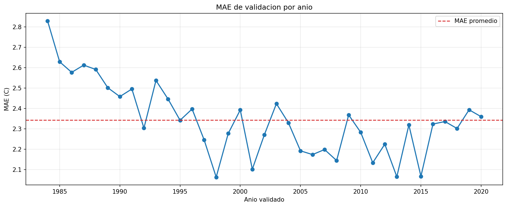

Lectura:

- Los primeros años tienen mayor error porque el entrenamiento dispone de menos historial.
- Entre 2000 y 2020 el MAE se estabiliza alrededor de `2.1-2.4 °C`.
- No se observa una caída fuerte al agregar más años, lo que sugiere que la limitación principal no es cantidad de datos históricos sino información predictiva faltante.

### MAE por temporada

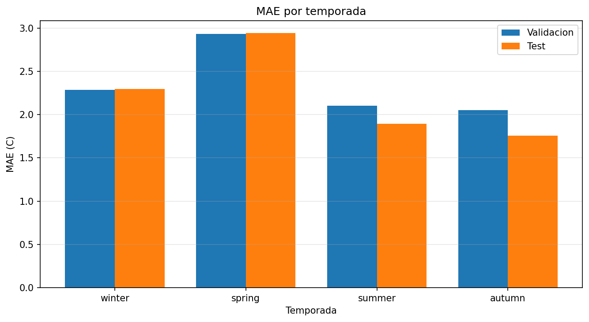

Lectura:

- Primavera es la estación más difícil, con MAE cercano a `2.94 °C` tanto en validación como en test.
- Verano y otoño tienen mejor desempeño, probablemente por regímenes térmicos más persistentes.
- Esta gráfica sugiere que los mayores errores vienen de cambios bruscos de masa de aire, no de estacionalidad básica.

### Test: real vs predicción

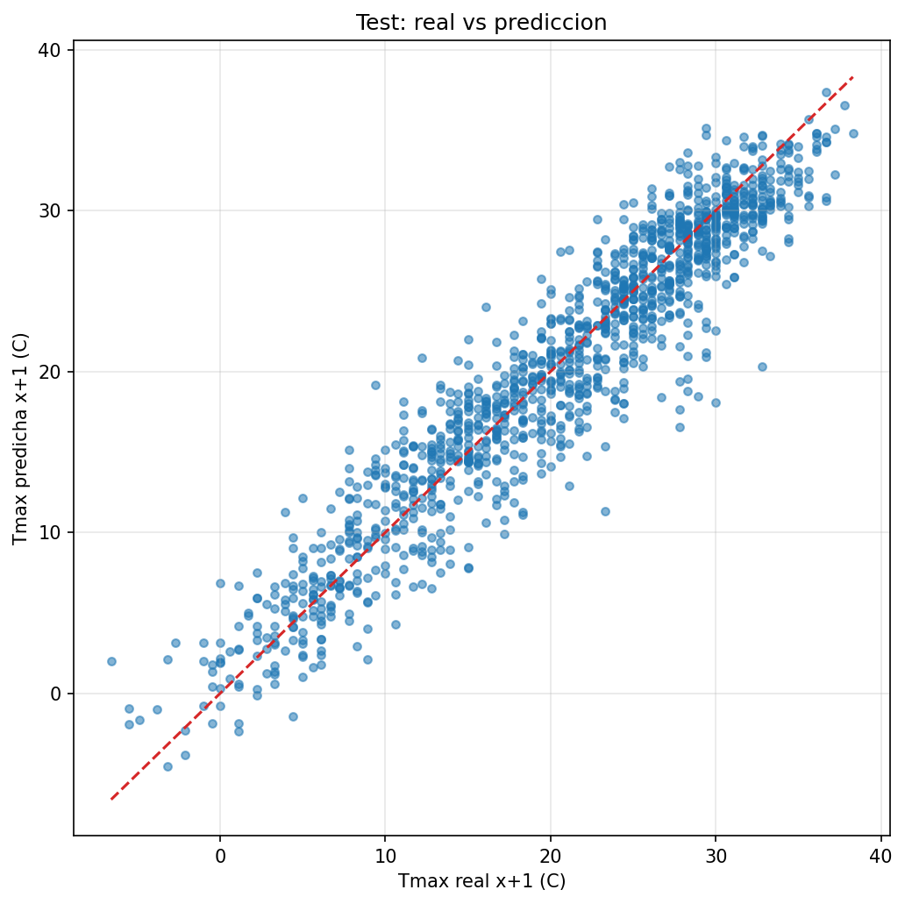

Lectura:

- El modelo captura la relación general entre temperatura real y predicha.
- Hay dispersión relevante alrededor de la diagonal.
- En extremos y cambios bruscos, el modelo tiende a suavizar la predicción hacia valores más medios.

### Test: serie temporal real vs predicha

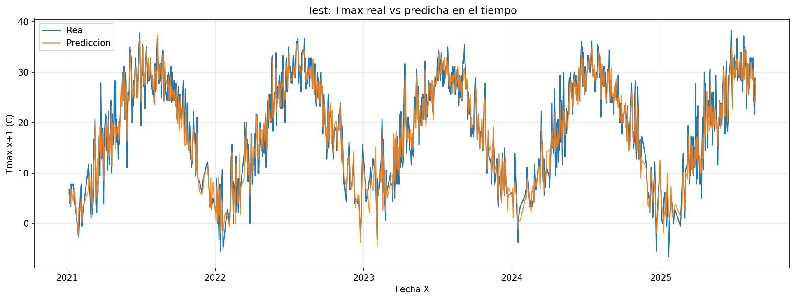

Lectura:

- El modelo sigue bien la estacionalidad anual.
- Los errores más visibles aparecen en picos o caídas rápidas.
- Esto refuerza la hipótesis de que faltan variables de forecast o información regional/upstream.

### Distribución de errores

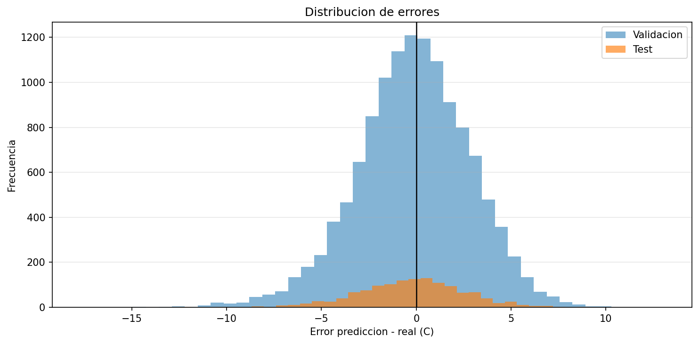

Lectura:

- La distribución está centrada cerca de cero, pero con colas largas.
- El MAE global queda penalizado por eventos extremos o transiciones rápidas.
- En test, el bias es `-0.2775 °C`, indicando una ligera tendencia a subestimar la Tmax de X+1.

</details>

<details open>
<summary><strong>Conclusiones técnicas</strong></summary>

1. **SPRINT 2 mejora la integridad del dataset**, especialmente al unificar fuentes alrededor de LaGuardia y respetar el corte as-of 23h.

2. **Agregar más features no produjo una mejora proporcional**, porque muchas features nuevas son transformaciones de la misma información térmica, estacional o local.

3. **El cuello de botella no parece ser el algoritmo**, sino la falta de información atmosférica predictiva sobre el día X+1.

4. **Primavera concentra el mayor error**, lo cual es consistente con cambios frontales y transiciones rápidas de masa de aire en New York.

5. **El objetivo de `0.2 °C MAE` no parece factible con este set de features no-forecast**. El resultado actual está en `2.2369 °C` de MAE en test, y los errores de cola superan `4.8 °C` en el percentil 90.

6. **Para una mejora sustancial, el siguiente sprint debería incorporar forecasting externo**, por ejemplo:

| Feature propuesta | Fuente | Motivo |
| ----------------- | ------ | ------ |
| `forecast_tmax_x+1` | NBM / HRRR / GFS / NWS / Open-Meteo forecast archive | Probablemente la feature más potente. |
| `forecast_anomaly_x+1` | Forecast externo + climatología LaGuardia | Captura qué tan extremo se espera el día siguiente. |
| `forecast_error_tmax_lag1` | Forecast histórico + observado GHCND | Corrige sesgo reciente del forecast externo. |
| `forecast_error_tmax_ma3` | Forecast histórico + observado GHCND | Detecta si el forecast viene subestimando/sobrestimando. |
| Variables regionales/upstream | JFK, Newark, Central Park, estaciones al oeste/noroeste | Ayudan a detectar advección y cambios de masa de aire. |

</details>

# Sprint 3-v0

<details open>
<summary><strong>Objetivo del sprint</strong></summary>

SPRINT 3-v0 parte de la conclusion de SPRINT 2: el modelo ya esta construido con fuentes consistentes de LaGuardia y respeta el corte **as-of 23h del dia X**, pero todavia le falta informacion sobre la dinamica atmosferica que conecta el cierre del dia X con la maxima de X+1.

El foco de este sprint es enriquecer `./src/moira/features/build_climate_data.py` sin cambiar la definicion del target:

- Mantener todas las features de SPRINT 2.
- Agregar senales intradia disponibles antes o exactamente a las 23h de X.
- Agregar memoria termica de dias completos ya cerrados, siempre hasta X-1.
- Agregar climatologia del dia siguiente calculada solo con registros historicos anteriores a X.
- Evitar forecast externo por ahora, salvo que exista una fuente de snapshots historicos emitidos antes de las 23h de X.

No se incorporaron forecasts externos en esta iteracion. Un forecast real puede ser muy potente, pero para entrenamiento historico debe venir de un archivo de pronosticos emitidos antes del cierre de X. Usar reanalysis, observaciones de X+1 o forecasts regenerados hoy para fechas pasadas introduciria leakage.

</details>

<details open>
<summary><strong>Features agregadas</strong></summary>

La nueva version conserva el esquema anterior y agrega **95 features**. En `train_mode` el output pasa a tener `133` keys incluyendo `t_max_x+1`; en `inference_mode` devuelve `132` keys y excluye el target.

| Grupo | Features agregadas | Fuente / calculo | Motivo esperado |
| ----- | ------------------ | ---------------- | --------------- |
| Temperatura puntual intradia | `Temp_23h_x`, `Temp_06h_x`, `Temp_12h_x`, `Temp_18h_x`, `Temp_21h_x` | ISD-Lite LaGuardia, observacion disponible a cada hora o la anterior dentro de tolerancia; nunca usa observaciones futuras. | Describe la trayectoria termica del dia X, no solo el maximo/minimo. Ayuda a distinguir dias que cierran enfriando fuerte de dias que mantienen masa calida. |
| Cambios termicos intradia | `Temp_change_23h_minus_18h`, `Temp_change_23h_minus_12h`, `Temp_change_23h_minus_06h`, `Temp_change_23h_1d` | Diferencias entre temperatura de 23h y puntos previos del dia X o 23h de X-1. | Captura enfriamiento nocturno, persistencia y cambio de masa de aire. |
| Estadistica termica del dia X | `Temp_std_00_23h_x`, `Temp_range_00_23h_x`, `Temp_mean_last_6h`, `Temp_min_last_6h`, `Temp_max_last_6h` | Agregados de `Temp_C` en ISD-Lite hasta 23h. | Resume volatilidad intradia y estado termico reciente antes del corte. |
| Tendencia termica reciente | `Temp_change_last_3h`, `Temp_change_last_6h`, `Temp_change_last_12h`, `Temp_slope_last_6h`, `Temp_slope_last_12h` | Cambios y pendientes lineales de observaciones horarias hasta 23h. | Da una senal directa de si la temperatura viene cayendo, subiendo o estabilizandose al cierre. |
| Punto de rocio intradia | `Td_mean_00_23h_x`, `Td_min_00_23h_x`, `Td_max_00_23h_x`, `Td_mean_last_6h`, `Td_change_last_6h` | ISD-Lite LaGuardia, usando `dew_point_temperature / 10`. | El punto de rocio aproxima contenido de humedad y masa de aire; suele anticipar noches calidas/frias y cambios frontales. |
| Humedad relativa intradia | `HR_mean_00_23h_x`, `HR_min_00_23h_x`, `HR_max_00_23h_x`, `HR_mean_last_6h`, `HR_change_last_6h` | Humedad calculada con formula Magnus desde temperatura y punto de rocio. | Complementa Td; ayuda a separar calor seco, aire maritimo humedo y enfriamiento radiativo. |
| Presion intradia | `SLP_mean_00_23h_x`, `SLP_min_00_23h_x`, `SLP_max_00_23h_x`, `SLP_change_last_3h`, `SLP_change_last_6h`, `SLP_change_last_12h` | ISD-Lite LaGuardia hasta 23h. | Cambios de presion son proxies de frentes, adveccion y transiciones sinopticas. |
| Viento intradia | `WindSpd_mean_00_23h_x`, `WindSpd_max_00_23h_x`, `WindSpd_mean_last_6h`, `WindSpd_change_last_6h` | ISD-Lite LaGuardia hasta 23h. | Viento fuerte o cambiante puede indicar mezcla, adveccion o paso frontal. |
| Nubosidad intradia | `Cloud_mean_00_23h_x`, `Cloud_max_00_23h_x`, `Cloud_mean_last_6h`, `Cloud_change_last_6h` | `sky_condition` de ISD-Lite convertido a porcentaje aproximado. | La nubosidad modula enfriamiento nocturno y calentamiento del dia siguiente. |
| Precipitacion reciente | `Precip_sum_last_6h`, `Precip_sum_last_12h`, `Precip_positive_hours_00_23h`, `Precip_positive_hours_last_6h`, `Precip_flag_00_23h` | `Precip_1h` de ISD-Lite; fallback local ya existente para acumulado diario. | Lluvia reciente sugiere nubosidad, humedad alta, evaporacion y cambios frontales. |
| Humedad fisica derivada | `Temp_dewpoint_spread_23h`, `Temp_dewpoint_spread_mean_00_23h`, `Vapor_pressure_23h` | Diferencia `Temp_C - Td` y presion de vapor aproximada desde Td. | Resume saturacion del aire y potencial de enfriamiento nocturno. |
| Climatologia del dia X ampliada | `climatology_tmax_std_doy`, `climatology_tmax_p10_doy`, `climatology_tmax_p90_doy` | GHCND LaGuardia, solo fechas anteriores a X. | Da al modelo escala de normalidad y extremos para el dia actual. |
| Climatologia del dia siguiente | `climatology_tmax_doy_plus1`, `climatology_tmax_std_doy_plus1`, `climatology_tmax_p10_doy_plus1`, `climatology_tmax_p90_doy_plus1`, `climatology_tmin_doy_plus1`, `climatology_tmean_doy_plus1` | GHCND LaGuardia para el dia del anio de X+1, filtrando `index < X`. | Es un prior fuerte para la Tmax de X+1 sin mirar el target real. |
| Delta climatologico hacia X+1 | `climatology_tmax_delta_doy_plus1_minus_x`, `tmax_anomaly_vs_doy_plus1` | Diferencia entre climatologia de X+1 y X, y anomalia de `Tmax_so_far_23h_x` contra la climatologia de X+1. | Ayuda durante transiciones estacionales, donde la normal climatologica cambia dia a dia. |
| Lags diarios completados | `tmax_lag1`, `tmin_lag2`, `tmin_lag3`, `tmin_lag7`, `tmean_lag1`, `tmean_lag2`, `tmean_lag3`, `dtr_lag1` | GHCND LaGuardia, solo dias completos hasta X-1. | Refuerza persistencia termica y amplitud diaria reciente. |
| Rolling windows diarios | `tmax_ma3_completed`, `tmax_ma7_completed`, `tmax_ma14_completed`, `tmax_std7_completed`, `tmax_min7_completed`, `tmax_max7_completed`, `tmin_ma3_completed`, `tmin_ma7_completed`, `tmean_ma3_completed`, `tmean_ma14_completed`, `tmean_std7_completed`, `dtr_ma7_completed` | Ventanas de dias completos, siempre terminando en X-1. | Captura regimen reciente y volatilidad, evitando mezclar la observacion parcial de X con dias oficiales completos. |
| Cambios y rachas diarias | `tmax_change_1d_completed`, `tmax_change_3d_completed`, `tmax_recent_warming_streak`, `tmax_recent_cooling_streak` | GHCND LaGuardia hasta X-1. | Identifica calentamientos/enfriamientos persistentes que un promedio simple suaviza. |
| Estado 23h multidia | `Temp_23h_ma3`, `Temp_23h_trend_3d`, `HR_23h_ma3`, `WindSpd_23h_ma3` | Tabla diaria 23h construida desde ISD-Lite para X-2, X-1, X. | Resume persistencia nocturna y condiciones de cierre en varios dias. |
| Estacionalidad adicional | `month_sin`, `month_cos`, `daylight_hours_x`, `daylight_hours_plus1`, `daylight_delta_plus1_minus_x` | Calculo deterministico desde fecha y latitud de New York. | Daylength aporta una senal fisica suave de radiacion disponible, distinta de `doy_sin/cos`. |

</details>

<details open>
<summary><strong>Cambios en build_climate_data.py</strong></summary>

Archivo modificado:

```text
./src/moira/features/build_climate_data.py
```

Cambios principales:

1. Se mantiene el contrato `train_mode` / `inference_mode`.
   - `train_mode` devuelve todas las features y el target oficial `t_max_x+1`.
   - `inference_mode` devuelve las mismas features disponibles al cierre de X, sin `t_max_x+1`.

2. Se agrego `Temp_23h` a la tabla diaria 23h interna de ISD-Lite.
   - `_build_23h_daily_from_hourly(...)` ahora devuelve `Temp_23h`, `HR_23h`, `Td_23h`, `SLP_23h`, `WindSpd_23h`, `WindDir_23h`, `Cloud_23h`.
   - Se incremento la version del cache `ISD_DAILY_23H_CACHE_VERSION = 2` para no reutilizar pickles antiguos sin la nueva columna.

3. Se agregaron helpers genericos para evitar duplicacion:
   - `_stat_if_enough(...)`
   - `_completed_daily_values(...)`
   - `_rows_within_last_hours(...)`
   - `_stat_from_rows(...)`
   - `_change_from_rows(...)`
   - `_slope_from_rows(...)`
   - `_value_at_or_before(...)`
   - `_precip_sum_from_rows(...)`
   - `_positive_precip_hours(...)`
   - `_vapor_pressure_hpa(...)`
   - `_daylight_hours(...)`
   - `_recent_directional_streak(...)`

4. La climatologia ahora devuelve tambien `median`, `std` e `iqr`, ademas de `mean`, `p10`, `p90` y `n`.

5. Todas las features nuevas respetan el corte temporal:
   - ISD-Lite se filtra hasta `execution_dt = X 23:00`.
   - Las lecturas por hora usan `_value_at_or_before(...)`, que solo mira hacia atras.
   - Las ventanas intradia usan observaciones `<= 23h`.
   - Los rolling windows diarios usan GHCND hasta X-1.
   - La climatologia de X+1 usa `available_until_ts=target_ts`, por lo que filtra historico con `index < X`.

6. `strict=True` sigue descartando filas sin features base necesarias, pero permite faltantes puntuales en senales intradia granulares por huecos horarios de ISD-Lite. Las keys existen siempre; el pipeline de entrenamiento puede imputar esos valores.

</details>

<details open>
<summary><strong>Cambios en test.py</strong></summary>

Archivo modificado:

```text
./tests/contract/test_feature_contract.py
```

Cambios principales:

- El modulo por defecto ahora es `moira.features.build_climate_data`, pero mantiene fallback para importar `build_climate_data`.
- Se agregaron parametros del contrato nuevo:

```text
--mode
--include-target
--history-start
--execution-hour
--nearest-tolerance-hours
--min-climatology-records
--climatology-window-days
--compute-td-anomaly
--run-inference-leakage-check
--inference-check-samples
```

- El tester ahora pasa kwargs dinamicamente segun la firma real de `get_weather_features`.
- Se agrego una auditoria de leakage: ejecuta una muestra en `inference_mode` con `include_target=False` y falla si aparece `t_max_x+1`.
- El resumen JSON registra los parametros efectivos usados para construir las features.

Comando recomendado para Sprint 3-v0:

```bash
PYTHONPATH=src python3 -m tests.contract.test_feature_contract \
  --module moira.features.build_climate_data \
  --function get_weather_features \
  --city "new york" \
  --start 1983-01-01 \
  --end 2025-12-31 \
  --n-samples 1000 \
  --strict true \
  --mode train_mode \
  --nearest-tolerance-hours 6 \
  --history-start 1980-01-01 \
  --out-dir ./reports/contract-tests/sprint3-v0/feature_contract_test
```

</details>

<details open>
<summary><strong>Dependencias</strong></summary>

SPRINT 3-v0 no introduce dependencias nuevas. Las features agregadas usan el stack ya presente en el proyecto:

```text
requests
pandas
numpy
```

Para entrenamiento se sigue necesitando `scikit-learn`, como en SPRINT 2. El intento de instalarlo en el entorno actual con `python3 -m pip install scikit-learn --user` fue bloqueado por la politica PEP 668 del sistema (`externally-managed-environment`). La forma recomendada es usar un virtualenv del proyecto o instalar desde el gestor del sistema.

</details>

<details>
<summary><strong>Problemas identificados</strong></summary>

Esta seccion resume riesgos detectados en la integracion entre `src/moira/features/build_climate_data.py` (feature builder), `src/moira/data/miner.py` (generacion de dataset) y `tests/contract/test_feature_contract.py` (contrato y auditoria).

| Riesgo | Modulos | Sintoma | Impacto | Prob. | Sev. | Mitigacion recomendada | Cobertura build | Evidencia / Nota |
| --- | --- | --- | --- | --- | --- | --- | --- | --- |
| Defaults desalineados de `nearest_tolerance_hours` | build_climate_data + miner + test | Resultados no reproducibles si no se pasa el flag explicitamente | Cambia cobertura de features (especialmente as-of 23h) y tasa de filas vacias | Alta | Alta | Pasar siempre `--nearest-tolerance-hours` en `miner.py` y `test.py` y documentar un unico valor recomendado (actual: `6`) | [x] | Cubierto en builder: `DEFAULT_NEAREST_TOLERANCE_HOURS = 6` para preload + feature builder. |
| Retorno `{}` con `strict=True` induce sesgo de muestreo | build_climate_data + miner + test | `get_weather_features()` retorna `{}` cuando faltan inputs criticos (ej: `Cloud_23h_x`) | `miner.py` termina excluyendo fechas no aleatorias; el dataset queda sesgado hacia dias con mejor cobertura; `test.py` puede fallar por `empty_ratio` | Media | Alta | Persistir y analizar `failed_rows` como parte del pipeline; decidir politica (reintentos, tolerancias, o `strict` diferenciado train vs inference) | [x] | Mitigado en builder: `Cloud_23h_x` y otros faltantes puntuales pasan a imputacion; en muestra 120: `empty_returns=0`. |
| Doble fuente de verdad del contrato 133/132 | test + build_climate_data | `test.py` valida cantidad/keys esperadas pero el builder no expone un contrato unico reutilizable | Cambios de features pueden romper tests o, peor, pasar con drift silencioso si se ajusta solo el test | Media | Media | Mantener el contrato documentado y cambiarlo de forma coordinada (builder + test + miner); idealmente derivar expected keys desde el builder | [x] | Cubierto en builder y test: `test.py` consume `FEATURE_COUNT_*`, `FEATURE_TARGET_KEY`, `FEATURE_ALLOWED_*` con fallback para modulos genericos. |
| Inconsistencia de formato de fecha (`date_str`) | build_climate_data + miner + test | El builder espera `%d-%m-%y`; ejecuciones directas con ISO fallan o generan fechas incorrectas | Errores de ejecucion o mineria con fechas desplazadas | Media | Media | Estandarizar input a ISO en CLI (`miner.py`/`test.py`) y convertir en un solo lugar; documentar formato aceptado para llamadas directas | [x] | Cubierto en builder: parseo dual `%d-%m-%y` y `%Y-%m-%d`. |
| Ciudad soportada efectivamente solo `new york` | build_climate_data + miner + test | `CITY_COORDS` expone varias ciudades pero el builder hard-fail fuera de `new york` | Confusion operativa: `miner.py`/`test.py` aceptan `--city` pero el builder no soporta varias estaciones | Alta | Media | Documentar explicitamente la limitacion actual y/o validar antes en CLI para fallar con mensaje claro | [x] | Cubierto en builder: `SUPPORTED_CITIES={"new york"}` y validacion explicita en ambos entrypoints. |
| `miner.py` depende del modo de ejecucion para imports | miner + build_climate_data | Ejecutar `PYTHONPATH=src python -m moira.data.miner ...` evita fallos de import y reduce dependencia de cwd | Friccion para reproducir dataset, especialmente en entornos limpios | Media | Baja | Recomendar `PYTHONPATH=src python -m moira.data.miner ...` desde la raiz del repo | [x] | Cubierto en `miner.py`: se agrega fallback de `sys.path` para incluir `src` y raiz del repo. |
| Cache local afecta reproducibilidad y el git status | build_climate_data + miner + test | `.weather_cache/` puede cambiar entre corridas; accidentalmente se versionan borrados/cambios | Dificulta comparar resultados y contamina diffs/PRs | Media | Media | Mantener `.weather_cache/` ignorado y controlar ubicacion via `WEATHER_CACHE_DIR` o deshabilitar con `WEATHER_DISABLE_DISK_CACHE=1` | [ ] | No cubierto en este ciclo: riesgo operativo/documental, no de logica principal del builder. |
| Fallback de precipitacion puede sobrecontar (1h vs 6h) | build_climate_data + miner | Si se suman ventanas de 6h sin garantizar no solapamiento, `Precip_*` puede inflarse | Ruido sistematico en feature de precip; afecta entrenamiento | Baja | Media | Definir una unica estrategia (preferir 1h con umbral; si no, 6h sin sumar solapes) y cubrir con un test de consistencia | [x] | Cubierto en builder: fallback `Precip_6h` usa ultimo valor valido en vez de suma. |

</details>

<details open>
<summary><strong>Ultimos cambios aplicados (build_climate_data)</strong></summary>

Archivo modificado:

```text
./src/moira/features/build_climate_data.py
```

Cambios implementados:

1. Se unifico la tolerancia por defecto con `DEFAULT_NEAREST_TOLERANCE_HOURS = 6` para `preload_weather_cache(...)` y `get_weather_features(...)`.

2. Se dejo soporte explicito solo para New York:
   - `SUPPORTED_CITIES = {"new york"}`
   - `CITY_COORDS` ahora expone solo `new york`
   - ambos entrypoints validan contra `SUPPORTED_CITIES`.

3. Se agrego parseo dual de fecha en `get_weather_features(...)`:
   - formato historico `%d-%m-%y`
   - formato ISO `%Y-%m-%d`

4. Se corrigio la estrategia de precipitacion en fallback `Precip_6h`:
   - antes: suma de todos los `Precip_6h` del periodo
   - ahora: ultimo `Precip_6h` valido (evita sobreconteo por ventanas solapadas)

5. Se agrego contrato interno versionado del builder:
   - `FEATURE_CONTRACT_VERSION = "sprint3_v0"`
   - conteo esperado: 133 (`train_mode`) y 132 (`inference_mode`)
   - validacion interna de presencia/ausencia de `t_max_x+1` segun modo

6. Se movio la politica de faltantes a constantes y se permitio imputacion de faltantes puntuales (incluyendo `Cloud_23h_x`) para reducir descartes no necesarios en `strict=True`.

Validacion ejecutada despues de los cambios:

```bash
python -m py_compile src/moira/features/build_climate_data.py

PYTHONPATH=src python -m tests.contract.test_feature_contract \
  --module moira.features.build_climate_data \
  --function get_weather_features \
  --city "new york" \
  --start 1983-01-01 \
  --end 2025-12-31 \
  --n-samples 120 \
  --strict true \
  --mode train_mode \
  --nearest-tolerance-hours 6 \
  --history-start 1980-01-01 \
  --out-dir ./reports/contract-tests/sprint3-v0/fix_validation_train_v2

PYTHONPATH=src python -m tests.contract.test_feature_contract \
  --module moira.features.build_climate_data \
  --function get_weather_features \
  --city "new york" \
  --start 1983-01-01 \
  --end 2025-12-31 \
  --n-samples 120 \
  --strict true \
  --mode inference_mode \
  --include-target false \
  --nearest-tolerance-hours 6 \
  --history-start 1980-01-01 \
  --out-dir ./reports/contract-tests/sprint3-v0/fix_validation_inference_v2
```

Resultados observados:

- `ok_returns=120` y `empty_returns=0` en train e inference para la muestra de 120 fechas.
- `feature_union_count=133` en `train_mode` y `feature_union_count=132` en `inference_mode`.
- `target_like_key_count=0` en inferencia (sin leakage del target).
- En `tests/contract/test_feature_contract.py` ya no persisten `strict_contract_failure_count` por desalineacion de nulls permitidos; ahora sincroniza contrato desde el builder con fallback seguro.

</details>


<details open>
<summary><strong>Ultimos cambios aplicados (test + miner)</strong></summary>

Archivos modificados:

```text
./tests/contract/test_feature_contract.py
./src/moira/data/miner.py
```

Cambios implementados en `tests/contract/test_feature_contract.py`:

1. `load_function(...)` ahora retorna modulo y funcion para resolver contrato exportado.
2. Se agrego `resolve_contract_config(...)` con prioridad: CLI explicito > constantes `FEATURE_*` del modulo > fallback local.
3. Se reemplazo hardcode de target en leakage/paridad por `FEATURE_TARGET_KEY` efectivo.
4. Se sincronizo validacion estricta de nulls permitidos y no numericos permitidos con `FEATURE_ALLOWED_MISSING` y `FEATURE_ALLOWED_NON_NUMERIC`.
5. Se sincronizaron conteos esperados por modo con `FEATURE_COUNT_TRAIN_MODE` / `FEATURE_COUNT_INFERENCE_MODE`.
6. El `summary` ahora reporta `contract_source`, `contract_version`, `contract_target_key` y politica efectiva.

Cambios implementados en `src/moira/data/miner.py`:

1. Import robusto (`import_weather_module(..., script_file=__file__)`) con insercion defensiva de rutas para soportar `PYTHONPATH=src python -m moira.data.miner ...`.
2. `--dry-run true` ahora evita side effects (sin backups, sin preload y sin escrituras); opcion `--dry-run-probe` para smoke controlado.
3. Validacion temprana de ciudad con `SUPPORTED_CITIES` cuando el modulo la exporta.
4. Metadata enriquecida con contrato y cache (`builder_metadata`, `cache_info_after`, firma y kwargs efectivos).
5. `failed_rows` enriquecido con contexto temporal y operativo (`run_id`, year/month/day, `temporal_bucket`, `contract_version`, etc.).
6. Summary final de miner agrega ratios y agregados de fallos por tiempo.

Validacion ejecutada:

```bash
python -m py_compile tests/contract/test_feature_contract.py src/moira/data/miner.py src/moira/features/build_climate_data.py

PYTHONPATH=src python -m tests.contract.test_feature_contract \
  --module moira.features.build_climate_data \
  --function get_weather_features \
  --city "new york" \
  --start 1983-01-01 \
  --end 2025-12-31 \
  --n-samples 120 \
  --strict true \
  --mode train_mode \
  --nearest-tolerance-hours 6 \
  --history-start 1980-01-01 \
  --out-dir ./reports/contract-tests/sprint3-v0/test_miner_fix_train

PYTHONPATH=src python -m tests.contract.test_feature_contract \
  --module moira.features.build_climate_data \
  --function get_weather_features \
  --city "new york" \
  --start 1983-01-01 \
  --end 2025-12-31 \
  --n-samples 120 \
  --strict true \
  --mode inference_mode \
  --include-target false \
  --nearest-tolerance-hours 6 \
  --history-start 1980-01-01 \
  --out-dir ./reports/contract-tests/sprint3-v0/test_miner_fix_inference

PYTHONPATH=src python -m moira.data.miner \
  --module moira.features.build_climate_data \
  --city "new york" \
  --start 1983-01-01 \
  --end 1983-01-10 \
  --history-start 1980-01-01 \
  --dry-run true \
  --limit 5

PYTHONPATH=src python -m moira.data.miner \
  --module moira.features.build_climate_data \
  --city "new york" \
  --start 1983-01-01 \
  --end 1983-01-10 \
  --history-start 1980-01-01 \
  --dry-run true \
  --limit 5

PYTHONPATH=src python -m moira.data.miner \
  --module moira.features.build_climate_data \
  --city "new york" \
  --start 1983-01-01 \
  --end 1983-01-10 \
  --history-start 1980-01-01 \
  --output ./reports/contract-tests/sprint3-v0/miner_fix/dataset.csv \
  --failed-output ./reports/contract-tests/sprint3-v0/miner_fix/failed_rows.csv \
  --metadata-output ./reports/contract-tests/sprint3-v0/miner_fix/metadata.json \
  --strict true \
  --preload true \
  --nearest-tolerance-hours 6 \
  --include-target true \
  --skip-existing false
```

Resultados observados:

- `tests/contract/test_feature_contract.py` train: `ok_returns=120`, `empty_returns=0`, `feature_union_count=133`, `strict_contract_failure_count=0`.
- `tests/contract/test_feature_contract.py` inference: `ok_returns=120`, `empty_returns=0`, `feature_union_count=132`, `target_like_key_count=0`, `strict_contract_failure_count=0`.
- `PYTHONPATH=src python -m moira.data.miner --dry-run true` ejecuta sin errores de import y sin side effects.
- Corrida corta real de `miner`: `processed=10`, `ok_new_records=10`, `errors_total=0`, `schema_mismatch_count=0`.

</details>


<details open>
<summary><strong>Resumen generacion dataset Sprint 3 (1980-2026)</strong></summary>

Objetivo de corrida:

- Generar un dataset supervisado para entrenamiento de ML con target `t_max_x+1`.
- Rango solicitado: `1980-01-01` a `2026-05-21` para ciudad `new york`.
- Ejecucion con cache limpia dedicada en `data/external/weather_cache_sprint3_1980_20260521`.

Comando ejecutado:

```bash
PYTHONPATH=src python -m moira.data.miner \
  --module moira.features.build_climate_data \
  --function get_weather_features \
  --city "new york" \
  --start 1980-01-01 \
  --end 2026-05-21 \
  --history-start 1980-01-01 \
  --date-format "%d-%m-%y" \
  --output ./data/processed/sprint3.csv \
  --failed-output ./data/processed/sprint3_failed_rows.csv \
  --metadata-output ./data/processed/sprint3_metadata.json \
  --backup-dir ./data/processed/backups \
  --strict false \
  --preload true \
  --skip-existing true \
  --save-every 500 \
  --max-retries 3 \
  --backoff-base-sec 2 \
  --backoff-jitter-sec 1 \
  --execution-hour 23 \
  --nearest-tolerance-hours 6 \
  --climatology-window-days 7 \
  --min-climatology-records 30 \
  --compute-td-anomaly true \
  --include-target true \
  --allow-schema-variance false
```

Artefactos generados:

```text
./data/processed/sprint3.csv
./data/processed/sprint3_failed_rows.csv
./data/processed/sprint3_metadata.json
./data/processed/sprint3_audit.json
```

Resultados principales:

- Dias esperados en rango: `16943`.
- Filas validas generadas: `16806`.
- Cobertura total: `99.19%` (`16806 / 16943`).
- Errores totales: `137` (todos en 2026, `OTHER_ERROR: 'datetime_local'`).
- Esquema: `1` variante, `schema_mismatch_count=0`.
- Target `t_max_x+1`: `target_null_rate=0.0`.
- Duplicados por fecha: `0`.
- Missingness promedio de features: `~1.12%`.

Auditoria de utilidad para entrenamiento (escala 1-10):

- Nota final: **`9.88 / 10`**.
- Desglose:
  - Cobertura (30%): `9.60`
  - Target y nulos (25%): `10.00`
  - Estabilidad de esquema (20%): `10.00`
  - Validez temporal (15%): `10.00`
  - Plausibilidad fisica (10%): `10.00`

</details>


<details open>
<summary><strong>Configuracion de entrenamiento</strong></summary>

Script ejecutado:

```text
./experiments/v0-sprint3/train_1.0/main.py
```

Comando:

```bash
python ./experiments/v0-sprint3/train_1.0/main.py
```

Dataset utilizado:

```text
./data/processed/sprint3.csv
```

Split temporal:

- Train/validation: `1980-2020`.
- Test final: `2021+`.
- Regla de validacion: expanding-window backtest (walk-forward por anio).

Esquema de validacion:

```text
train: 1980              -> validation: 1981
train: 1980-1981         -> validation: 1982
train: 1980-1982         -> validation: 1983
...
train: 1980-2019         -> validation: 2020
test final: 2021-2026
```

Modelos comparados:

- `hist_gbr`
- `lightgbm`
- `xgboost`
- `elasticnet`
- `ridge`
- `gbr`
- `mlp`
- `extra_trees`
- `random_forest`

Criterio de seleccion: menor `MAE` global en validacion temporal.

</details>

<details open>
<summary><strong>Artefactos generados</strong></summary>

```text
./experiments/v0-sprint3/train_1.0/report.json
./experiments/v0-sprint3/train_1.0/model_comparison.csv
./experiments/v0-sprint3/train_1.0/validation_predictions.csv
./experiments/v0-sprint3/train_1.0/test_predictions.csv
./experiments/v0-sprint3/train_1.0/models/best_model.joblib
./experiments/v0-sprint3/train_1.0/plots/model_comparison_mae.png
./experiments/v0-sprint3/train_1.0/plots/validation_mae_by_year.png
./experiments/v0-sprint3/train_1.0/plots/test_mae_by_year.png
./experiments/v0-sprint3/train_1.0/plots/mae_by_season.png
./experiments/v0-sprint3/train_1.0/plots/test_actual_vs_predicted.png
./experiments/v0-sprint3/train_1.0/plots/test_timeseries_actual_vs_predicted.png
./experiments/v0-sprint3/train_1.0/plots/error_distribution.png
```

</details>

<details open>
<summary><strong>Resultados principales</strong></summary>

Modelo ganador por validacion:

- `hist_gbr` (`HistGradientBoostingRegressor`).

Ranking por MAE de validacion (menor es mejor):

| Modelo | MAE validacion (°C) | MAE test (°C) |
| ------ | ------------------: | ------------: |
| `hist_gbr` | `2.1882` | `2.4281` |
| `lightgbm` | `2.1906` | `2.4468` |
| `xgboost` | `2.2016` | `2.4188` |
| `elasticnet` | `2.2148` | `2.3599` |
| `ridge` | `2.2165` | `2.3903` |
| `gbr` | `2.2337` | `2.4576` |
| `mlp` | `2.2461` | `2.2777` |
| `extra_trees` | `2.2933` | `2.5013` |
| `random_forest` | `2.3058` | `2.5049` |

Metricas globales del ganador:

| Split | N | MAE (°C) | RMSE (°C) | Median AE (°C) | P90 AE (°C) | Bias (°C) | R² |
| ----- | -: | -------: | --------: | -------------: | ----------: | --------: | -: |
| Validacion walk-forward | `14610` | `2.1882` | `2.8189` | `1.7716` | `4.5758` | `-0.1454` | `0.9224` |
| Test 2021+ | `1830` | `2.4281` | `3.3726` | `1.8123` | `5.1579` | `-0.1139` | `0.8821` |

MAE test por anio:

| Anio | N | MAE (°C) |
| ---: | -: | -------: |
| `2021` | `365` | `2.1144` |
| `2022` | `365` | `2.0341` |
| `2023` | `365` | `2.0368` |
| `2024` | `366` | `2.0633` |
| `2025` | `365` | `3.7638` |
| `2026` | `4` | `14.2241` |

MAE por temporada (ganador):

| Temporada | Validacion MAE (°C) | Test MAE (°C) |
| --------- | ------------------: | ------------: |
| `winter` | `2.0956` | `2.6992` |
| `spring` | `2.7468` | `2.7301` |
| `summer` | `2.0230` | `1.8809` |
| `autumn` | `1.8825` | `2.4050` |

Baselines simples en test:

| Baseline | MAE (°C) |
| -------- | -------: |
| `Tmax_so_far_23h_x` | `3.2402` |
| `MA_Tmax_3d_asof_23h` | `3.5876` |
| `climatology_tmax_doy` | `3.4895` |
| `tmean_ma7` | `4.8754` |

Lectura rapida:

- El ganador mejora de forma clara a todos los baselines simples.
- `lightgbm` y `xgboost` quedaron muy cerca del ganador en validacion, pero sin superarlo.
- `mlp` logra el mejor MAE en test (`2.2777`) sin ser ganador por criterio de validacion.
- En test aparece degradacion fuerte en `2025` y extrema en `2026` por cobertura parcial (solo 4 filas de 2026).

</details>

<details open>
<summary><strong>Graficos generados</strong></summary>

### Comparacion de modelos por MAE

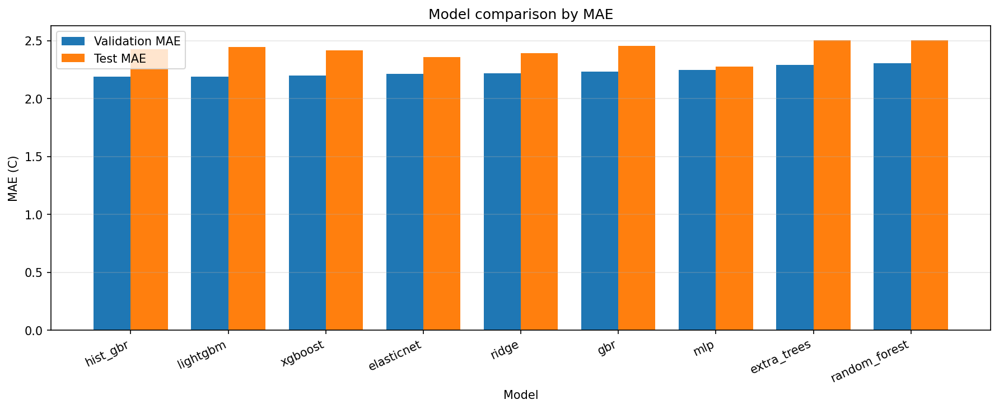

### MAE de validacion por anio

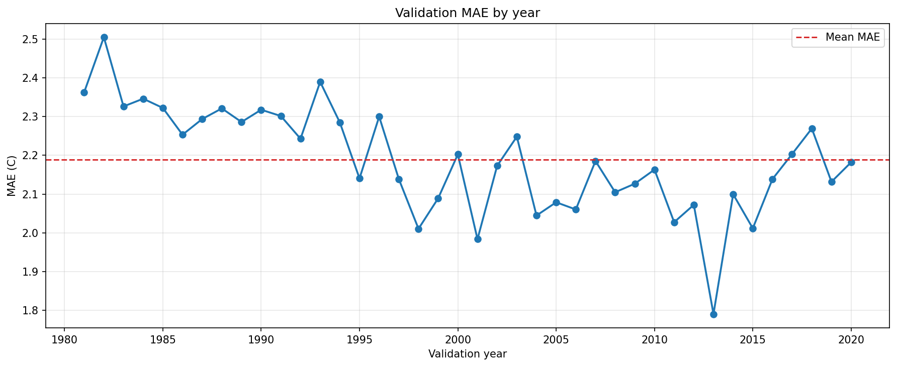

### MAE test por anio

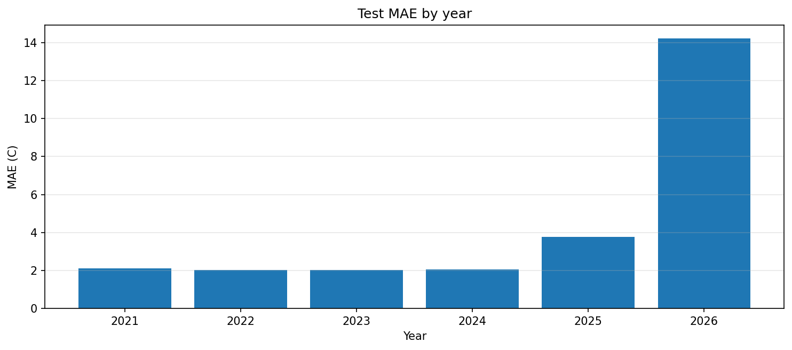

### MAE por temporada

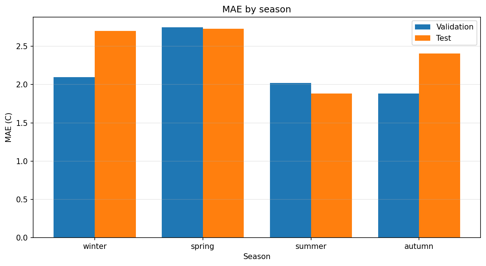

### Test: real vs prediccion

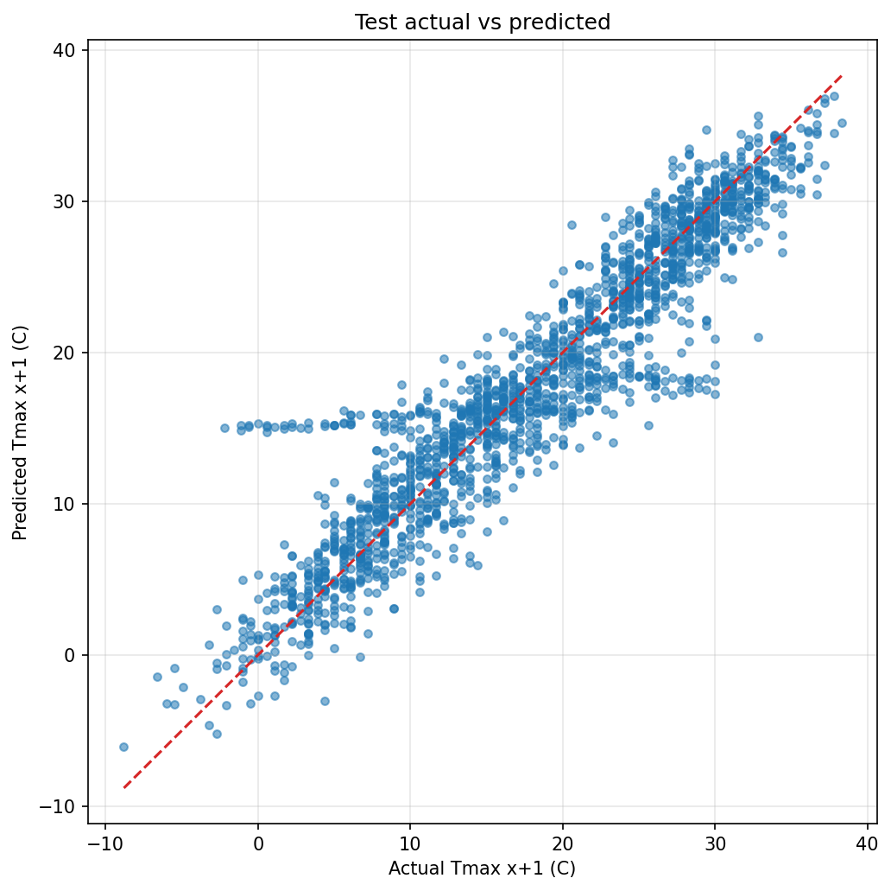

### Test: serie temporal real vs predicha

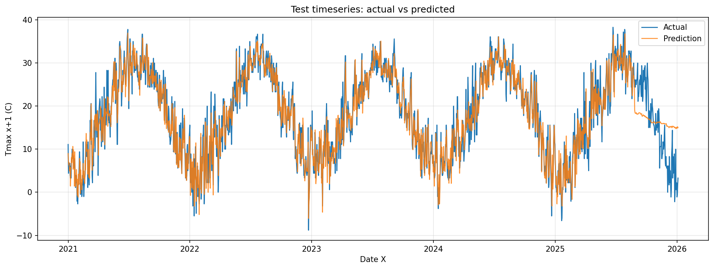

### Distribucion de errores

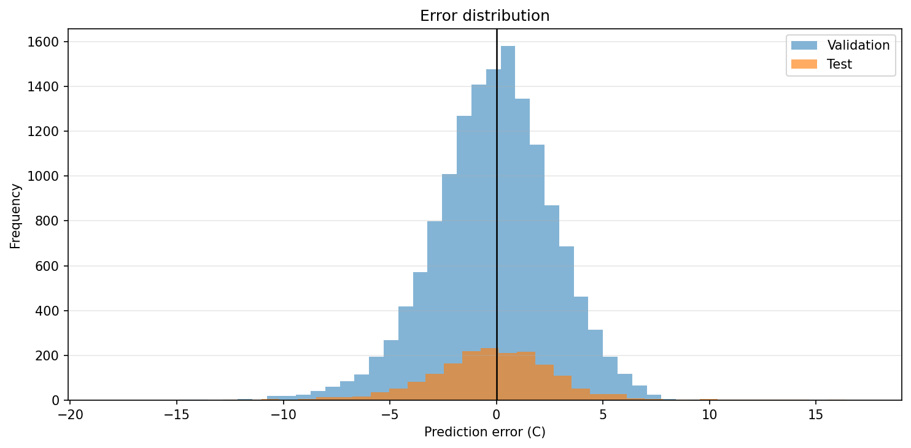

</details>

<details open>
<summary><strong>Notas tecnicas y limitaciones</strong></summary>

- El criterio de seleccion fue estrictamente `MAE` de validacion temporal para evitar sesgo por test.
- El test incluye `2026`, pero con solo `4` filas disponibles debido a faltantes del dataset Sprint 3.
- Los warnings de imputacion en folds tempranos son esperables: algunas features climatologicas no tienen observaciones suficientes al inicio del historial.
- Se mantuvieron controles anti-leakage: split temporal estricto, transforms ajustadas por fold y exclusion de `date`, `date_str`, `year` y target en features.

</details>


# Sprint 4 - V0: Estudio de utilidad predictiva de features

Se analizo `data/processed/sprint3.csv` con foco en explicar por que el rendimiento fuera de muestra no siempre cumple expectativas.

Metodologia:

- Split del estudio: train `1980-2020`, evaluacion externa `2021-2025`, y nota separada para 2026.
- Ranking por `utility_score` compuesto (correlaciones, mutual information, importancia por permutacion, estabilidad temporal y penalizaciones por missingness, redundancia y drift).
- Criterio principal: utilidad predictiva practica sobre modelo, no solo correlacion lineal.

Top 10 features mas utiles:

| Rank | Feature | Utility score | Abs Pearson | Abs Spearman | Mutual Info | Drift KS |
| ---: | ------- | ------------: | ----------: | -----------: | ----------: | -------: |
| 1 | `Temp_23h_x` | `0.8288` | `0.9446` | `0.9441` | `1.1139` | `0.0456` |
| 2 | `Temp_min_last_6h` | `0.7443` | `0.9433` | `0.9430` | `1.1010` | `0.0455` |
| 3 | `Temp_mean_last_6h` | `0.6604` | `0.9388` | `0.9387` | `1.0447` | `0.0462` |
| 4 | `Temp_21h_x` | `0.6543` | `0.9370` | `0.9368` | `1.0169` | `0.0443` |
| 5 | `Temp_max_last_6h` | `0.6392` | `0.9309` | `0.9311` | `0.9713` | `0.0470` |
| 6 | `Temp_18h_x` | `0.6312` | `0.9276` | `0.9279` | `0.9390` | `0.0452` |
| 7 | `Tmean_so_far_23h_x` | `0.6189` | `0.9191` | `0.9217` | `0.9064` | `0.0451` |
| 8 | `Tmax_so_far_23h_x` | `0.6101` | `0.9136` | `0.9159` | `0.8782` | `0.0426` |
| 9 | `Tmin_so_far_23h_x` | `0.6055` | `0.9101` | `0.9129` | `0.8764` | `0.0478` |
| 10 | `Temp_23h_ma3` | `0.6042` | `0.9146` | `0.9164` | `0.8627` | `0.0502` |

Top 10 features menos utiles:

| Rank | Feature | Utility score | Missing rate | Redundancy max corr | Drift KS |
| ---: | ------- | ------------: | -----------: | ------------------: | -------: |
| 1 | `Cloud_mean_last_6h` | `-0.0183` | `0.0009` | `0.8835` | `0.1324` |
| 2 | `extreme_heat_flag` | `-0.0193` | `0.0489` | `0.6317` | `0.0020` |
| 3 | `extreme_cold_flag` | `-0.0231` | `0.0489` | `0.5474` | `0.0352` |
| 4 | `HR_min_00_23h_x` | `-0.0233` | `0.0000` | `0.9011` | `0.1336` |
| 5 | `Temp_dewpoint_spread_23h` | `-0.0240` | `0.0003` | `0.9792` | `0.1147` |
| 6 | `Temp_dewpoint_spread_mean_00_23h` | `-0.0500` | `0.0000` | `0.9750` | `0.1422` |
| 7 | `tmax_anomaly_x` | `-0.0600` | `0.0489` | `0.9991` | `0.0549` |
| 8 | `tmax_anomaly_vs_doy_plus1` | `-0.0620` | `0.0489` | `0.9991` | `0.0538` |
| 9 | `climatology_tmax_delta_doy_plus1_minus_x` | `-0.0680` | `0.0489` | `0.7355` | `0.0636` |
| 10 | `Cloud_23h_x` | `-0.1967` | `0.0524` | `0.8835` | `0.1557` |

Conclusiones para entender la brecha de rendimiento:

- El top 10 esta dominado por temperatura instantanea y ventanas cortas (`Temp_*`, `T*_so_far`), lo que confirma que el modelo depende fuerte de persistencia termica de corto plazo.
- Varias features debiles no son "inutiles" por falta total de senal, sino por **alta redundancia** (correlacion alta con pares fuertes) y **drift temporal** entre train (`1980-2020`) y evaluacion externa (`2021-2025`).
- Features de anomalia/climatologia (`tmax_anomaly_*`) aparecen penalizadas por redundancia extrema, sugiriendo que su implementacion actual no esta agregando informacion independiente suficiente.
- Parte del gap esperado vs observado puede explicarse por cambio de distribucion en variables de nubosidad/humedad y por sobredependencia en senales de temperatura muy correlacionadas.

Recomendaciones directas hacia Sprint 4 - V0:

1. Reducir colinealidad: conservar 1-2 representantes por grupo termico altamente redundante.
2. Replantear features de anomalia/climatologia para que aporten senal no redundante.
3. Crear features de cambio de regimen (frentes, cambios bruscos de presion/humedad, interacciones) para mejorar robustez fuera de muestra.
4. Revalidar modelo con set podado por utilidad y test temporal estricto para medir mejora real.

Graficos:

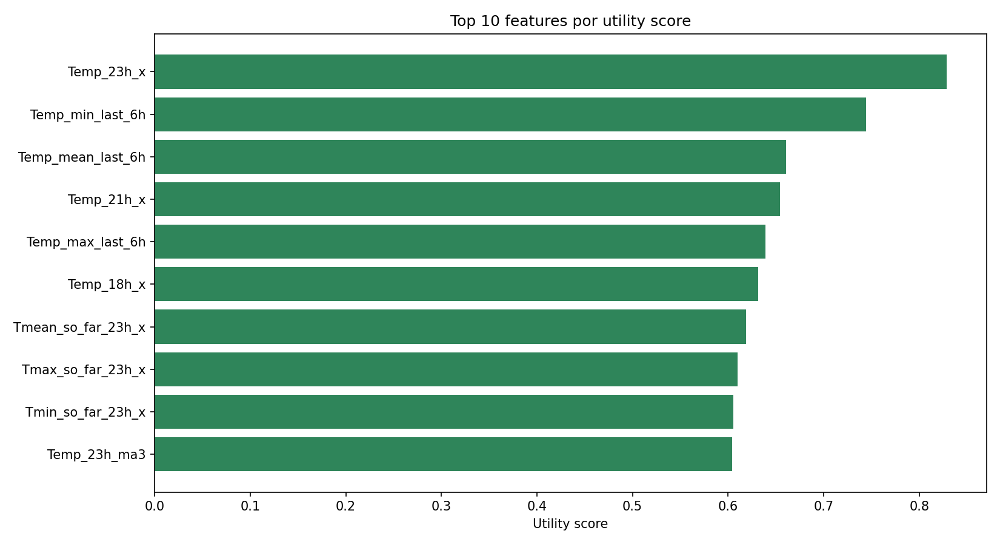
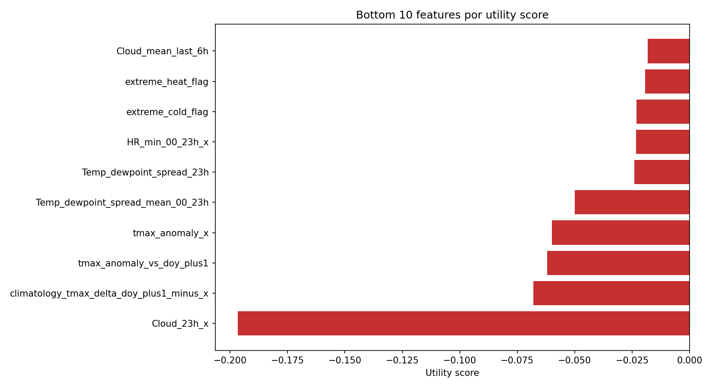
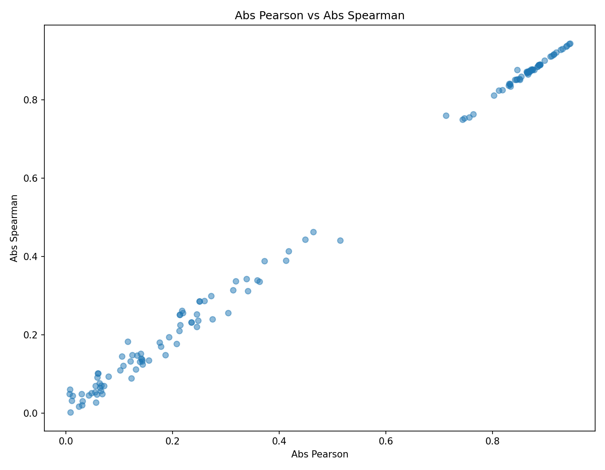
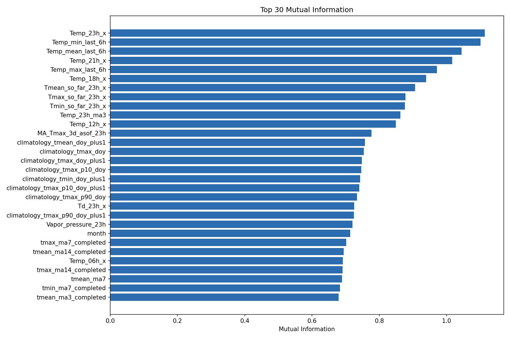
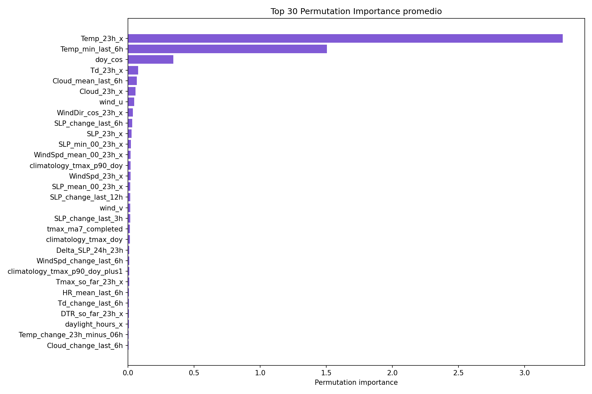
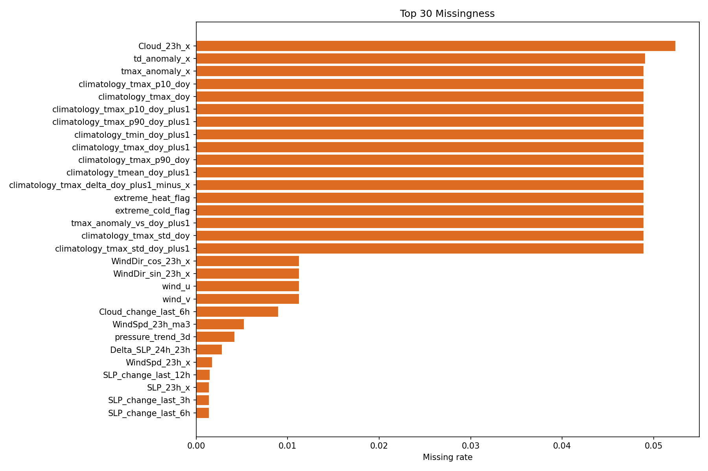
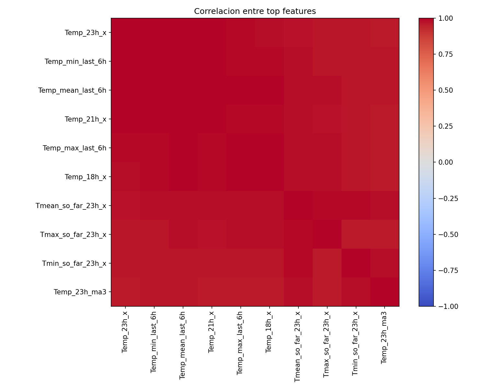
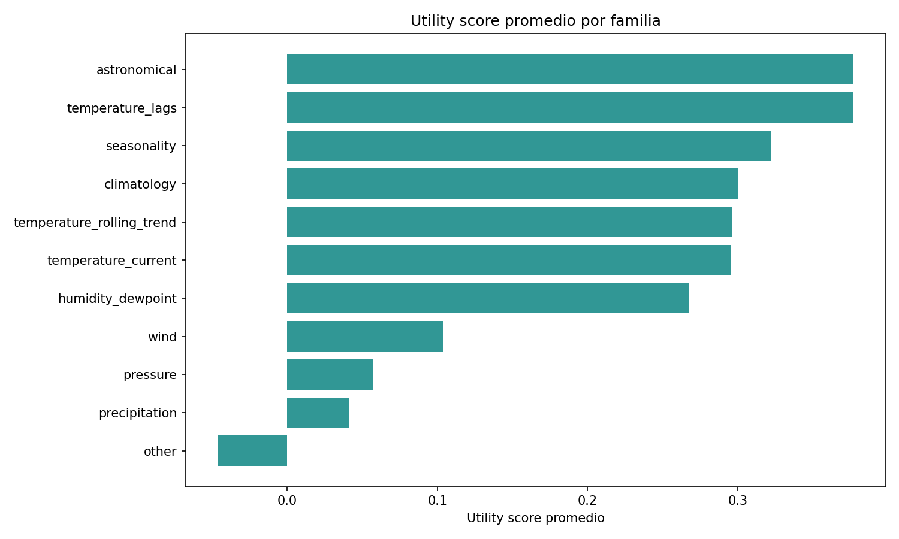


## Sprint 4 - V0: Nueva lista propuesta de features (limpieza + extension)

> Esta seccion define una **lista objetivo** para la siguiente iteracion.
> No se modifico el codigo de `feature engineering` en este paso.

### 1) Features a eliminar del set actual

Criterio: `utility_score` bajo/negativo, redundancia alta, drift alto o senal inestable en evaluacion externa.

```text
Cloud_23h_x
Cloud_mean_last_6h
Cloud_change_last_6h
Cloud_mean_00_23h_x
Cloud_max_00_23h_x

extreme_heat_flag
extreme_cold_flag

HR_min_00_23h_x
HR_mean_00_23h_x
HR_mean_last_6h
HR_23h_ma3

Temp_dewpoint_spread_23h
Temp_dewpoint_spread_mean_00_23h

tmax_anomaly_x
tmax_anomaly_vs_doy_plus1
climatology_tmax_delta_doy_plus1_minus_x
td_anomaly_x

wind_u
WindDir_sin_23h_x

Temp_change_23h_minus_12h
Temp_change_last_12h
Temp_change_last_3h

SLP_min_00_23h_x
SLP_mean_00_23h_x

Precip_sum_last_12h
```

### 2) Features a conservar como nucleo base

Criterio: mayor utilidad predictiva y estabilidad, especialmente sobre persistencia termica y estado termodinamico cercano a la hora objetivo.

```text
Temp_23h_x
Temp_21h_x
Temp_18h_x
Temp_12h_x
Temp_06h_x

Temp_min_last_6h
Temp_mean_last_6h
Temp_max_last_6h
Temp_23h_ma3

Tmax_so_far_23h_x
Tmin_so_far_23h_x
Tmean_so_far_23h_x
MA_Tmax_3d_asof_23h

tmax_lag1
tmax_lag2
tmax_lag3
tmax_lag7
tmax_ma3_completed
tmax_ma7_completed
tmax_ma14_completed
tmax_std7_completed
tmax_min7_completed
tmax_max7_completed

tmean_lag1
tmean_lag2
tmean_lag3
tmean_ma3_completed
tmean_ma7
tmean_ma14_completed
tmean_std7_completed

Td_23h_x
Vapor_pressure_23h
td_ma3

SLP_23h_x
Delta_SLP_24h_23h
pressure_trend_3d

WindSpd_23h_x
WindSpd_23h_ma3
WindSpd_mean_last_6h

month_sin
month_cos
doy_sin
doy_cos
daylight_hours_x
daylight_hours_plus1
daylight_delta_plus1_minus_x
```

### 3) Nuevas features a agregar (enfasis forecasting)

Objetivo: mejorar generalizacion temporal, capturar cambios de regimen y enriquecer senal multihorizonte.

#### 3.1 Forecasting por persistencia y extrapolacion local

```text
fc_persist_tmax_h1                = Tmax_so_far_23h_x
fc_persist_tmean_h1               = Tmean_so_far_23h_x
fc_linear_tmax_6h_h1              = Temp_23h_x + Temp_slope_last_6h * 1.0
fc_linear_tmax_12h_h1             = Temp_23h_x + Temp_slope_last_12h * 1.0
fc_damped_tmax_6h_h1              = Temp_23h_x + 0.6 * Temp_slope_last_6h
fc_damped_tmax_12h_h1             = Temp_23h_x + 0.6 * Temp_slope_last_12h
fc_bias_adj_from_climatology_h1   = fc_persist_tmax_h1 - climatology_tmax_doy_plus1
fc_persist_error_proxy            = Tmax_so_far_23h_x - tmax_lag1
```

#### 3.2 Forecasting multi-horizonte autoregresivo (AR)

```text
ar_tmax_lag1_2_diff               = tmax_lag1 - tmax_lag2
ar_tmax_lag2_3_diff               = tmax_lag2 - tmax_lag3
ar_tmax_lag3_7_diff               = tmax_lag3 - tmax_lag7
ar_tmax_accel_1_3                 = (tmax_lag1 - tmax_lag2) - (tmax_lag2 - tmax_lag3)
ar_tmax_ratio_lag1_ma7            = tmax_lag1 / (tmax_ma7_completed + 1e-6)
ar_tmax_ratio_ma3_ma14            = tmax_ma3_completed / (tmax_ma14_completed + 1e-6)
ar_tmean_ratio_ma3_ma14           = tmean_ma3_completed / (tmean_ma14_completed + 1e-6)
ar_tmax_zscore_7d                 = (tmax_lag1 - tmax_ma7_completed) / (tmax_std7_completed + 1e-6)
ar_tmean_zscore_7d                = (tmean_lag1 - tmean_ma7) / (tmean_std7_completed + 1e-6)
```

#### 3.3 Regimen synoptico (cambio de masa de aire)

```text
regime_pressure_drop_24h          = -Delta_SLP_24h_23h
regime_pressure_accel_3d          = pressure_trend_3d - SLP_change_last_12h
regime_warm_advection_proxy       = WindSpd_23h_x * Temp_change_last_6h
regime_cold_advection_proxy       = WindSpd_23h_x * (-Temp_change_last_6h)
regime_humidity_jump_6h           = HR_change_last_6h
regime_dewpoint_jump_6h           = Td_change_last_6h
regime_stability_proxy            = Temp_dewpoint_spread_23h / (WindSpd_23h_x + 1e-6)
regime_precip_instability_proxy   = Precip_sum_last_6h * Temp_change_last_6h
```

#### 3.4 Estacionalidad avanzada para forecasting

```text
season_phase_shift_1d_sin         = sin(2*pi*(doy+1)/365)
season_phase_shift_1d_cos         = cos(2*pi*(doy+1)/365)
season_temp_expected_residual     = Temp_23h_x - climatology_tmax_doy
season_expected_nextday_gap       = climatology_tmax_doy_plus1 - climatology_tmax_doy
season_daylight_temp_interaction  = daylight_hours_plus1 * Temp_23h_x
season_daylight_trend_interaction = daylight_delta_plus1_minus_x * Temp_slope_last_6h
```

#### 3.5 Interacciones no lineales orientadas a modelo

```text
int_temp_humidity                 = Temp_23h_x * HR_23h_x
int_temp_pressure                 = Temp_23h_x * SLP_23h_x
int_temp_wind                     = Temp_23h_x * WindSpd_23h_x
int_tmax_td                       = Tmax_so_far_23h_x - Td_23h_x
int_tmean_pressure_trend          = Tmean_so_far_23h_x * pressure_trend_3d
int_tmax_precip                   = Tmax_so_far_23h_x * Precip_sum_last_6h
int_wind_pressure                 = WindSpd_23h_x * Delta_SLP_24h_23h
int_humidity_pressure             = HR_23h_x * Delta_SLP_24h_23h
```

#### 3.6 Features de robustez para extremos

```text
extreme_recent_heat_3d            = max(tmax_lag1, tmax_lag2, tmax_lag3)
extreme_recent_cold_3d            = min(tmax_lag1, tmax_lag2, tmax_lag3)
extreme_range_recent_7d           = tmax_max7_completed - tmax_min7_completed
extreme_warming_flag_3d           = 1 if ar_tmax_lag1_2_diff>0 and ar_tmax_lag2_3_diff>0 else 0
extreme_cooling_flag_3d           = 1 if ar_tmax_lag1_2_diff<0 and ar_tmax_lag2_3_diff<0 else 0
extreme_volatility_flag_7d        = 1 if tmax_std7_completed > p75_train else 0
```

### 4) Lista objetivo consolidada (Sprint 4 - V0)

- Mantener el **nucleo base** (seccion 2).
- Eliminar el bloque de features de baja utilidad (seccion 1).
- Agregar todas las features de forecasting y regimen (seccion 3).
- En entrenamiento, aplicar seleccion adicional por:
  - `utility_score` positivo,
  - redundancia maxima por cluster (`|corr| < 0.95` dentro del mismo grupo),
  - estabilidad temporal minima.

Resultado esperado en Sprint 4 - V0 (iteracion incremental): menor sobreajuste a senales termicas redundantes y mejor robustez en anos fuera de muestra.

### 5) Impacto en cantidad de features (referencia 132/133)

Tomando como referencia el contrato actual:

- `132` features en inference mode.
- `133` columnas en train mode (incluyendo target `t_max_x+1`).

Aplicando esta propuesta:

- Features eliminadas: `25`.
- Features agregadas: `45`.
- Cambio neto: `+20`.

Conteo resultante esperado:

```text
Inference mode: 132 - 25 + 45 = 152 features
Train mode:     133 - 25 + 45 = 153 columnas (incluyendo target)
```


# Desarrollo de V1

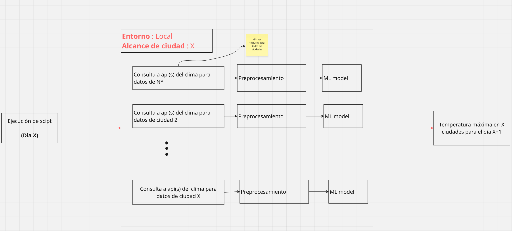

# Desarrollo de V2

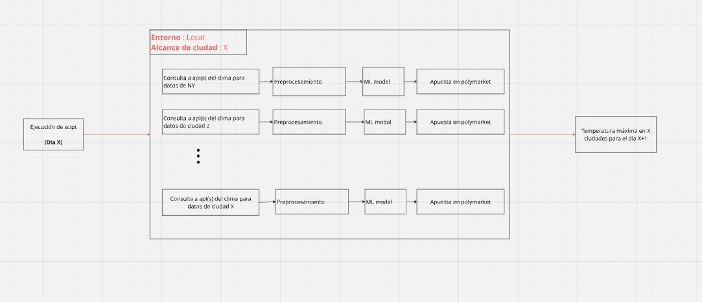

# Desarrollo de V3

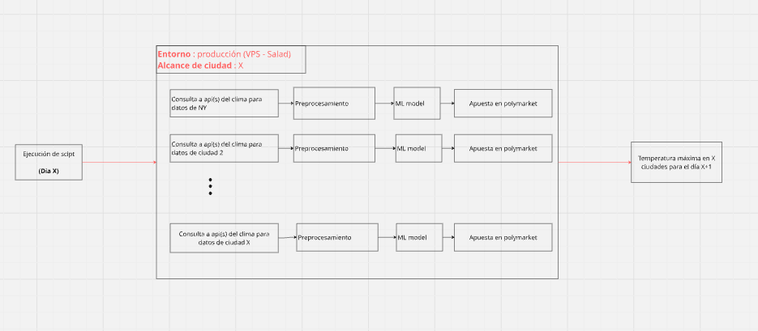
